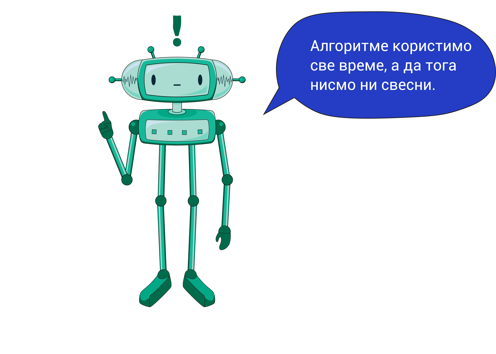

Добродошли у Дигитални свет!
============================
 
Заједно ћемо кренути на узбудљиво путовање кроз свет дигиталних уређаја! Можда се питаш шта су то дигитални уређаји и како нам могу помоћи у свакодневном животу? Спреми се да на занимљив начин истражиш све што те интересује о дигиталним уређајима.

.. image:: ../../_images/u_digitalni_uredjaji.png
    :width: 600
    :align: center

Прво, научићеш како да препознаш дигиталне уређаје око нас и научићеш њихова имена. Замисли да је свет око нас испуњен чаробним кутијама које свима нама помажу да лакше обављамо свакодневне послове. Запиташ ли се како су људи живели пре него што су постојали ови чаробни уређаји? И, то ћемо заједно да истражимо!

Да ли знаш да можеш да ствараш уз помоћ  дигиталних уређаја? На пример, можеш цртати, причати приче, па чак и да учиш на потпуно нов и забаван начин. А, да би сазнао/ла све о томе, разговараћемо о дигиталним уџбеницима и о томе како нам могу помоћи да учимо о различитим стварима на много занимљивији начин.

Такође, мораш да научиш и како да будеш безбедан/на док истражујеш свет око нас. Да ли знаш шта су паметни уређаји? То су они који могу да „мисле” и раде ствари као да су чаробни! То су уређаји који су способни да „размишљају” и обављају најразличитије задатке као да су чаробњаци који својим чаробнем моћима решавају сваки проблем.
Али понекад, мораш да знаш и како да се заштитиш од прекомерног и небезбедног коришћења дигиталних уређаја како би остао/ла  здрав и безбедан.

    
И то није све! Научићеш како да будеш чувар наше планете тако што ћеш се правилно бринути о електронском отпаду.. Такође, говорићемо и о заштити наших личних података јер је важно да знаш како да будеш безбедан/на док користиш дигиталне уређаје.

Ако ти се деси да видиш нешто необично или се осећаш несигурно док користиш дигиталне уређаје, не брини! Постоје људи којима можеш да се обратиш за помоћ и савет. И наравно, научићеш како да будеш одговоран/на корисник/ца дигиталних уређаја и зашто је то важно.

На овом путовању, такође ћеш да откријеш шта је то "алгоритам" и како ти он може помоћи да решиш најразличитије проблеме корак по корак. Ако се приликом решавања неког задатка запетљаш или направиш грешку, не брини, научићеш како да је исправиш и пронађеш најбоље право решење.

    
Како бисмо ти олакшали истраживање дигиталног света, поред материјала које пружа овај курс, ту је и твоја радна свеска. У њој ћеш решавати разноврсне задатке које смо посебно припремили за тебе. Било би одлично да уз сваку лекцију имаш и своју радну свеску. Ако ти је потребна помоћ, нека ти родитељ или блиска одрасла особа помогне да је одштампаш и припремиш. 

А, сада смо спремни да заједно истражимо све тајне дигиталних уређаја и научимо како да будемо прави мали истраживачи дигиталног света. Спремни? Крећемо!
