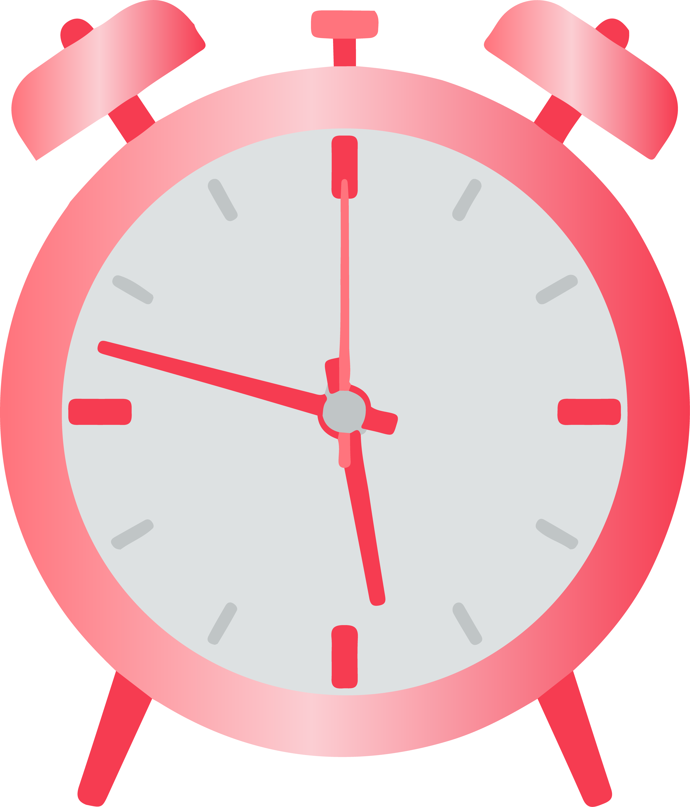
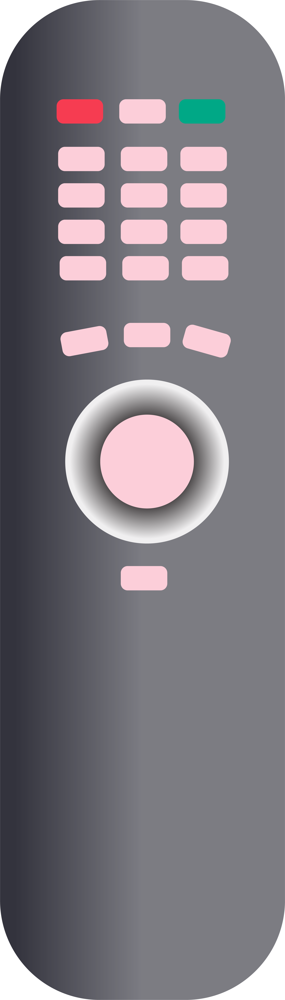
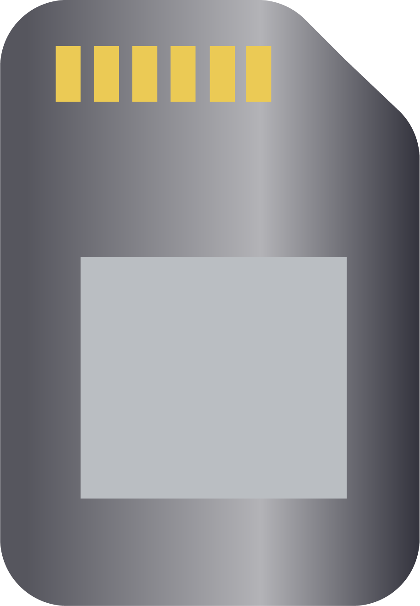
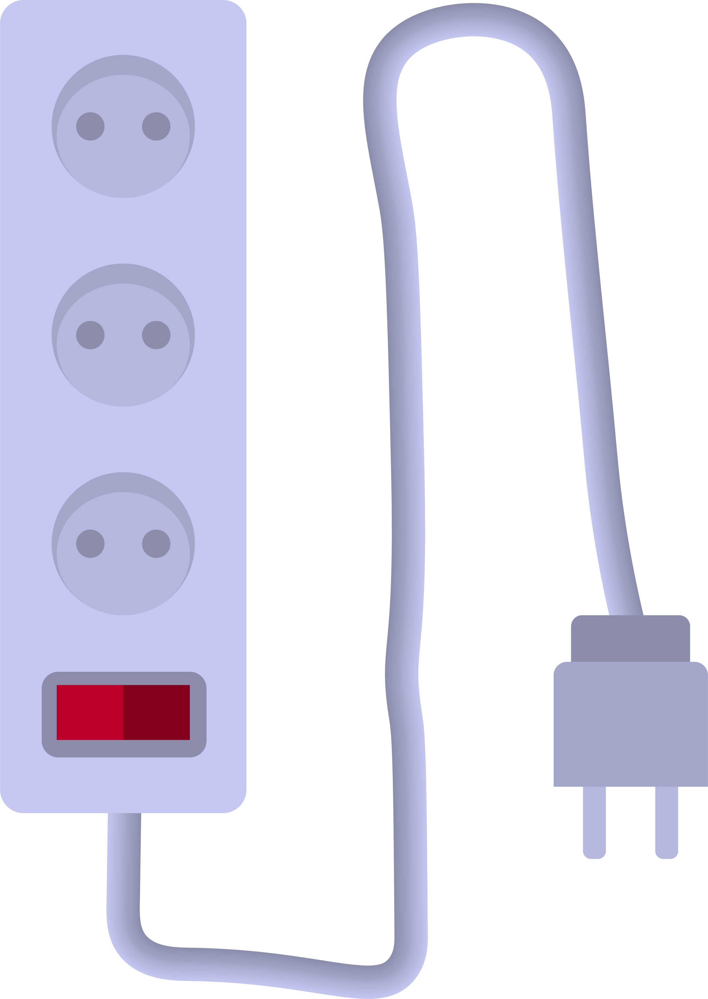
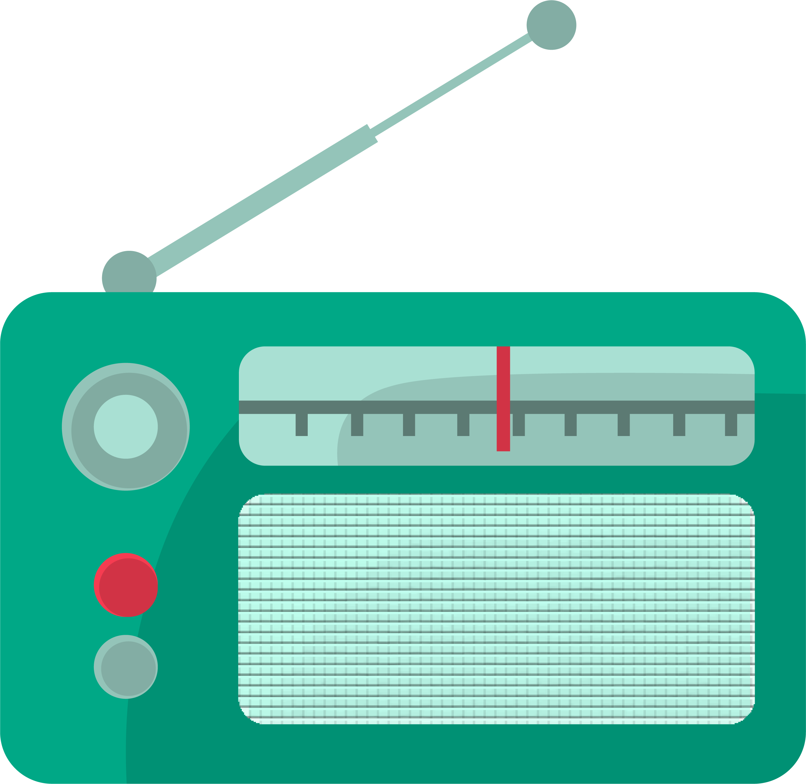
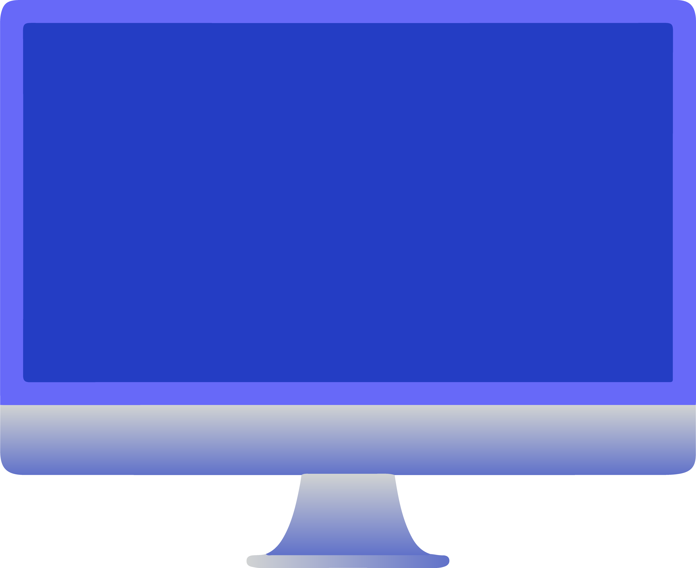

Дигитални уређаји су свуда око нас
==================================

.. |cetkica| image:: ../../_images/cetkica.png
            :height: 150px

.. |digitalni_sat| image:: ../../_images/digitalni_sat.png
            :height: 100px

.. |frizider| image:: ../../_images/frizider.png
            :height: 200px

.. |pametni_sat| image:: ../../_images/pametni_sat.png
            :height: 150px

.. |auto| image:: ../../_images/auto.png
            :height: 100px

.. |autobus| image:: ../../_images/autobus.png
            :height: 100px

.. |sporet| image:: ../../_images/sporet.png
            :height: 200px

.. |toster| image:: ../../_images/toster.png
            :height: 150px

.. |digitron| image:: ../../_images/kalkulator.png
            :height: 150px

.. |cd_plejer| image:: ../../_images/cd_plejer.png
            :height: 150px

.. |sat| image:: ../../_images/sat_rucni_obican.png
            :height: 150px

.. |pametna_tabla| image:: ../../_images/pametna_tabla.png
            :height: 150px

.. |tablet| image:: ../../_images/tablet.png
            :height: 100px

.. |knjige| image:: ../../_images/knjige.png
            :height: 150px

.. |lenjir| image:: ../../_images/lenjir.png
            :height: 150px

.. |marker| image:: ../../_images/marker1.png
            :height: 150px

.. |video_bim| image:: ../../_images/projektor.png
            :height: 100px

.. |laptop| image:: ../../_images/laptop.png
    :height: 150px  

.. |pametni_telefon| image:: ../../_images/pametni_telefon.png
            :height: 150px

.. |slusalice| image:: ../../_images/slusalice.png
            :height: 150px

.. |zvucnici| image:: ../../_images/zvucnici.png
            :height: 150px       

.. |stampac| image:: ../../_images/stampac.png
            :height: 150px          

.. |sat_ro| image:: ../../_images/sat_rucni_obican.png
            :height: 80px        

.. |televizor| image:: ../../_images/televizor.png
            :height: 80px        

.. |aa| image:: ../../_images/analogni_aparat.png
            :height: 80px        

.. |navigacija| image:: ../../_images/navigacija.png
            :height: 80px    

.. |pam_sat| image:: ../../_images/pametni_sat.png
            :height: 80px
    

.. |lt| image:: ../../_images/laptop.png  
            :height: 80px  

.. |kv| image:: ../../_images/kv.png
            :height: 20px        

.. |slus| image:: ../../_images/slusalice.png
            :height: 80px

.. |tab| image:: ../../_images/tablet.png
            :height: 80px

.. |pt| image:: ../../_images/pametni_telefon.png
            :height: 80px

.. |web_kamera| image:: ../../_images/web_kamera.png
            :height: 80px

.. |konzola| image:: ../../_images/konzola.png
            :height: 80px

.. infonote::

 .. image:: ../../_images/robot1a.png
    :height: 100
    :align: left

 Када урадиш дате задатке и одговориш на питања у лекцији знаћеш да препознаш дигиталне  уређаје који те окружују. Осим тога знаћеш и да 
 их именујеш и да опишеш где и како их користиш.

Дигитални уређаји су свуда око нас. 

|

Пред тобом се налази слика различитих предмета. 

|

.. image:: ../../_images/bojanka.png
  :width: 780
  :align: center

.. questionnote::

 Обој различитим бојама све дигиталне уређаје које препознајеш. Покушај да именујеш сваки уређај који препознајеш. 

Размисли и одговори на следећа питања.

.. questionnote::

 - Да ли користиш неке од дигиталних уређаја на овој слици? 
 - Које дигиталне уређаје користиш самостално, а које уз присуство родитеља?
 - Опиши како раде дигитални уређаји? 

Свакодневно користиш различите уређаје који ти олакшавају живот. Размисли о данашњем дану, од тренутка када устанеш до доласка у школу. Које си уређаје користио/ла?

.. csv-table:: 
   :widths: auto
   :align: center
   
   "|cetkica|", "|digitalni_sat|"
   "|kv|", "|kv|"
   "|frizider|", "|pametni_sat|"
   "|kv|", "|kv|"
   "|sporet|", "|toster|"
   "|kv|", "|kv|"
   "|auto|", "|autobus|"
   "|kv|", "|kv|"
   "", ""

Доцртај предмет који користиш од тренутка када устанеш до доласка у школу.

|

.. image:: ../../_images/prostor_za_crtanje.png
    :width: 500
    :align: center

.. questionnote::

 .. image:: ../../_images/robot3c.png
    :height: 100
    :align: left

 Како ти ови предмети олакшавају живот? Опиши како их користиш.

 |

---------

Погледај пажљиво учионицу са слике.

|

.. image:: ../../_images/hajtek_ucionica.png
    :width: 780
    :align: center

|

Обој први квадратић испод предмета које можеш да пронађеш у учионици плавом бојом.

.. csv-table:: 
   :widths: auto
   :align: center
   
   "|laptop|", "|slusalice|", "|zvucnici|"
   "|kv| |kv|", "|kv| |kv|", "|kv| |kv|"
   "|marker|", "|pametni_telefon|", "|stampac|"
   "|kv| |kv|", "|kv| |kv|", "|kv| |kv|"
   "|digitron|", "|cd_plejer|", "|sat|"
   "|kv| |kv|", "|kv| |kv|", "|kv| |kv|"
   "|pametna_tabla|", "|tablet|", "|knjige|"
   "|kv| |kv|", "|kv| |kv|", "|kv| |kv|"
   "|lenjir|", "|marker|", "|video_bim|"
   "|kv| |kv|", "|kv| |kv|", "|kv| |kv|"

Упореди твоју учионицу са учионицом на слици. Које све предмете проналазиш у својој учионици? Обој други квадратић испод предмета које можеш да 
пронађеш у својој учионици црвеном бојом. 

.. questionnote::

 .. image:: ../../_images/robot3c.png
    :height: 100
    :align: left

 Како ти ови предмети олакшавају живот? Опиши како их користиш.

 |

.. image:: ../../_images/robot5c.png
    :width: 100
    :align: right

--------------

**Рад код куће**

Изабери из горње табеле један дигитални уређај. Напиши или нацртај слику помоћу које ћеш да опишеш чему служи тај уређај. Како користиш тај уређај?

|

.. image:: ../../_images/prostor_za_crtanje.png
    :width: 500
    :align: center

.. questionnote::

 Да ли тај одабрани уређај можеш да пронађеш у својој кући? Напиши како тај уређај користиш код куће. 

------

Распореди све предмете у једну од ове две колоне на основу тога да ли је предмет дигитални уређај или не.

.. csv-table:: 
   :header: "**Дигитално**", "**Предмети**", "**Није дигитално**"
   :widths: 300, 300, 300
   :align: center

   "", "|cet_ob| |sat_ob| |sat_ro| |daljinac| |televizor| |aa| |navigacija| |pam_sat| |kasetofon| |sd| |lt| |produzni| |slus| |tab| |pt| |stari_tv| |web_kamera| |mikrofon| |konzola| |stari_radio| |monitor|", ""

