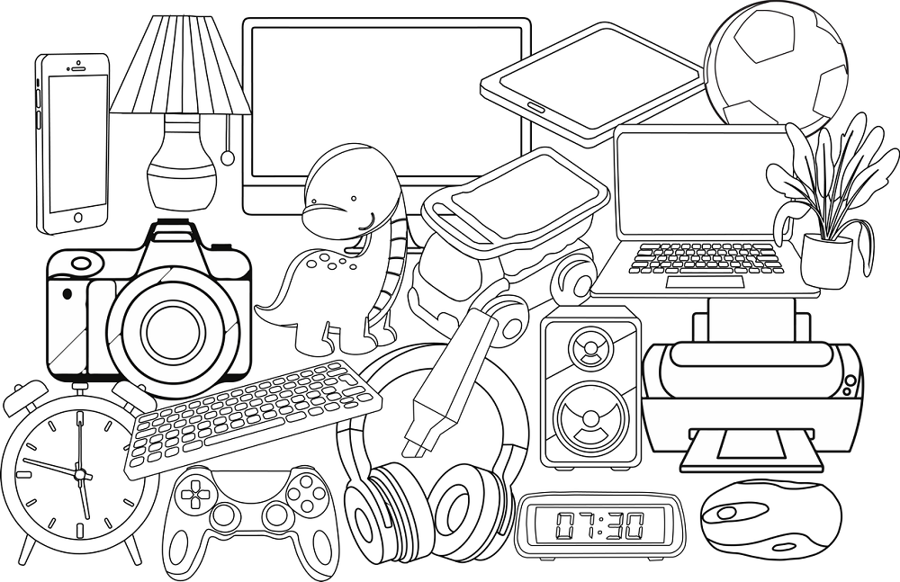

Дигитални уређаји су свуда око нас
==================================

.. infonote::

 .. image:: ../../_images/robot11.png
    :height: 120
    :align: left

 Када урадиш дате задатке и одговориш на питања у лекцији знаћеш да препознаш дигиталне  уређаје који те окружују. Осим тога знаћеш и да 
 их именујеш и да опишеш где и како их користиш.

Дигитални уређаји су свуда око нас. 

|

Пред тобом се налази слика различитих предмета. 

|

Покушај да препознаш дигиталне уређаје. Именуј сваки уређај који препознајеш. 

.. questionnote::

 У радној свесци на страни **XX** обој различитим бојама све дигиталне уређаје које препознајеш.

Размисли и одговори на следећа питања.

.. questionnote::
 .. image:: ../../_images/robot12.png
    :height: 130
    :align: left

 - Да ли користиш неке од дигиталних уређаја на овој слици? 
 - Које дигиталне уређаје користиш самостално, а које уз присуство родитеља?
 - Опиши како раде дигитални уређаји? 

Свакодневно користиш различите уређаје који ти олакшавају живот. Размисли о данашњем дану, од тренутка када устанеш до доласка у школу. Које си уређаје користио/ла?

.. questionnote::

 Како ти ови предмети олакшавају живот? Опиши како их користиш.

---------

Погледај пажљиво учионицу са слике.

.. image:: ../../_images/hajtek_ucionica.png
    :width: 780
    :align: center

|

.. questionnote::

 Како ти ови предмети олакшавају живот? Опиши како их користиш.

--------------

.. quizq::

    .. image:: ../../_images/p101a.png
            :width: 600px
            :align: center

    .. mchoice:: p2
            :multiple_answers:
            :answer_a: 1 
            :answer_b: 2
            :answer_c: 3 
            :answer_d: 4
            :answer_e: 5
            :correct: b, c, d

            Кликни на квадратић испред броја којим су означени дигитални уређаји.

.. quizq::

    .. image:: ../../_images/p101b.png
            :width: 600px
            :align: center

    .. mchoice:: p3
            :multiple_answers:
            :answer_a: 1 
            :answer_b: 2
            :answer_c: 3 
            :answer_d: 4
            :answer_e: 5
            :correct: b, d, e

            Кликни на квадратић испред броја којим су означени предмети који **нису** дигитални.

|

.. image:: ../../_images/robot13.png
    :height: 200
    :align: right

------------

**Домаћи задатак**

У радној свесци на страни **XX** заокружи зеленом бојом све предмете који су дигитални, а црвеном бојом све уређаје који нису дигитални.

|

|

.. image:: ../../_images/uredjaji.png
    :width: 780
    :align: center

