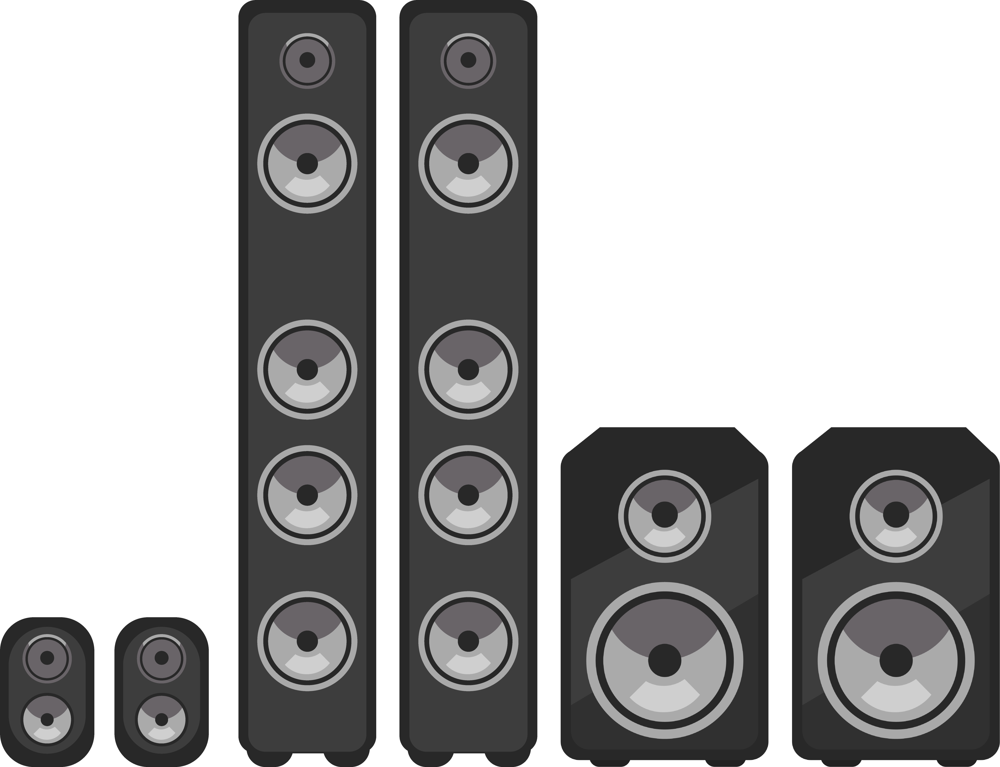
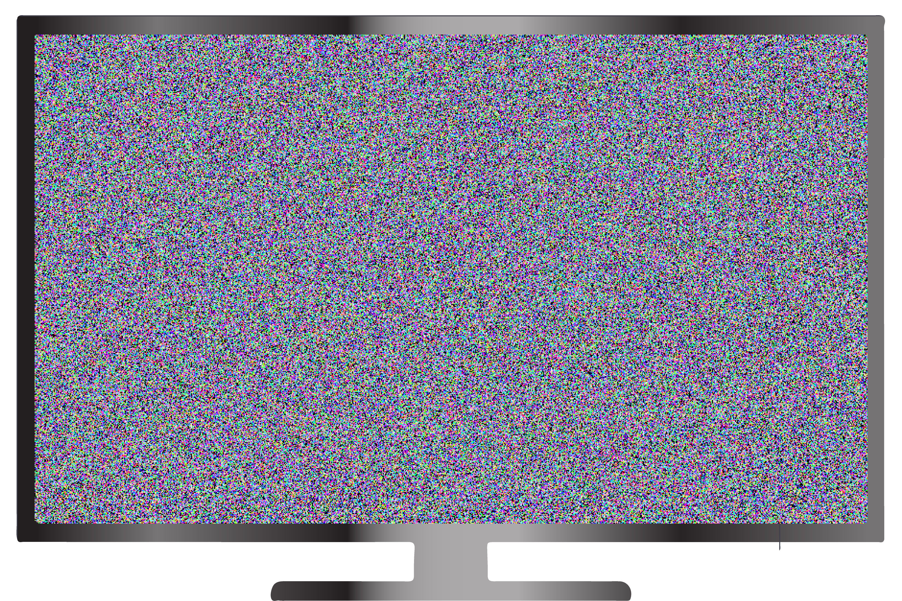

Дигитални уређаји олакшавају обављање послова
=============================================

.. infonote::

 .. image:: ../../_images/robot1a.png
    :height: 100
    :align: left

 Када урадиш дате задатке и одговориш на питања у лекцији знаћеш да наведеш неке од животних ситуација у којима дигитални уређаји олакшавају обављање послова.

 |

Пажљиво погледај обе слике. 

|

|

.. questionnote::

 Опиши приказане ситуације.

Пажљиво погледај доњу слику. Означи све дигиталне уређаје које можеш да пронађеш на слици.

|

.. questionnote::

 Напиши колико дигиталних уређаја препознајеш на слици? 

 Да ли ове уређаје можеш да пронађеш у својој кући? 

-------

У доњу табелу напиши назив дигиталног уређаја који имаш у својој кући, а затим напиши и зашта га користите ти и твоји укућани.

|

.. csv-table:: 
   :header: "**Дигитални уређаји**", "**Назив уређаја**", "**Користим га за...**"
   :widths: auto
   :align: left
   
   "|pametni_telefon|", "", ""
   "|laptop|", "", ""
   "|televizor|", "", ""
   "|surround|", "", ""
   "|klima|", "", ""
     "", "", ""

Нацртај или напиши које послове обављају твоји укућани уз помоћ дигиталних уређаја?

|

.. image:: ../../_images/prostor_za_crtanje.png
    :width: 500
    :align: center

.. questionnote::

 Наведи још неке ситуације у којима дигитални уређаји олакшавају свакодневни посао?

|

.. image:: ../../_images/robotP5c.png
    :width: 100
    :align: right

------------

**Рад код куће**

Разговарај са теби блиском одраслом особом о томе које дигиталне уређаје користе на послу. Нацртај или напиши на који начин они на послу користе дигиталне 
уређаје како би обављали свој посао.

|

.. image:: ../../_images/prostor_za_crtanje.png
    :width: 500
    :align: center

.. questionnote::

 Шта мислиш зашто користе баш тај дигитални уређај. Да ли би свој посао могли да обављају и без дигиталног уређаја?