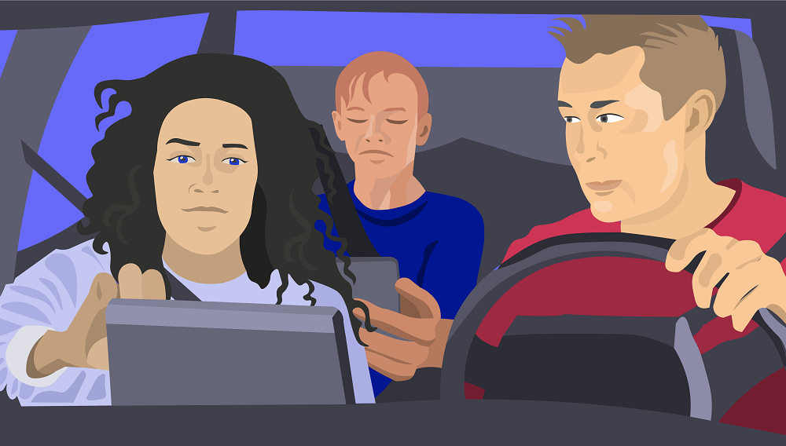
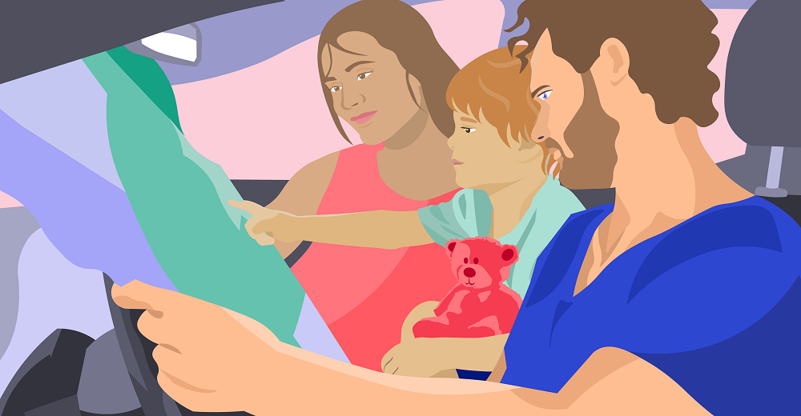
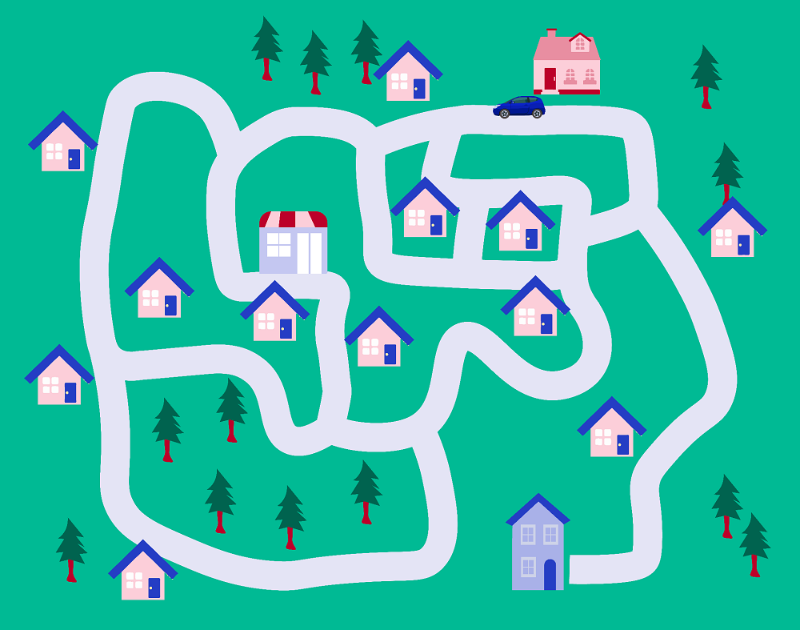

Свакодневно коришћење дигиталних уређаја
========================================

.. infonote::

 .. image:: ../../_images/robot11.png
    :height: 120
    :align: left

 Када урадиш дате задатке и одговориш на питања у лекцији бићеш у стању да препознаш различите ситуације из свакодневног живота у којима дигитални уређаји 
 значајно олакшавају извршавање разних задатака.

Пажљиво погледај обе слике. 

.. csv-table:: 
   :widths: auto
   :align: center

   "|moderni_odmor|", "|retro_odmor|"
   "   ", "  "

Покушај да препознаш предмете на обе слике који могу помоћи да породица пронађе прави пут до мора. Именуј предмете које препознајеш. 

.. questionnote::

 У радној свесци на страни **12** заокружи на обе слике све предмете који могу помоћи да породица пронађе прави пут до мора.
 Опиши на који начин мама помаже тати да пронађу пут до мора. Како то мама ради на првој слици, а како на другој слици?

---------

Наја је позвана на рођендан код својих другарица близнакиња Иване и Петре. Оне живе на другом крају града у љубичастој кући. 
Пре него што оде на рођендан она са татом одлази у продавницу да им купи поклон. Наја зна пут до куће својих другарица, мама ју је 
возила више пута. Помози Наји да тату одведе на право место. 

У радној свесци на страни **13** означи плавом бојом путању од продавнице до куће Најиних другарица Иване и Петре.

.. questionnote::

 Ако тата први пут вози Нају код њених другарица, како може без Најине помоћи да дође до њих? Опиши уређај који може да му помогне.

.. image:: ../../_images/robot13.png
    :width: 100
    :align: right

------------

**Домаћи задатак**

|

У радној свесци на страни **15** спој тачкицама редом обележене бројеве. Обој предмет истом бојом. Kако се зове овај уређај?

|

------------

.. questionnote::

 - Kако се назива овај уређај? 
 - Да ли имаш овај уређај? 
 - Чему служи овај уређај?
 - У којој ситуацији си користио/користила овај уређај?

