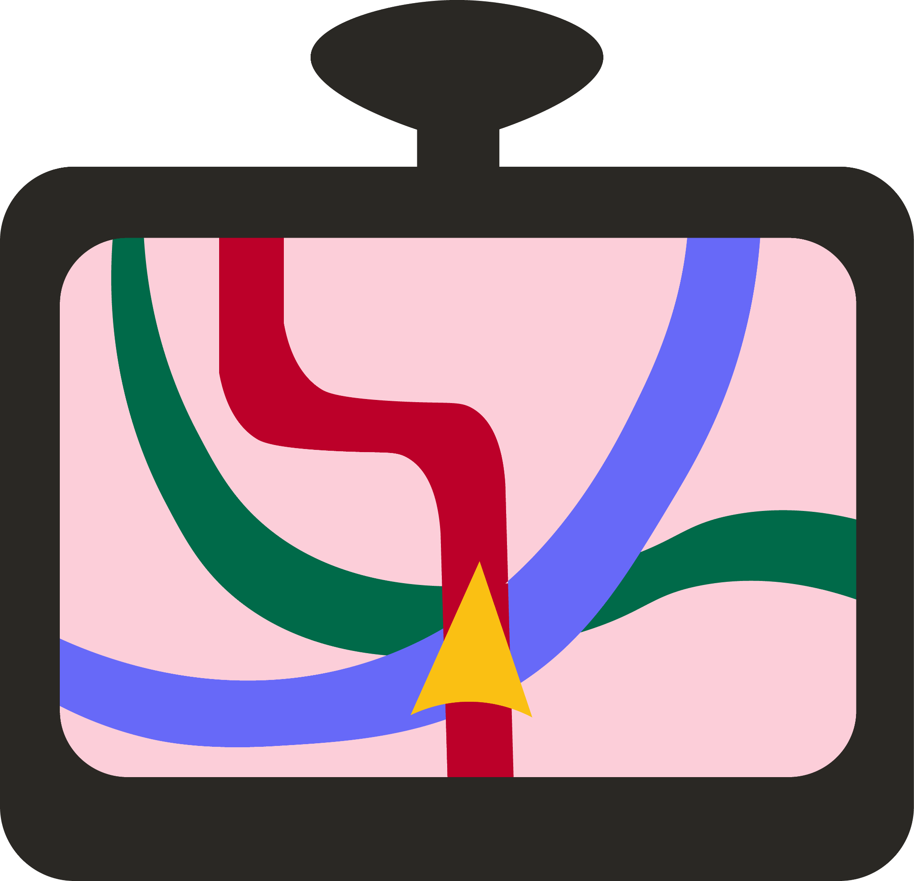
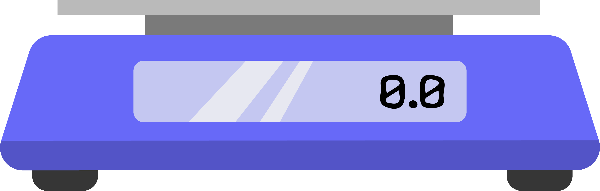
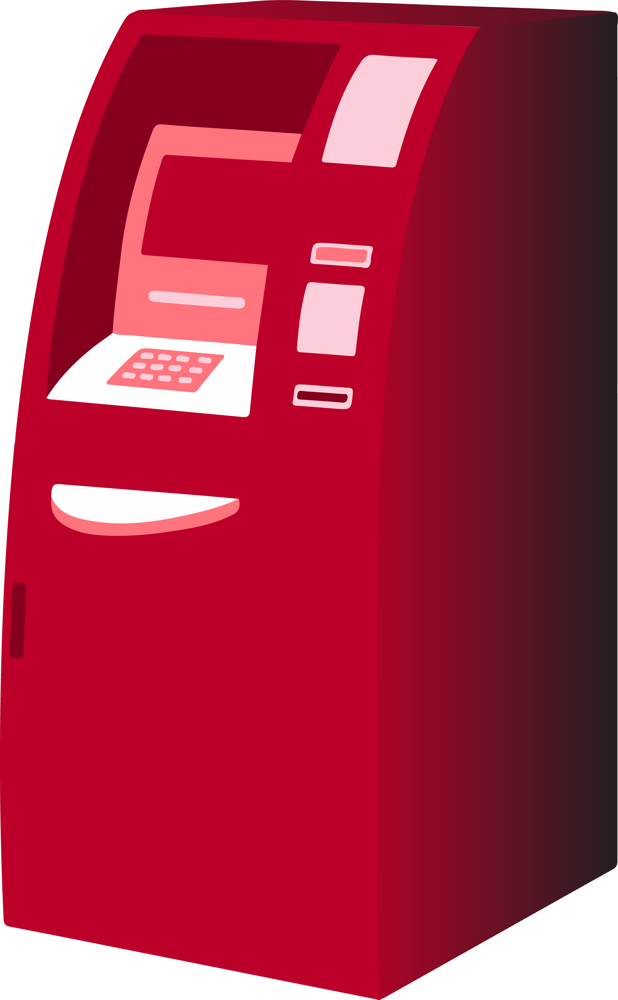
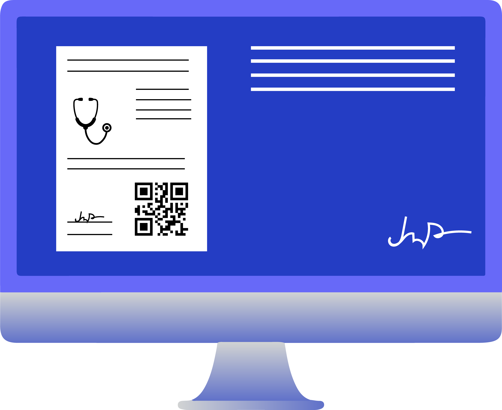
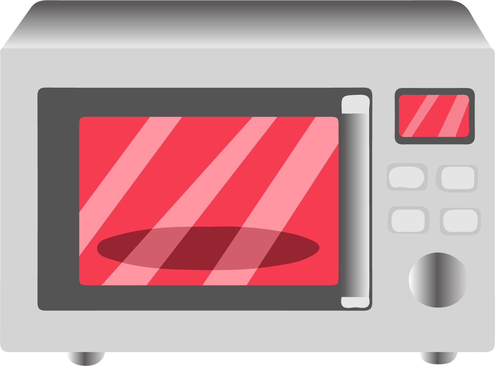
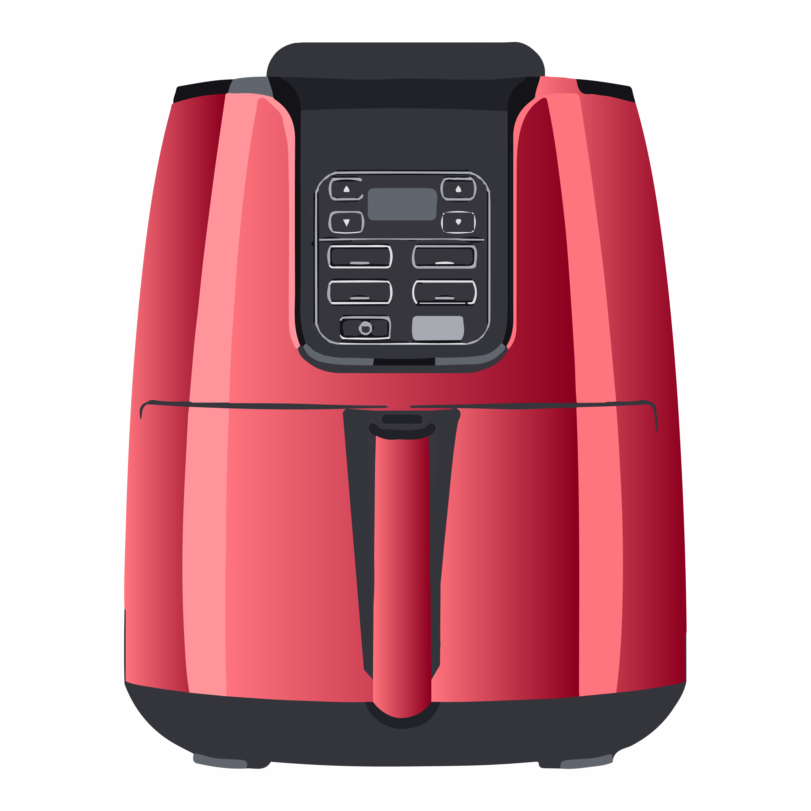
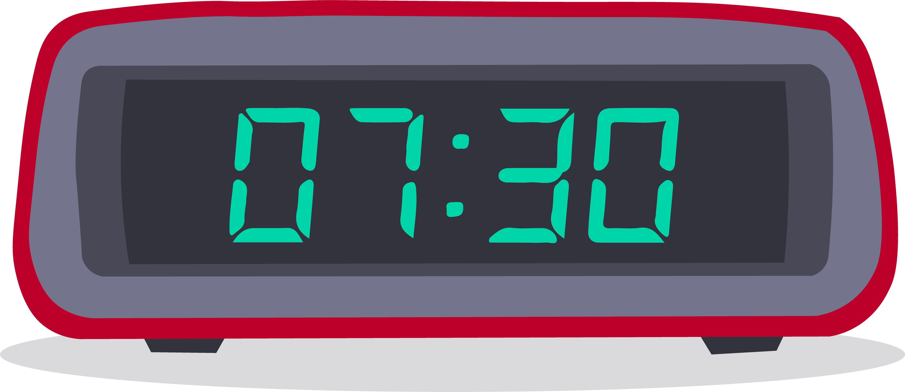
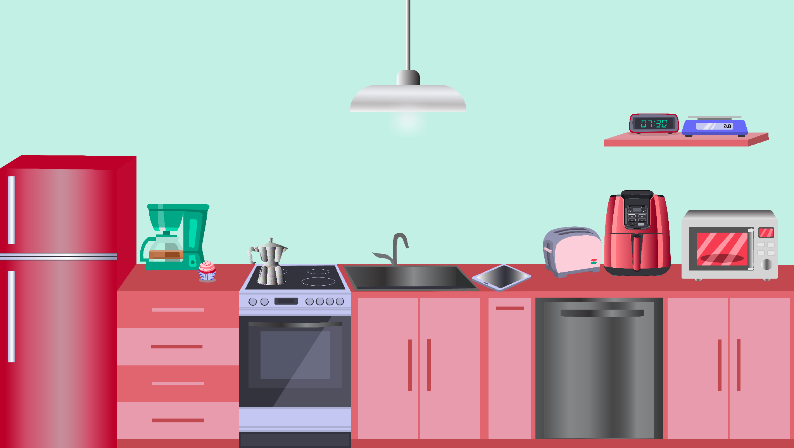

Дигитални уређаји мењају посао
==============================

.. |tablet| image:: ../../_images/tablet.png
            :width: 100px      

.. infonote::

 .. image:: ../../_images/robot1a.png
    :height: 100
    :align: left

 Када урадиш дате задатке и одговориш на питања у лекцији знаћеш да упоредиш како су људи радили и живели пре и после појаве дигиталних уређаја.

.. dragndrop:: 106
    :feedback: Покушајте поново.
    :match_1: навигација ||| возач
    :match_2: дигитална вага ||| посластичар
    :match_3: графичка табла ||| графички дизајнер
    :match_4: каса ||| трговац

    Повежи занимања са одговарајућим сликама дигиталних уређаја.

Напиши како сваки од ових уређаја може да унапреди сваки од ових послова.

.. csv-table::
   :header: "**Дигитални уређај**", "**Како унапређује посао**" 
   :widths: auto
   :align: left

   "навигација", ""
   "дигитална вага", ""
   "банкомат", ""
   "дигитални рецепт", ""
   "каса", ""
   "графичка табла", ""
   "", ""

.. image:: ../../_images/robot5c.png
    :width: 100
    :align: right

------------

**Рад код куће**

Пажљивo погледај доњу слику. Означи све дигиталне уређаје које препознајеш.

|

.. questionnote::

 Напиши колико дигиталних уређаја препознајеш на слици? Да ли ове уређаје можеш да пронађеш у својој кући? 

У доњу табелу напиши назив дигиталних уређаја које имаш у својој кући, а затим напиши и за шта их користите ти и твоји укућани.

.. csv-table:: 
  :header: "**Дигитални уређаји**", "**Назив уређаја**", "**Користим га за...**"
  :widths: auto
  :align: left
   
  "|mikrotalasna|", "", ""
  "|air|", "", ""
  "|ds|", "", ""
  "|tablet|", "", ""
  "|dv|", "", ""
  "", "", ""
