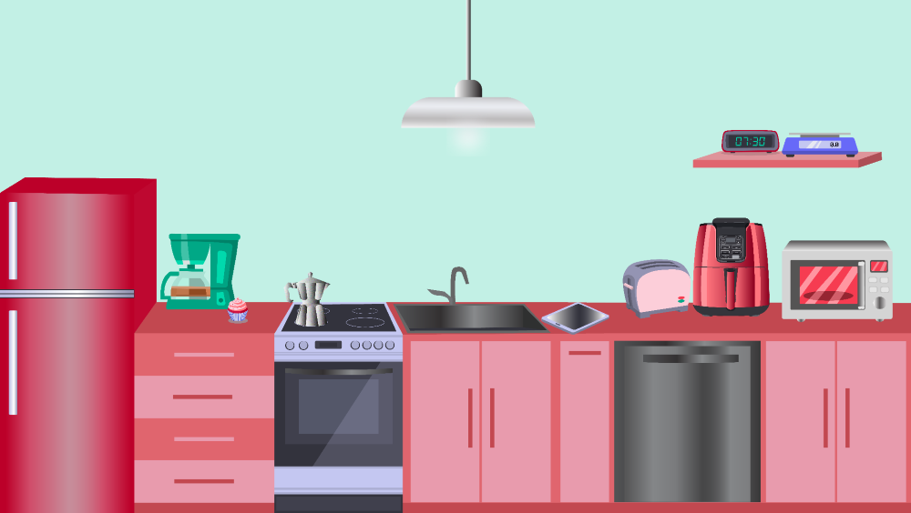

Дигитални уређаји мењају посао
==============================

.. infonote::

 .. image:: ../../_images/robot11.png
    :height: 120
    :align: left

 Када урадиш дате задатке и одговориш на питања у лекцији знаћеш да упоредиш како су људи радили и живели пре и после појаве дигиталних уређаја.

|
 
.. quizq::

    Дигитални уређаји су означени бројевима. Повежи назив занимања са одговарајући бројем којим је представљен дигитални уређај. 

    |

    .. image:: ../../_images/p106a.png
            :width: 780px
            :align: center

    .. dragndrop:: d106a
        :feedback: Покушајте поново.
        :match_1: навигација ||| возач
        :match_2: дигитална вага ||| посластичар
        :match_3: банкомат ||| банкар
        :match_4: графичка табла ||| графички дизајнер
        :match_5: каса ||| трговац

Како сваки од ових уређаја може да унапреди сваки од ових послова?

.. questionnote::
 .. image:: ../../_images/robot12.png
    :height: 150
    :align: left

 Размисли и одговори на следећа питања:

 - Како навигација може да унапреди посао возача?
 - Како дигитална вага може да унапреди посао посластичара?
 - Како банкомат може да унапреди посао банкара?
 - Како дигитални рецепт може да унапреди посао лекара?
 - Како каса може да унапреди посао трговца?
 - Како графичка табла може да унапреди посао графичког дизајнера?

.. image:: ../../_images/robot13.png
    :width: 100
    :align: right

------------

**Домаћи  задатак**

|

Пажљивo погледај доњу слику. Које све дигиталне уређаје препознајеш?

|

|

У радној свесци на страници **20** означи све дигиталне уређаје које препознајеш.

-----------

.. quizq::

    .. fillintheblank:: f106

        Колико дигиталних уређаја има на слици?

        Одговор: |blank|

     - :10|[Дд]есет|ДЕСЕТ|[Dd]eset|DESET: Одговор је тачан!
       :x: Провери још једном свој одговор!

.. questionnote::

 Које од ових уређаја имаш у својој кући? 

|

.. quizq::

    Дигитални уређаји су означени бројевима. Повежи назив уређаја са бројем којим је представљен одговарајући дигитални уређај.

    |

    .. image:: ../../_images/p106b.png
            :width: 780px
            :align: center

    .. dragndrop:: d106b
        :feedback: Покушајте поново.
        :match_1: 1 ||| микроталасна рерна
        :match_2: 2 ||| дигитална фритеза
        :match_3: 3 ||| дигитални сат
        :match_4: 4 ||| таблет
        :match_5: 5 ||| дигитална вага

Опиши за шта их користите ти и твоји укућани.
