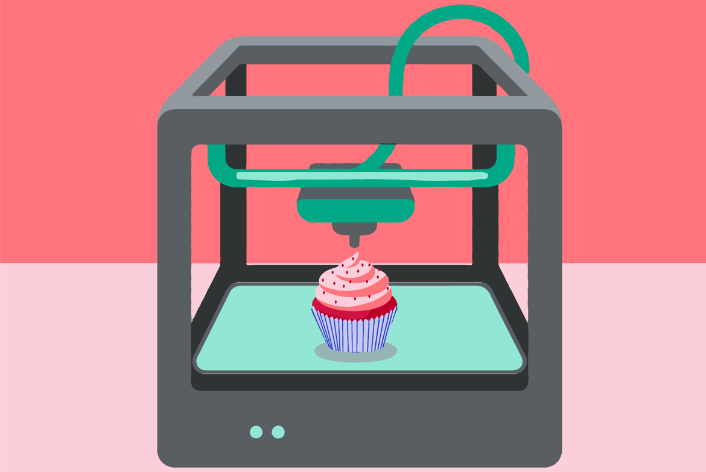
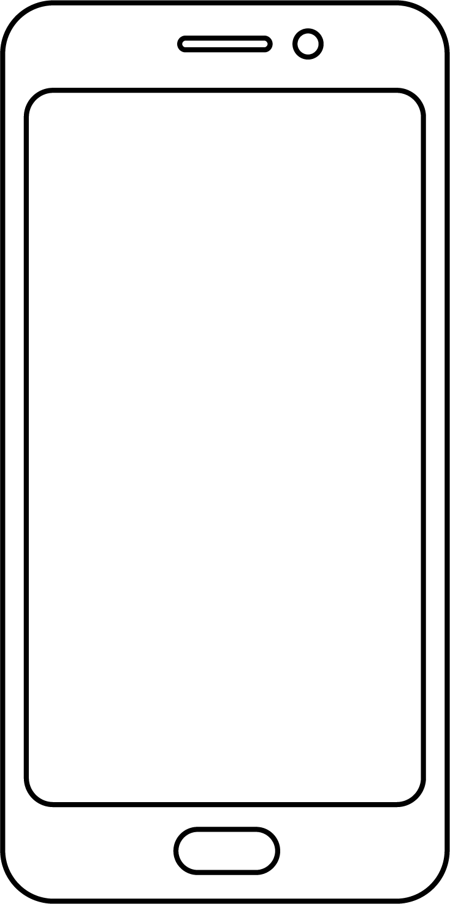

Дигитални уређаји у будућности
==============================

.. infonote::

 .. image:: ../../_images/robot11.png
    :height: 120
    :align: left

 Када урадиш дате задатке и одговориш на питања у лекцији биће ти јаснија улога дигиталних уређаја у будућности. Разумећеш и како би твоје свакодневне активности могле да се промене са развојем дигиталних уређаја.

Пажљиво погледај доње четири слике. 

.. questionnote::

 Шта представљају приказане слике? Именуј све уређаје који су приказани на сликама. 

| 

.. csv-table:: 
  :widths: auto
  :align: center
   
  "|rs|", "|vr|"
  "|tb|", "|3d|"
  "", ""

У радној свесци на страници **21** уз помоћ учитеља или учитељице напиши називе уређаје који су приказани на сликама.
Како они могу да помогну људима у будућности? Опиши.

 
.. questionnote::

  Технологија се стално мења. Да ли можеш да замислиш како ће изгледати дигитални уређаји у будућности? 

  У радној свесци на страници **22** нацртај дигиталне уређаје помоћу којих ћеш радити одређене врсте послова. 

.. questionnote::

 Објасни како ће дигитални уређаји помагати људима у будућности.

.. image:: ../../_images/robot13.png
    :width: 100
    :align: right

------------

**Домаћи задатак**

|

Да је позната историјска личност имала мобилни телефон за шта би га користила? Изабери историјску личност. А затим, у радној свесци на страници **23** попуни екран мобилног телефона сличицама (иконицама) апликација које би та историјска личност користила. 

Нека ти родитељ или теби блиска одрасла особа покаже које све апликације (програми) постоје на телефону за комуникацију, прављење слика или текста. Нацртај иконице или осмисли своје. 

|

            

.. questionnote::

 Објасни зашто си нацртао/ла баш те апликације.
