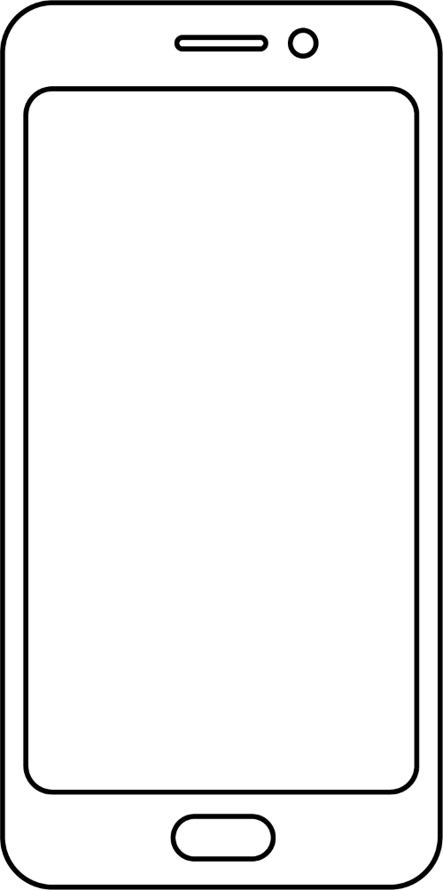

Дигитални уређаји у будућности
==============================

.. |rs| image:: ../../_images/robo_sah.png
            :width: 300px  

.. |3d| image:: ../../_images/3d_stampac_hrane.png
            :width: 300px  

.. |tb| image:: ../../_images/taksi_buducnosti.png
            :width: 300px  

.. |vr| image:: ../../_images/vr_komunikacija.png
            :width: 300px  

.. |line| image:: ../../_images/line.png
            :width: 200px  

.. |pzc| image:: ../../_images/prostor_za_crtanje.png
            :width: 300px  

.. infonote::

 .. image:: ../../_images/robot1a.png
    :height: 100
    :align: left

 Када урадиш дате задатке и одговориш на питања у лекцији бићеш у стању да размислиш о улози коју ће дигитални уређаји имати у будућности и како би наше 
 свакодневне активности могле да се развијају у наредним годинама.

 Пажљиво погледај доње четири слике. Шта представљају приказани предмети? На цртици испод слике именуј дати уређај. 

.. csv-table:: 
  :widths: auto
  :align: center
   
  "|rs|", "|vr|"
  "|line|", "|line|"
  "|tb|", "|3d|"
  "|line|", "|line|"

.. questionnote::

 Како они могу да помогну људима у будућности. Напиши.

 Упореди своје решење са другом или другарицом.

Технологија се стално мења. Да ли можеш да замислиш како ће изгледати дигитални уређаји у будућности? Нацртај дигиталне уређаје помоћу којих ћеш радити 
одређене врсте послова. 

|

.. csv-table::
  :widths: auto
  :align: center
   
   "Нацртај како ће изгледати дигитални уређај који ћеш у будућности носити на свом телу.", "Нацртај дигитални уређај који ћеш у будућности користити за забаву."
  "|pzc|", "|pzc|"
  "Нацртај дигитални уређај који ће ти у будућности помоћи да се на што бољи начин бринеш о животној средини.", "Нацртај један од дигитални уређаја који ће се у будућности користити како би се помогло особама које имају проблем са ходањем, слухом или видом."
  "|pzc|", "|pzc|"
  "", ""

.. questionnote::

 Објасни како ће ти дигитални уређаји помагати људима у будућности.

.. image:: ../../_images/robot5c.png
    :width: 100
    :align: right

------------

**Рад код куће**

Да је позната историјска личност имала мобилни телефон за шта би га користила? 

Изабери историјску личност, а затим попуни екран мобилног телефона сличицама (иконама) апликација које би користио/ла. Нека ти родитељ или теби блиска 
одрасла особа покаже које све апликације (програми) постоје на телефону за комуникацију, прављење слика или текста. Нацртај иконице или осмисли своје. 

|

            

.. questionnote::

 Објасни зашто си нацртао/ла баш те апликације.

.. image:: ../../_images/prostor_za_crtanje.png
    :width: 500
    :align: center