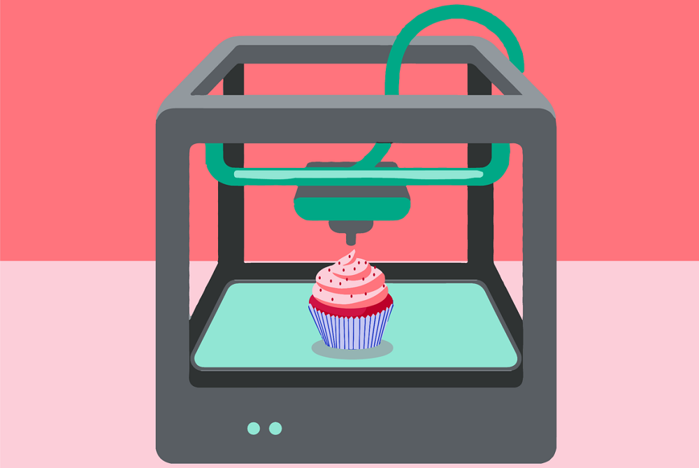
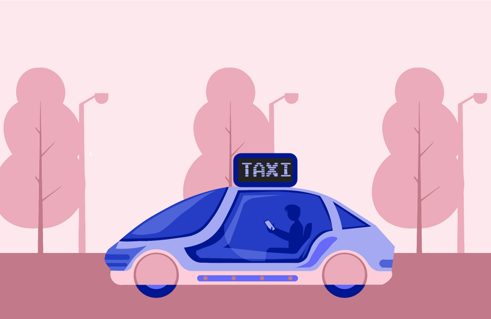

Дигитални уређаји у будућности
==============================

.. |vr| image:: ../../_images/vr_komunikacija.png
            :width: 300px  

.. infonote::

 .. image:: ../../_images/robot11.png
    :height: 120
    :align: left

 Када урадиш дате задатке и одговориш на питања у лекцији бићеш у стању да размислиш о улози коју ће дигитални уређаји имати у будућности и како би наше 
 свакодневне активности могле да се развијају у наредним годинама.

 Пажљиво погледај доње четири слике. Шта представљају приказане слике? Именуј све уређаје који су приказани на сликама. 

| 

.. csv-table:: 
  :widths: auto
  :align: center
   
  "|rs|", "|vr|"
  "|tb|", "|3d|"
  "", ""

.. У радној свесци на страни XX уз помоћ учитеља или учитељице напиши називе уређаје који су приказани на сликама.
 Како они могу да помогну људима у будућности. Опиши.

.. 
  .. questionnote::

.. Технологија се стално мења. Да ли можеш да замислиш како ће изгледати дигитални уређаји у будућности? 

.. У радној свесци на страни XX нацртај дигиталне уређаје помоћу којих ћеш радити одређене врсте послова. 

.. questionnote::

 Објасни како ће ти дигитални уређаји помагати људима у будућности.

.. image:: ../../_images/robot13.png
    :width: 100
    :align: right

------------

.. **Домаћи задатак**

|

.. Да је позната историјска личност имала мобилни телефон за шта би га користила? Изабери историјску личност. А затим, у радној 
 свесци на страни **XX** попуни екран мобилног телефона сличицама (иконама) апликација које би користио/ла. 

.. Нека ти родитељ или теби блиска одрасла особа покаже које све апликације (програми) постоје на телефону за комуникацију, 
 прављење слика или текста. Нацртај иконице или осмисли своје. 

|

.. image:: ../../_images/telefonzadatak.png
    :width: 150
    :align: center
            

.. questionnote::

 Објасни зашто си нацртао/ла баш те апликације.
