Креативно изражавање помоћу дигиталних уређаја
==============================================

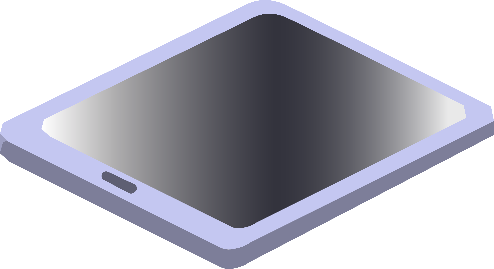

.. |pametni_telefon| image:: ../../_images/pametni_telefon.png
    :height: 100px

.. |surround| image:: ../../_images/surround.png
    :height: 100px

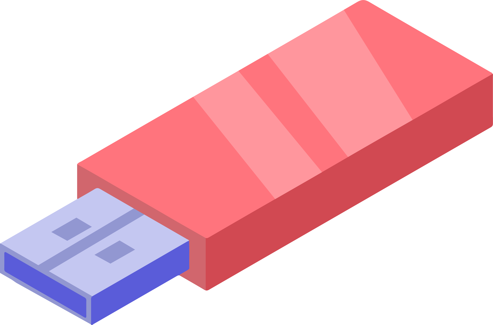

.. |kv| image:: ../../_images/kv.png
            :height: 15px  

.. |aa| image:: ../../_images/analogni_aparat.png
    :height: 100px  

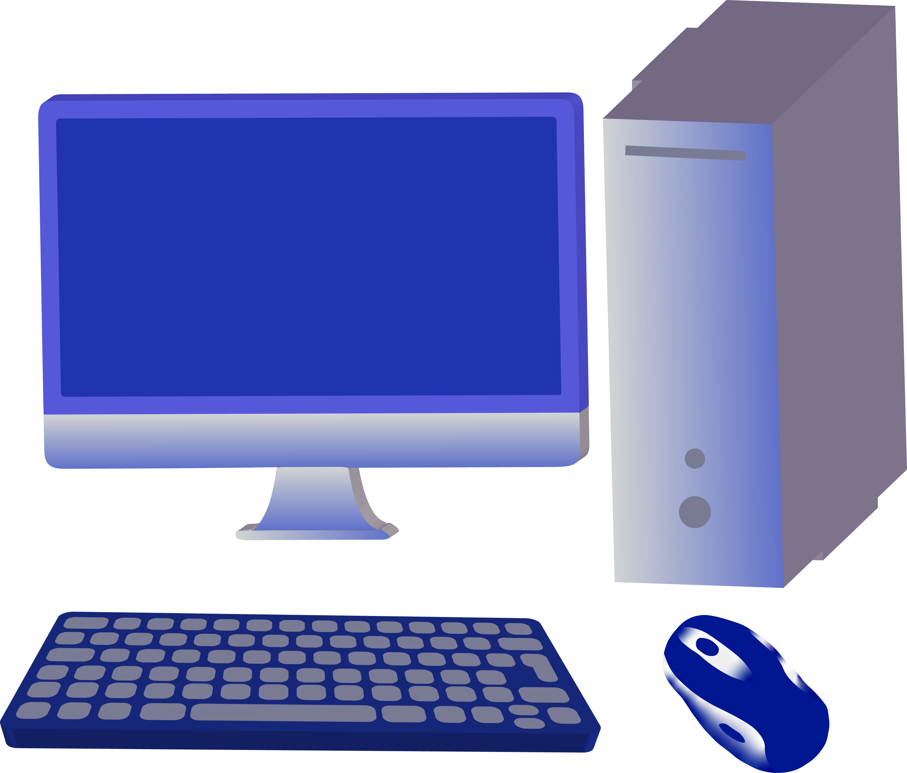

.. |laptop| image:: ../../_images/laptop.png
    :height: 100px

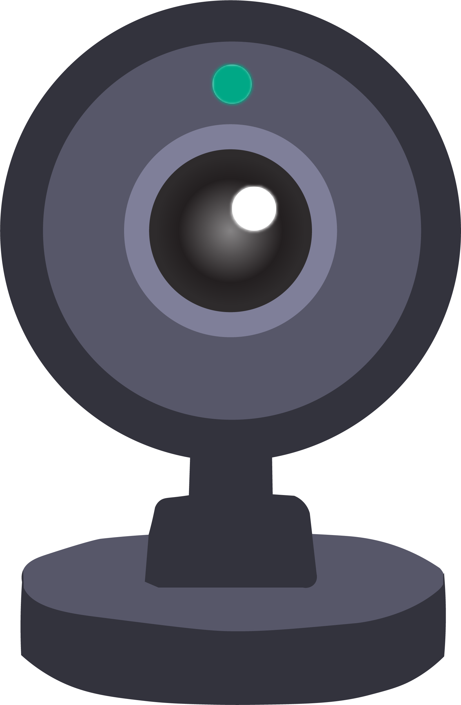

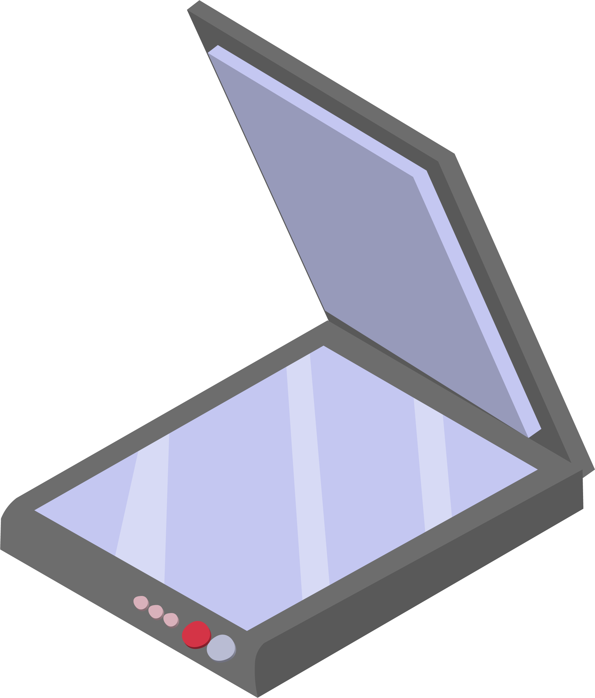

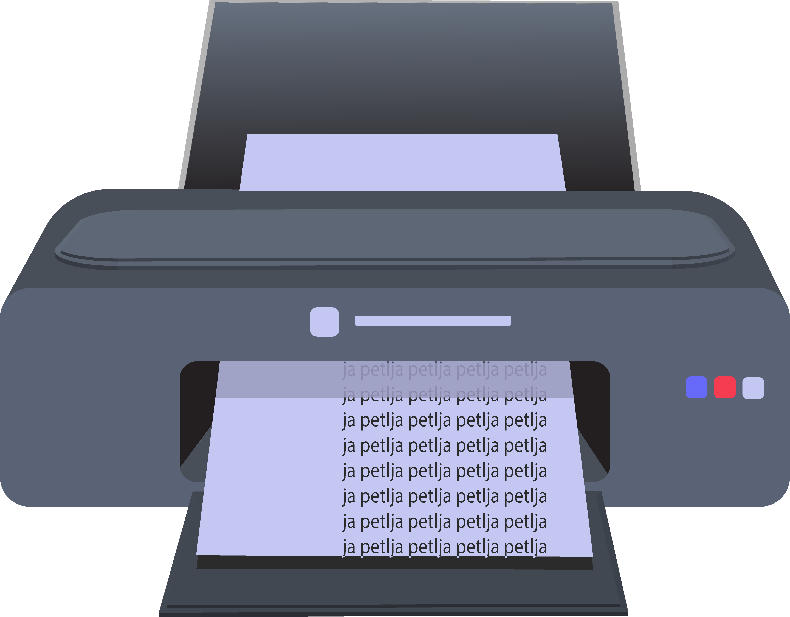

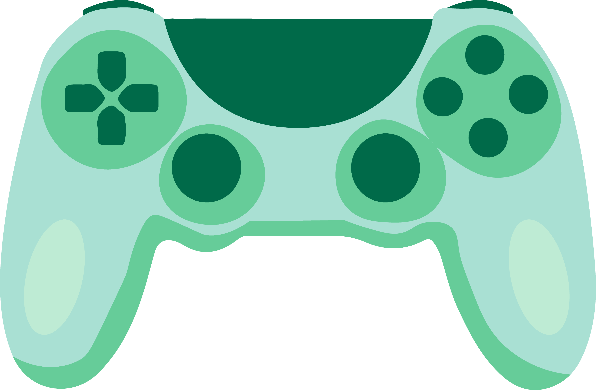

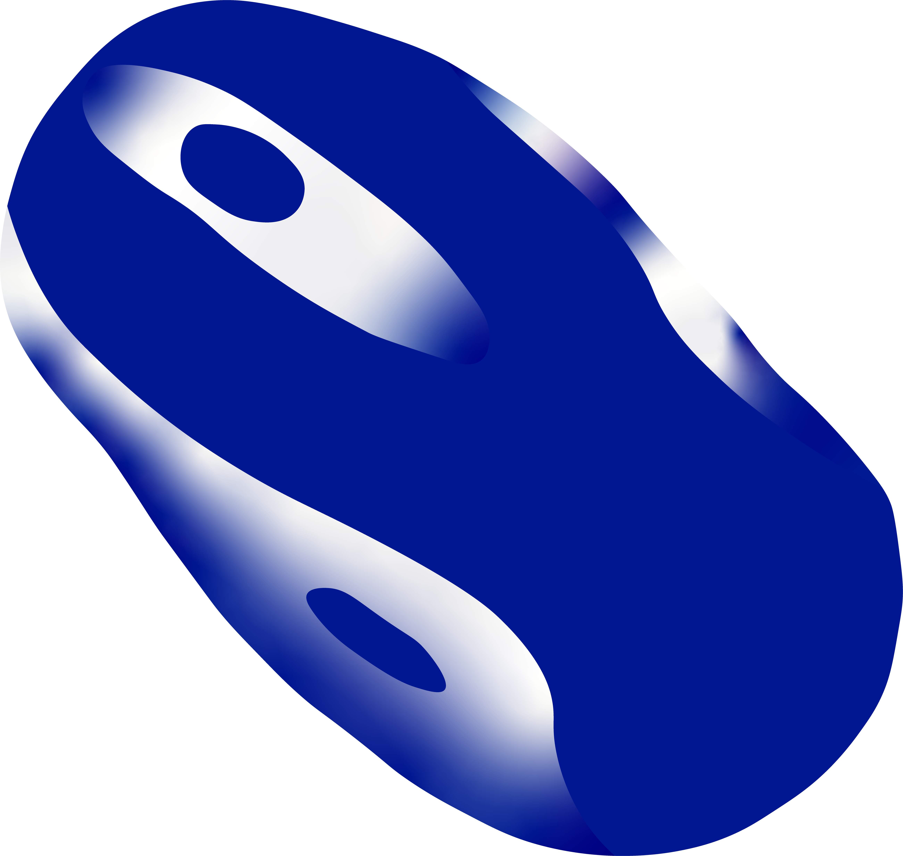

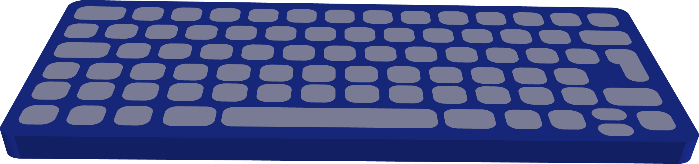

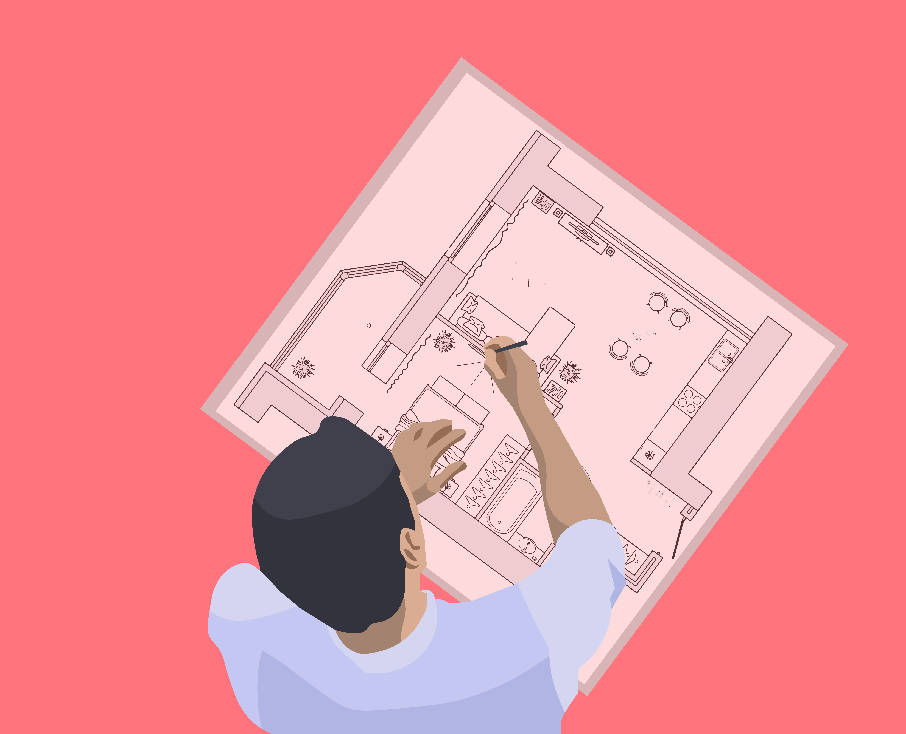

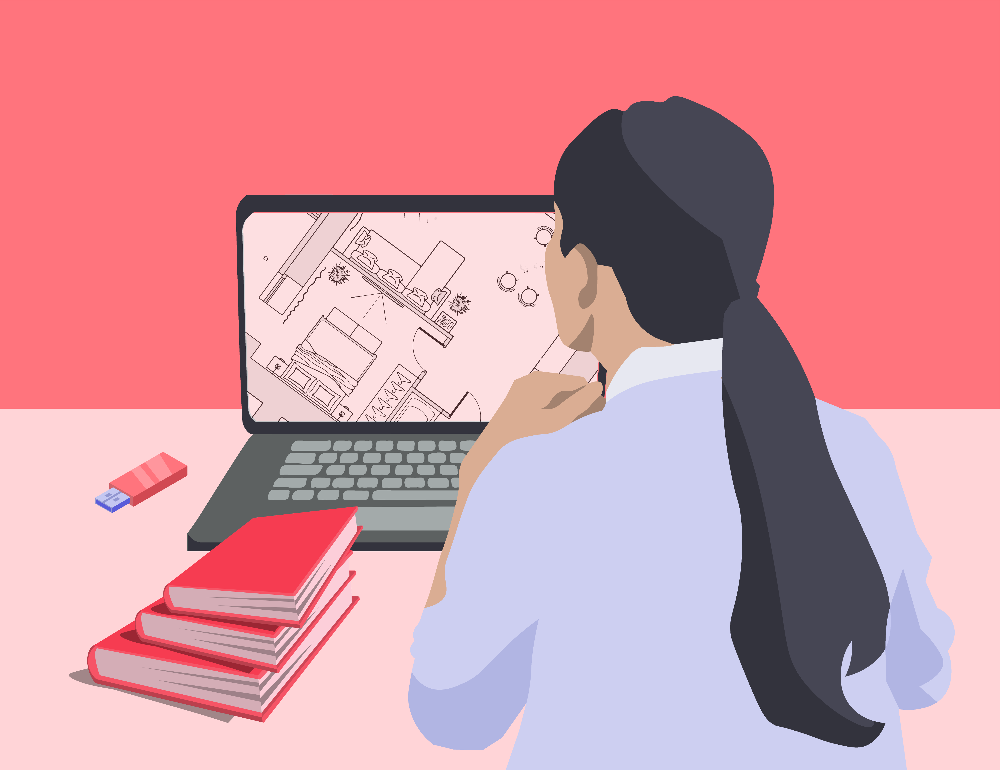

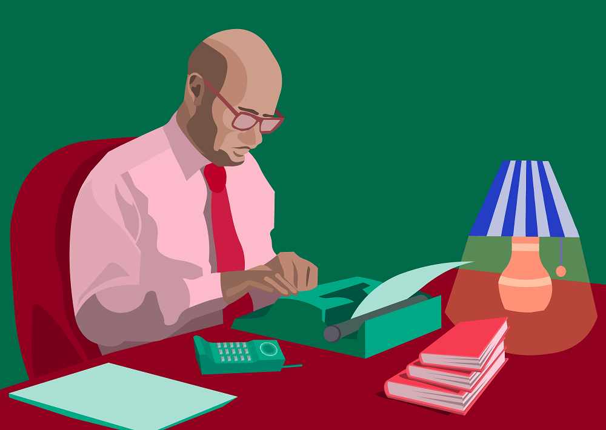

.. infonote::

 .. image:: ../../_images/robot1a.png
    :height: 100
    :align: left

 Када урадиш дате задатке и одговориш на питања у лекцији знаћеш да упоредиш начине креативног изражавања са дигиталним уређајима и без њих.

 |

Користећи један дигитални уређај можеш да ствараш слике, текст али и да решаваш најразличитије проблеме. Другим речима, помоћу дигиталног уређаја можеш да 
испољиш своју креативност на најбољи могући начин.

Обој квадратић испод сваке слике уређаја који можеш да користиш за:

.. csv-table::
   :header: "**Пуштање и креирање музике**"
   :widths: auto
   :align: center

   "|tablet|", "|pametni_telefon|", "|usb|","|surround|"
   "|kv|", "|kv|", "|kv|","|kv|"
   "|line|", "|line|", "|line|", "|line|"

.. csv-table::
   :header: "**Може да слика**"
   :widths: auto
   :align: center

   "|aa|", "|komp|", "|laptop|","|web|"
   "|kv|", "|kv|", "|kv|","|kv|"
   "|line|", "|line|", "|line|", "|line|"
 
.. csv-table::
   :header: "**Може да шаље слике**"
   :widths: auto
   :align: center

   "|skener|", "|stampac|", "|konzola|","|pametni_telefon|"
   "|kv|", "|kv|", "|kv|","|kv|"
   "|line|", "|line|", "|line|", "|line|"
 
.. csv-table::
   :header: "**Може помоћи да пишете текст**"
   :widths: auto
   :align: center

   "|slusalice|", "|mis|", "|tastatura|","|komp|"
   "|kv|", "|kv|", "|kv|","|kv|"
   "|line|", "|line|", "|line|", "|line|"
 

Упореди своје решење са другом или другарицом. 

.. questionnote::

 Именуј све уређаје. Напиши име уређаја на цртици која се налази испод сваког уређаја. Како користиш сваки од ових уређаја?

Пажљиво погледај обе слике.

.. csv-table:: 
   :widths: auto
   :align: center

   "|arhitekta|", "|arhitekta2|"
   "   ", "  "

.. questionnote::

 Напиши каква је разлика између ове две слике - у чему се разликује креативни рад са и без дигиталних уређаја?

.. csv-table::
   :header: "**Креативан рад архитекте без употребе дигиталног уређаја**", "**Креативан рад архитекте уз употребу дигиталног уређаја**" 
   :widths: auto
   :align: center

   "", ""
   
|

|

|

-------------

.. image:: ../../_images/robot5c.png
    :width: 100
    :align: right

------------

**Рад код куће**

Пажљиво проучи слике.

.. csv-table:: 
   :widths: auto
   :align: center

   "|retro_novinar|", "|savremeni_novinar|"
   "   ", "  "

Попуни следећи табелу. Обој квадратић испод писца на кога се дато тврђење односи.

.. csv-table:: 
   :header: "                 ", "**Прва слика**", "**Друга слика**"
   :widths: auto
   :align: left

   "Лакше исправља грешке.", "|kv|", "|kv|"
   "Може лако да мења редослед речи у реченици.", "|kv|", "|kv|"
   "Користи папир.", "|kv|", "|kv|"
   "Чува дрвеће.", "|kv|", "|kv|"
   "Брзо мења величину слова.", "|kv|", "|kv|"
   "Лако додаје слику у текст.", "|kv|", "|kv|"

