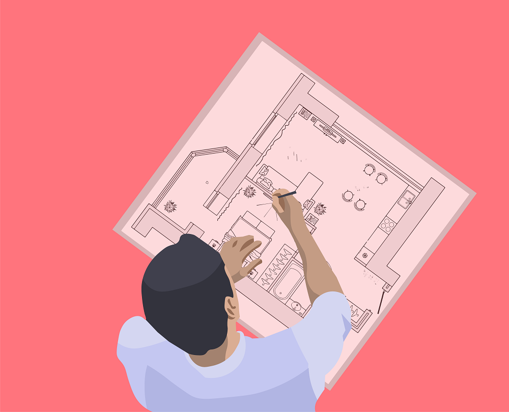
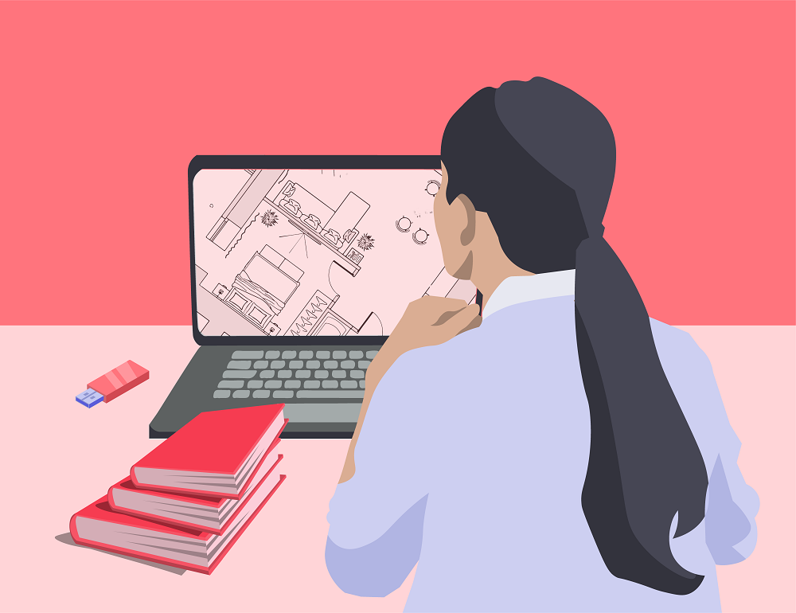

Креативно изражавање помоћу дигиталних уређаја
==============================================

.. |kv| image:: ../../_images/kv.png
            :height: 15px

.. infonote::

 .. image:: ../../_images/robot11.png
    :height: 120
    :align: left

 Када урадиш дате задатке и одговориш на питања у лекцији знаћеш да упоредиш начине креативног изражавања са дигиталним уређајима и без њих.

|

Користећи један дигитални уређај можеш да ствараш слике, текст али и да решаваш најразличитије проблеме. Другим речима, помоћу дигиталног уређаја можеш да 
испољиш своју креативност на најбољи могући начин.

Обој квадратић испод сваке слике уређаја који можеш да користиш за:

.. csv-table::
   :header: "**Пуштање и креирање музике**"
   :widths: auto
   :align: center

   "|kv|", "|kv|", "|kv|","|kv|"

.. csv-table::
   :header: "**Може да слика**"
   :widths: auto
   :align: center

 
   "|kv|", "|kv|", "|kv|","|kv|"
  
 
.. csv-table::
   :header: "**Може да шаље слике**"
   :widths: auto
   :align: center

  
   "|kv|", "|kv|", "|kv|","|kv|"
  
 
.. csv-table::
   :header: "**Може помоћи да пишете текст**"
   :widths: auto
   :align: center

   "|kv|", "|kv|", "|kv|","|kv|"
 
 

Упореди своје решење са другом или другарицом. 

.. questionnote::

Именуј дате уређаје. 

Како користиш сваки од ових уређаја?

------------------

Пажљиво погледај обе слике.

.. csv-table:: 
   :widths: auto
   :align: center

   "|arhitekta|", "|arhitekta2|"
   "   ", "  "

.. questionnote::

 Опиши каква је разлика између ове две слике - у чему се разликује креативни рад архитекте са и без дигиталних уређаја?

|

-------------

.. image:: ../../_images/robot13.png
    :width: 100
    :align: right

**Домаћи задатак**

|

Пажљиво проучи слике.

.. csv-table:: 
   :widths: auto
   :align: center

   "|retro_novinar|", "|savremeni_novinar|"
   "   ", "  "

У радној свесци на страни **XX** обој квадратић испод писца на кога се дато тврђење односи

.. csv-table:: 
   :header: "                 ", "**Прва слика**", "**Друга слика**"
   :widths: auto
   :align: left

   "Лакше исправља грешке.", "|kv|", "|kv|"
   "Може лако да мења редослед речи у реченици.", "|kv|", "|kv|"
   "Користи папир.", "|kv|", "|kv|"
   "Чува дрвеће.", "|kv|", "|kv|"
   "Брзо мења величину слова.", "|kv|", "|kv|"
   "Лако додаје слику у текст.", "|kv|", "|kv|"

