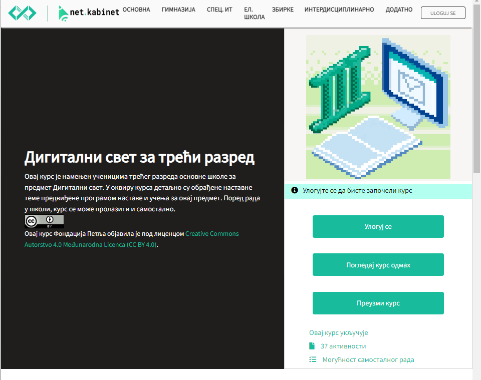
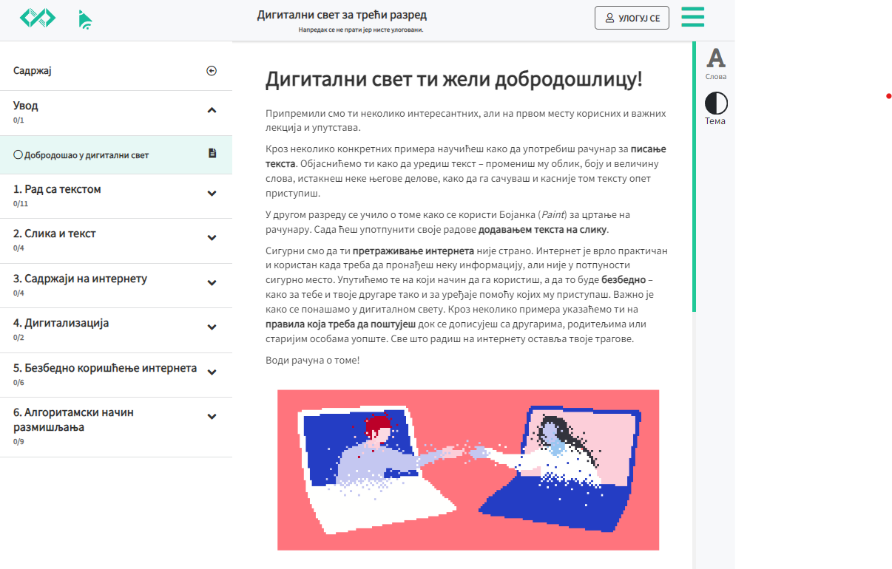
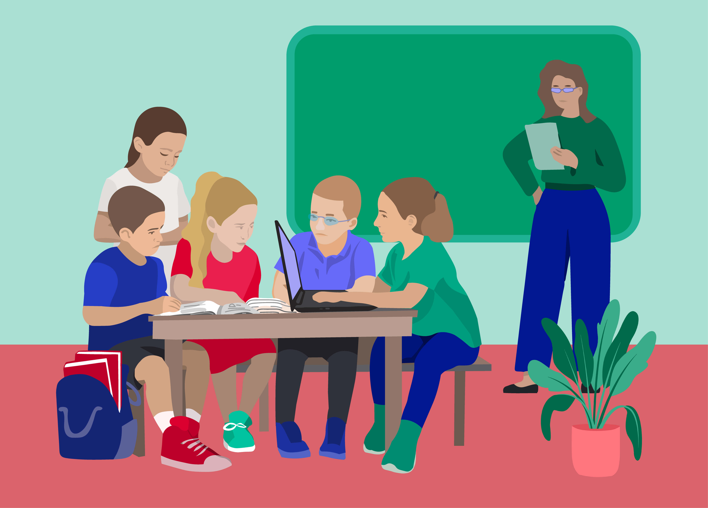
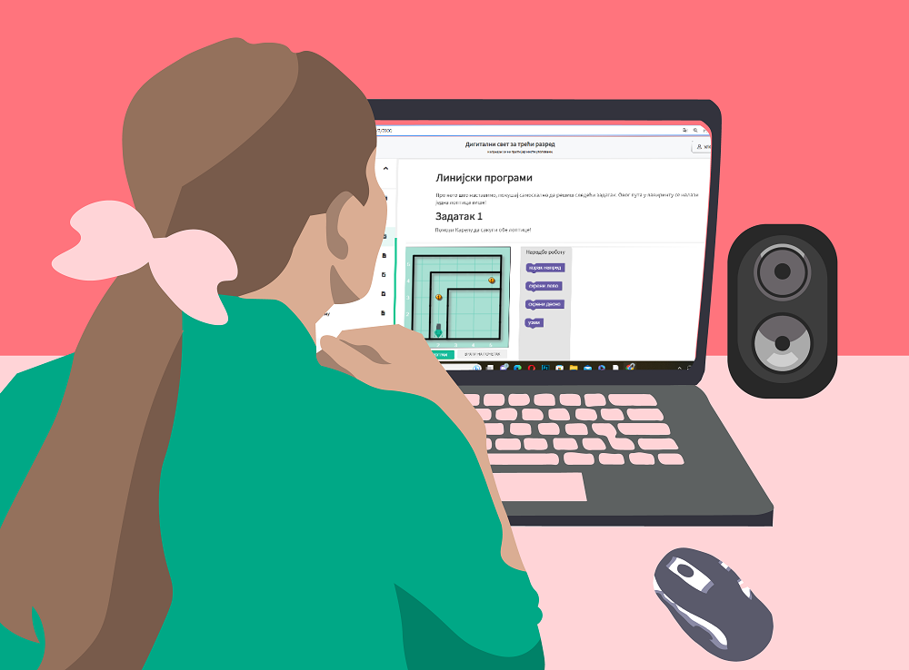

Папирни и дигитални уџбеник
===========================

.. |kv| image:: ../../_images/kv.png
            :height: 15px  

.. |sl| image:: ../../_images/slika.png
    :width: 350px  

.. infonote::

 .. image:: ../../_images/robot11.png
    :height: 120
    :align: left

 Када урадиш дате задатке и одговориш на питања која су предвиђена за ову лекцију знаћеш како да уз помоћ учитеља/учитељице или друге теби блиске одрасле особе 
 користиш дигиталне уџбенике за учење. Поред тога знаћеш које су предности и недостаци дигиталних и папирних уџбеника. 

Пажљиво погледај слику. 

У радној свесци на страници **26** заокружи све дигиталне уређаје које препознајеш на слици. Именуј све уређаје.

.. questionnote::

 На који начин девојчица у зеленој мајици може да провери да ли је добро одговорила на питања? Зашто то дечак са црвеним патикама не 
 може да уради? Опиши.

Да ли можеш да наведеш разлику између писаних и дигиталних уџбеника? У радној свесци на страници **27** oбој квадратић испод слике 
уџбеника на који се односи дато тврђење.

.. csv-table:: 
   :header: "                 ", "**Папирни уџбеник**", "**Дигитални уџбеник**"
   :widths: auto
   :align: left

   "Садржи текст", "|kv|", "|kv|"
   "Садржи различите слике", "|kv|", "|kv|"
   "Могуће је цртање, писање и бојење", "|kv|", "|kv|"
   "Могуће је играти игре", "|kv|", "|kv|"
   "Можеш одмах да провериш решења задатака", "|kv|", "|kv|"
   "Можеш одмах да провериш одговоре на постављена питања", "|kv|", "|kv|"
   "Можеш да слушаш приче или песме", "|kv|", "|kv|"
   "Можеш да одгледаш видео-запис", "|kv|", "|kv|"
   "Потребан је дигитални уређај", "|kv|", "|kv|"
   "Потребан је интернет", "|kv|", "|kv|"
   "Користиш га уз присуство одрасле особе", "|kv|", "|kv|"

.. questionnote::

 Који уџбеник радије користиш? Објасни зашто.

Један дигитални уређај ти је довољан да приступиш свим дигиталним уџбеницима.

.. infonote::

 .. image:: ../../_images/robot2.png
    :height: 150
    :align: left

 |

 Дигитални уџбеник увек користи у присуству учитеља, учитељице, родитеља или теби блиске одрасле особе.

 |

Заједно са учитељем или учитељицом истражи дигитални уџбеник.

.. csv-table:: 
   :widths: auto
   :align: center

   "|slika34|", "|slika35|"
   

.. questionnote::

 Опиши шта ти се највише допада када користиш дигитални уџбеник. 

Погледај доњу слику.

|

.. questionnote::

 Опиши како девојчица приступа предметима које има у првом разреду.   

Дигиталној учионици можеш да приступиш коришћењем корисничког имена и лозинке. Без интернета и дигиталног уређаја не можеш да 
приступиш дигиталној учионици. 

Корисничко име може да буде било која реч, али је пожељно да када користиш школску дигиталну учионицу корисничко име 
буде твоје име и презиме. 

 
.. questionnote::

 У радној свесци на страници **28** напиши твоје корисничко име.

Лозинка или шифра се састоји од бројева, слова и знакова. Свака лозинка треба да се састоји од најмање осам карактера. Лозинку треба да знају твоји родитељи.
У радној свесци на страници **28** осмисли и напиши своју лозинку.

.. image:: ../../_images/robot13.png
    :width: 100
    :align: right

------------

**Домаћи задатак**

|

Уз помоћ родитеља или теби блиске одрасле особе истражи дигиталну учионицу на адреси https://petlja.org/

|

