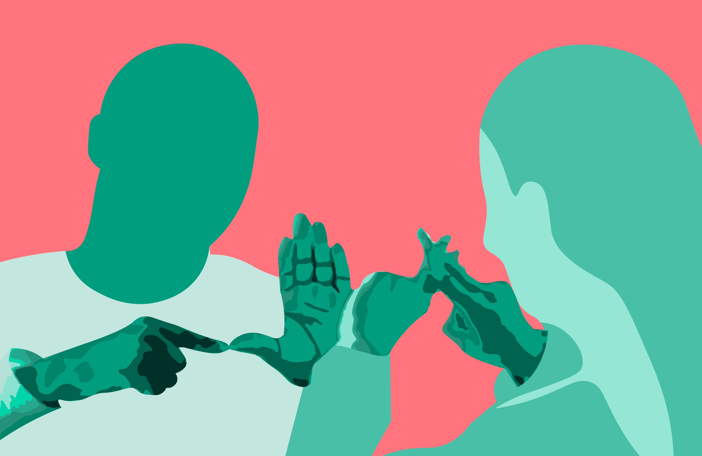
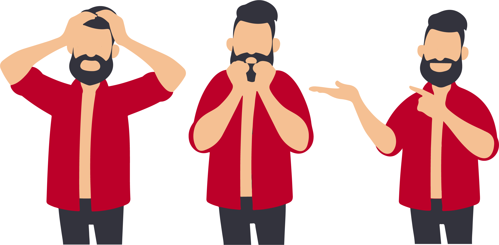
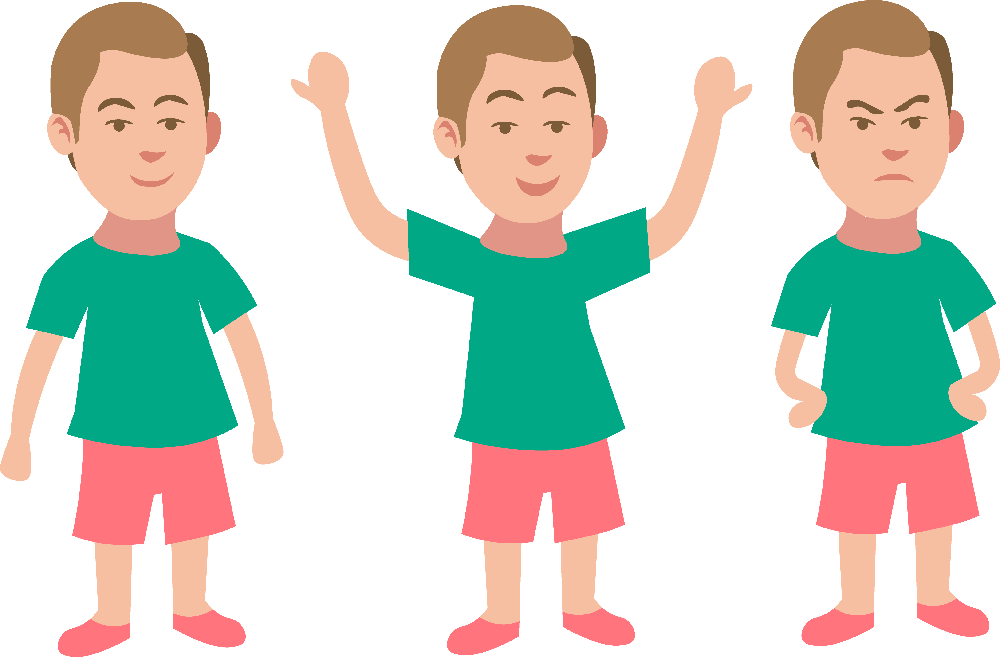
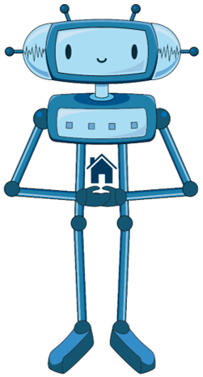

Комуникација је преношење порука
================================

   

.. infonote::

 .. image:: ../../_images/robot11.png
    :height: 120
    :align: left

 Када урадиш дате задатке и одговориш на питања у лекцији знаћеш да упоредиш начине комуникације уз помоћ дигиталног 
 уређаја и без њега.

 |

Пажљиво погледај све три слике.

.. csv-table:: 
   :widths: auto
   :align: left

   "|govor_tela|", "|znakovni_jezik|", "|izrazi_lica|"
   "", "", ""

.. questionnote::

 Опиши на који начин људи на горњим сликама комуницирају. 

.. quizq::
   
    Слика којом је предсатвљено неко осећање обележена је бројем. Повежи одговарајућа осећања са бројем којим је приказан израз лица особе.

    |

    .. image:: ../../_images/emocije1.png
            :width: 500px
            :align: center

    .. dragndrop:: d110а
        :feedback: Покушајте поново.
        :match_1: 1 ||| срећан
        :match_2: 2 ||| тужан
        :match_3: 3 ||| зачуђен
        :match_4: 4 ||| бесан
        :match_5: 5 ||| изненађен

.. quizq::
   
    Слика којом је представљено неко осећање обележена је бројем. Повежи одговарајућа осећања са бројем којим је приказан израз лица особе.

    |

    .. image:: ../../_images/emocije2.png
            :width: 500px
            :align: center

    .. dragndrop:: d110b
        :feedback: Покушајте поново.
        :match_1: 1 ||| уплашен
        :match_2: 2 ||| разочаран
        :match_3: 3 ||| заљубљен
        :match_4: 4 ||| постиђен
        :match_5: 5 ||| забринут

Начин на који људи комуницирају мењао се из дана у дан.

Пажљиво проучи доњу слику.

.. image:: ../../_images/istorijski_razvoj_komunikacije.png
    :width: 600
    :align: center

.. questionnote::

 Дискутуј са својим друговима и другарицама о томе како се кроз историју развијао начин комуникације међу људима. 
 
 Опиши сваки од приказаних начина комуникације.

------------

**Домаћи задатак**

|

У радној свесци на страници **XX** oбој квадратић испред тврдњи које описују шта је комуникацију.

.. csv-table:: 
  :widths: 40, 300
  :align: left

  "|kv|", "Коришћење речи, звукова, знакова или понашања за размену информација."
  "|kv|", "Изражавање својих идеја, мисли или осећања."
  "|kv|", "Размена информација."
  "|kv|", "Говор, писање или цртање."
  "|kv|", "Слање или примање информација."

------------

.. questionnote::

 Повежи појмове комуникације са бројем којим је представљена слика.

.. quizq::
   
    Повежи појмове комуникације са бројем којим је представљена слика.

    |

    .. image:: ../../_images/p110c.png
            :width: 780px
            :align: center

    .. dragndrop:: d110c
        :feedback: Покушајте поново.
        :match_1: 1 ||| голуб писмоноша
        :match_2: 2 ||| пећинска слика
        :match_3: 3 ||| радио
        :match_4: 4 ||| димни сигнали
        :match_5: 5 ||| телевизор

   
