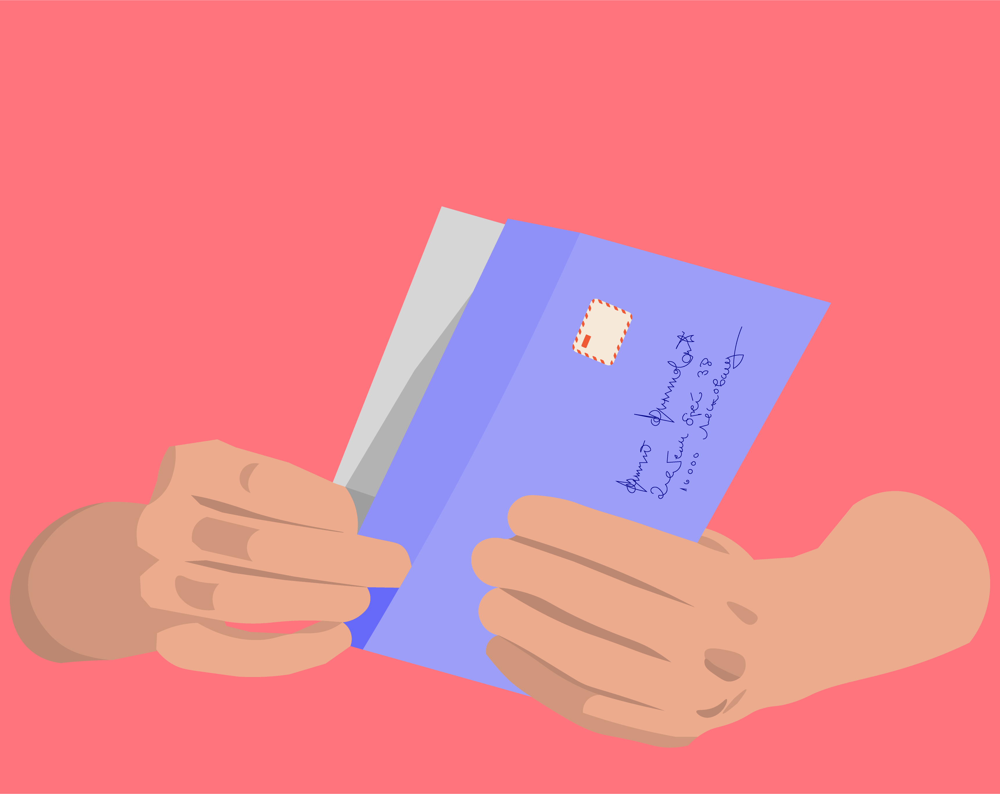
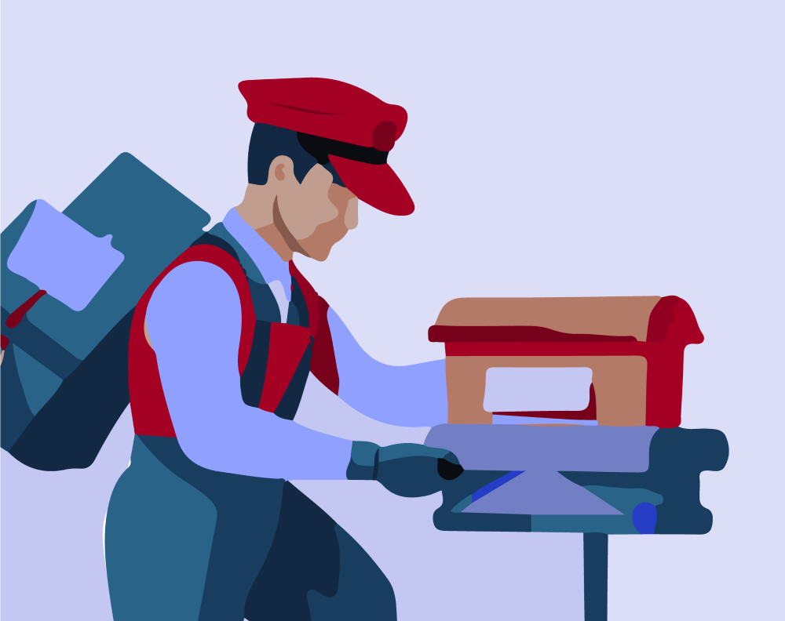
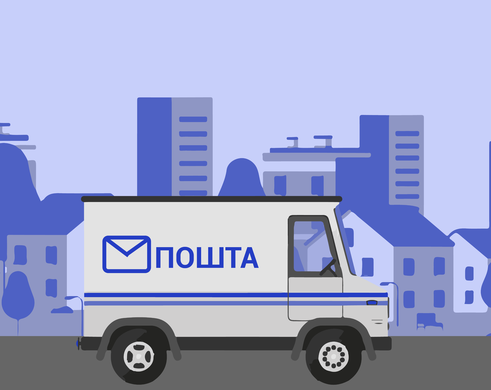
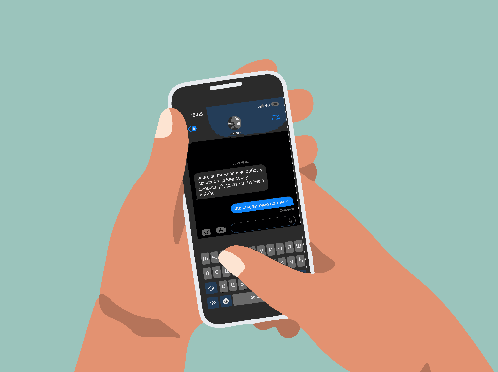
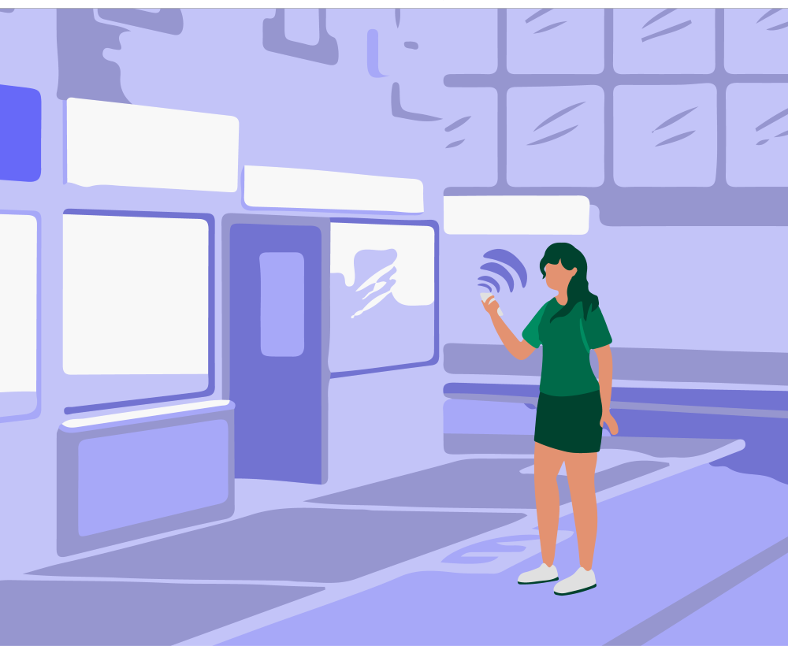
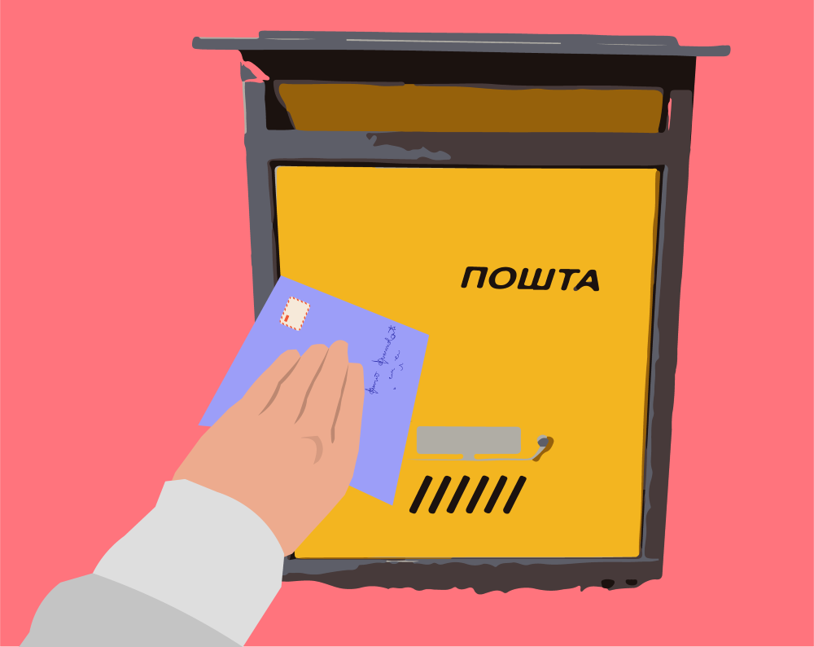

Писана комуникација некада и сада
=================================

            

                     

.. infonote::

 .. image:: ../../_images/robot1a.png
    :height: 100
    :align: left

 Када урадиш дате задатке и одговориш на питања у лекцији бићеш у стању да упоредиш начине комуникације који су се користили 
 радиционално са онима који се користе помоћу дигиталних уређаја. 

Пажљиво проучи доње слике.

.. csv-table:: 
  :widths: auto
  :align: center

  "|adr|", "|citanje|", "|pisanje|", "|postar|",  
  "**1**", "**2**", "**3**", "**4**"
  "", "", "", "", "", "", ""

.. csv-table:: 
  :widths: auto
  :align: center

   "|posta|", "|u_koverat|", "|u_sanduce|" 
   "**5**", "**6**", "**7**"
  "", "", ""

Означи бројевима редослед и именуј кораке при слању писма поштом.
  
.. questionnote::

  За колико времена писмо стигне до примаоца? Од чега то зависи?

  Колико је особа укључено у комуникацију? 

.. csv-table:: 
  :widths: auto
  :align: center

  "|jeca|", "|jecine_ruke|", "|jecine_ruke2|", "|mica_u_parku|", "|ruke|"
  "**1**", "**2**", "**3**", "**4**", "**5**"
  "", "", "", "", ""

.. questionnote::

 За колико времена порука стигне до примаоца? Од чега то зависи?

Попуни доњу табелу. Напиши како су се наведени задаци обављали пре него што су људи имали дигиталне уређаје, 
а како те задатке обављају сада када имају дигиталне уређаје. 

--------------

.. csv-table:: 
  :header: "", "**Пре проналаска дигиталних уређаја**", "**Када су пронађени дигитални уређаји**"
  :widths: auto
  :align: left

  "**Писање писма**", "Користећи оловку напиши писмо и пошаљи га поштом.", ""
  "**Куповина хране**", "", "Користећи оловку напиши писмо и пошаљи га поштом."
  "**Пронађи потребне инфорамције за домаћи задатак**", "", ""
  "**Комуникација са другом или другарицом која живи далеко**", "", ""
  "**Стварање слике**", "", ""
  "", "", ""

.. questionnote::

 .. image:: ../../_images/robot3c.png
    :height: 120
    :align: left

 Да ли мислиш да је ове задатке лакше радити уз помоћ дигиталног уређаја или без њега? Објасни свој одговор.

 |

.. image:: ../../_images/robot5c.png
    :width: 100
    :align: right

------------

**Рад код куће**

.. dragndrop:: d111
    :feedback: Покушајте поново.
    :match_1: прималац ||| особа која прима поруку
    :match_2: пошиљалац ||| особа која шаље поруку и започиње комуникацију.

    Спој одговарајуће појмове са њиховим описом.

.. questionnote::

 Напиши писмо свом другу или другарици. Пошаљи га поштом. Нека ти у томе помогну родитељи или теби блиска одрасла особа.

