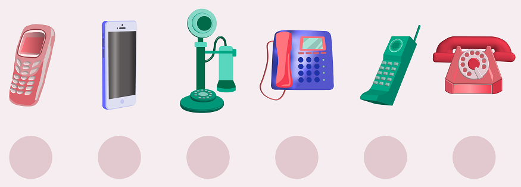

Комуницираш помоћу телефона
===========================

.. |kv| image:: ../../_images/kv.png
            :height: 15px  

.. |ajfon| image:: ../../_images/ajfon.png
            :height: 150px  

.. infonote::

 .. image:: ../../_images/robot1a.png
    :height: 100
    :align: left

 Када урадиш дате задатке и одговориш на питања у лекцији бићеш у стању да упоредиш начине комуникације који су се користили у 
 прошлости са онима који се данас остварују помоћу дигиталних уређаја.

Технологија се веома брзо мења. Испод су слике различитих телефона. 

Упиши бројеве од 1 до 5 у поља испод сваке слике да телефоне поређаш од најстаријег до најновијег. Број 1 представља најстарији 
уређај.

-----------

Замисли како ће изгледати комуникације међу људима у будућности. Нацртај како ће изгледати телефон у будућности. 

.. image:: ../../_images/prostor_za_crtanje.png
    :width: 500
    :align: center

.. questionnote::

 Које карактеристике ће имати? Како ћемо отварати и користити апликације? 

 Немој да заборавиш која је основна функција телефона, а то је да помоћу њега можеш да комуницираш са другим људима.

 Напиши како ће се разликовати од уређаја које данас користиш?

Обој квадратић црвеном бојом испред исказа који је тачан за црвени телефон, плавом бојом исказ који је тачан за мобилни уређај, 
и зеленом бојом исказ који је тачан за оба ова уређаја.

.. csv-table:: 
   :widths: auto
   :align: center

   "|ajfon|", "|fiksni|"
   "", ""

.. csv-table:: 
  :widths: auto
  :align: left

   "|kv|", "Телефонски бројеви се позивају окретањем бројчаника."
   "|kv|", "Могу да га телефонирам и шаљем писма."
   "|kv|", "Могу да га користим само у кући."
   "|kv|", "Могу да користим било где."
   "|kv|", "Могу да шаљем текстуалне поруке."
   "|kv|", "Могу да обављам телефонске разговоре."
   "|kv|", "Мора да буде стално укључен да бисмо могли да га користимо."
   "|kv|", "Телефонски бројеви се позивају притиском на слушалицу."
   "|kv|", "Може да се користи за телефонске позиве, видео позиве, слање е-поште и текстуалне поруке, а могу се играти и игрице."
   "", ""

.. image:: ../../_images/robot5c.png
    :width: 100
    :align: right

------------

**Рад код куће**

Током свог живота, користићеш различите начине комуникације са људима. Обој квадратић којим потврђујеш да ли користиш наведени тип комуникације. 

.. csv-table:: 
  :header: "**Тип комуникације**", "**Користим**", "**Нећу да користим**", "**Користићу када порастем**"
  :widths: auto
  :align: left

   "Телeфон", "|kv|", "|kv|", "|kv|"
   "Мобилни телефон", "|kv|", "|kv|", "|kv|" 
   "Електронска пошта", "|kv|", "|kv|", "|kv|" 
   "Писмо", "|kv|", "|kv|", "|kv|" 
   "Говор тела", "|kv|", "|kv|", "|kv|" 
   "Телеграм", "|kv|", "|kv|", "|kv|" 
   "СМС/ММС", "|kv|", "|kv|", "|kv|" 
   "Друштвене мреже", "|kv|", "|kv|", "|kv|" 
   "", "", ""

