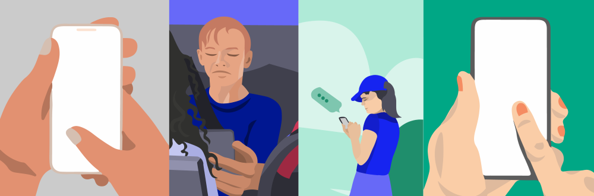
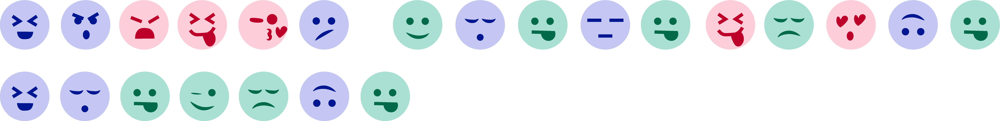
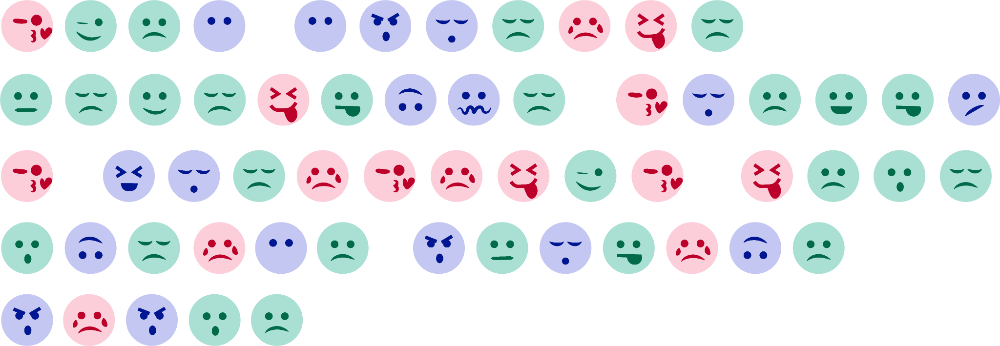

Лепо понашање у комуникацији помоћу дигиталних уређаја
======================================================

.. |kv| image:: ../../_images/kv.png
            :height: 15px  

.. infonote::

 .. image:: ../../_images/robot1a.png
    :height: 100
    :align: left

 Када урадиш дате задатке и одговориш на питања у лекцији бићеш у могућности да поредиш традиционалне облике комуникације са 
 комуникацијом преко дигиталних уређаја, а такође и да размислиш о важности лепог понашања при комуникацији помоћу дигиталних 
 уређаја. 

**Обој квадратић зеленом бојом испред тврдњи која тачно описује сличност између писма и мејла (електронског писма).**

.. csv-table:: 
  :widths: auto
  :align: left

   "|kv|", "Можеш да шаљеш мејл и писма у поштанско сандуче."
   "|kv|", "Помоћу мејла и писма преносиш поруке људима."
   "|kv|", "Писма и мејл су писане поруке."
   "|kv|", "Баке, деке и родитељи су слали мејлове и писма када су били млади."
   "", ""

.. questionnote::

 Напиши једну твоје тврдњу којом описујеш сличност између писма и мејла.

-----------

**Обој квадратић зеленом бојом испред тврдње која тачно описује разлику између писма и мејла.** 

.. csv-table:: 
  :widths: auto
  :align: left

   "|kv|", "Мејл шаљеш електронски, док писма шаљеш поштом."
   "|kv|", "Писма и мејл пишеш руком."
   "|kv|", "Потребан је рачунар да би се послало писмо, али није потребан за слање мејла."
   "|kv|", "Баке и деке су слале писма када су били мали, али се мејл данас углавном користи."
   "", ""

.. questionnote::

 Напиши једну твоју тврдњу којом описујеш разлику између писма и мејла.

.. infonote::

 .. image:: ../../_images/robot2.png
    :height: 150
    :align: left

 |

 **Јако је важно да поред тога што у свакодневној комуникацији правилно говориш и пишеш, то радиш и када користиш дигиталне уређаје.**
 
 |

Када комуницираш помоћу дигиталног уређаја мораш да поштујеш неколико правила:

.. image:: ../../_images/slika.png
    :width: 600
    :align: center

--------

Напиши поруке које ће разменити дечак и девојчица. Лево од дечака напиши његове поруке које је послао девојчици, а десно од девојчице 
напиши њене одговоре које је она послала дечаку. Њих двоје комуницирају на леп начин. 

Поштуј правила добре комуникације помоћу дигиталног уређаја. 

|

.. image:: ../../_images/robot5c.png
    :width: 100
    :align: right

------------

**Рад код куће**

Људи стално користе емотиконе на својим телефонима, таблетима и рачунарима. Нека сваки емотикон представља једно слово азбуке. 

|

.. image:: ../../_images/emotikoni.png
    :width: 500
    :align: center

.. questionnote::

 Пронађи слово за сваки емотикон. Откриj скривену реч или реченицу. 

------------

.. image:: ../../_images/ne_pisi_tekst_velikim_slovima.png
    :width: 780
    :align: center

------------

------------

------------

Провери на следећем часу своја решења са друговима или другарицама.