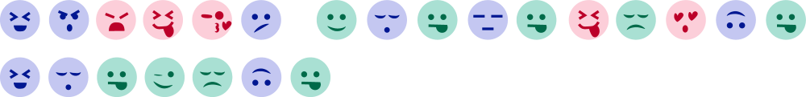

Лепо понашање у комуникацији помоћу дигиталних уређаја
======================================================

.. infonote::

 .. image:: ../../_images/robot11.png
    :height: 120
    :align: left

 Када урадиш дате задатке и одговориш на питања у лекцији бићеш у могућности да поредиш традиционалне облике комуникације са 
 комуникацијом преко дигиталних уређаја, а такође и да размислиш о важности лепог понашања при комуникацији помоћу дигиталних 
 уређаја. 

.. mchoice:: p113a
    :multiple_answers:
    :hide_labels:
    :answer_a: Можеш да шаљеш мејл и писма у поштанско сандуче.
    :answer_b: Помоћу мејла и писма преносиш поруке људима.
    :answer_c: Писма и мејл су писане поруке.
    :answer_d: Баке, деке и родитељи су слали мејлове и писма када су били млади.
    :feedback_a: Одговор није тачан.
    :feedback_b: Одговор је тачан. 
    :feedback_c: Одговор је тачан.
    :feedback_d: Одговор није тачан.
    :correct: b, c

    Означи квадратић испред тврдњи која тачно описује сличност између писма и мејла (електронског писма). 

.. questionnote::

 Напиши једну своју тврдњу којом описујеш сличност између писма и мејла.

.. mchoice:: p113b
    :multiple_answers:
    :hide_labels:
    :answer_a: Мејл шаљеш електронски, док писма шаљеш поштом.
    :answer_b: Писма и мејл пишеш руком.
    :answer_c: Потребан је рачунар да би се послало писмо, али није потребан за слање мејла.
    :answer_d: Баке и деке су слале писма када су били мали, али се данас углавном користи мејл.
    :feedback_a: Одговор је тачан.
    :feedback_b: Одговор није тачан.
    :feedback_c: Одговор није тачан.
    :feedback_d: Одговор је тачан.
    :correct: a, d

    Означи квадратић испред тврдње која тачно описује разлику између писма и мејла. 

.. questionnote::

 Напиши једну своју тврдњу којом описујеш разлику између писма и мејла.

.. infonote::

 .. image:: ../../_images/robot2.png
    :height: 150
    :align: left

 |

 **Јако је важно да поред тога што у свакодневној комуникацији правилно говориш и пишеш, то радиш и када користиш дигиталне уређаје.**
 
 |

Када комуницираш помоћу дигиталног уређаја мораш да поштујеш неколико правила:

|

--------

Опиши, а затим уз помоћ учитеља или учитељице напиши поруке које ће разменити дечак и девојчица. 

Лево од дечака напиши његове поруке које је послао девојчици, а десно од девојчице напиши њене одговоре које је она послала дечаку. Њих двоје комуницирају на леп начин. 

Поштуј правила добре комуникације помоћу дигиталног уређаја. 

|

|

.. image:: ../../_images/robot13.png
    :width: 100
    :align: right

------------

**Домаћи задатак**

|

Људи стално користе емотиконе на својим телефонима, таблетима и рачунарима. Нека сваки емотикон представља једно слово азбуке. 

|

.. questionnote::

 Пронађи слово за сваки емотикон. Откриj скривену реч или реченицу. 

.. image:: ../../_images/digitalni_uredjaj.png
    :width: 600
    :align: center

------------

.. image:: ../../_images/ne_pisi_tekst_velikim_slovima.png
    :width: 600
    :align: center

------------

------------

.. image:: ../../_images/uvek.png
    :width: 600
    :align: center

------------

Провери на следећем часу своја решења са друговима или другарицама.