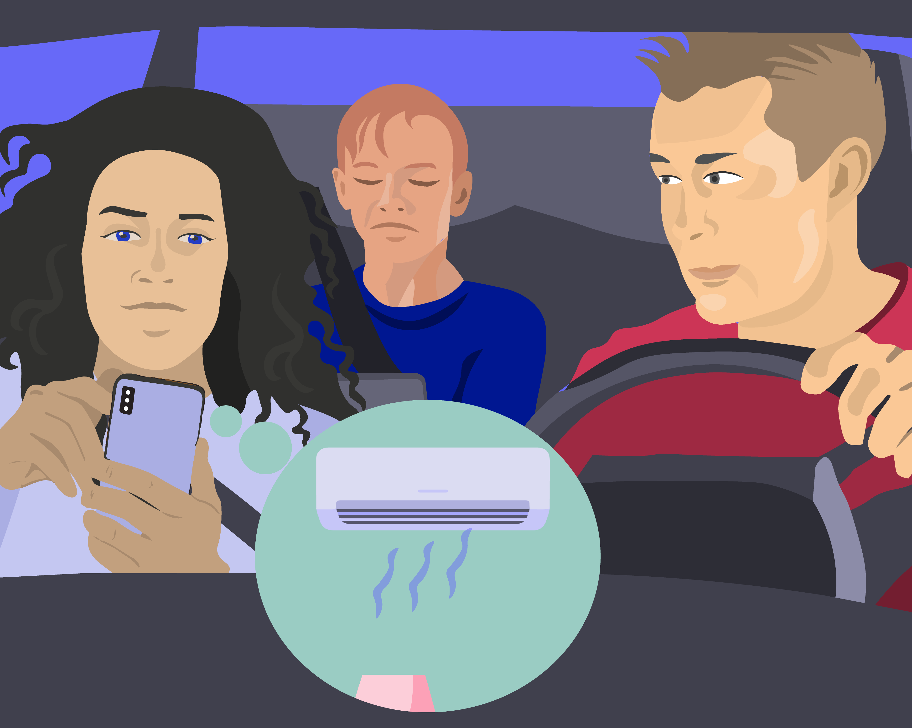

„Паметни“ дигитални уређаји
===========================

.. infonote::

 .. image:: ../../_images/robot11.png
    :height: 120
    :align: left

 Када урадиш дате задатке и одговориш на питања у лекцији знаћеш да наведеш неке од карактеристика „паметног“ дигиталног уређаја.

|

Да би дигитални уређај био „паметан“ уређај мора да буде повезан на интернет. 

Интернет је велика мрежа која повезује различите дигиталне уређаје. 

На доњој слици је дат приказ како се повезују дигитални уређаји на интернету. 
Један важан уређај који повезује све дигиталне уређаје назива се рутер. Опиши остале дигиталне уређаје са слике.

|

.. image:: ../../_images/internet.png
    :width: 780
    :align: center

.. questionnote::

 Како твоја породица користи интернет? У радној свесци на страници **XX** заокружи све начине на које твоја породица користи интернет.   

|

Један дигитални уређај може да се повеже са другим дигиталним уређајима широм света.

|

.. questionnote::

 Oпиши како је мама могла да укључи клима уређај помоћу мобилног телефона?

-------------

Пажљиво проучи слику.

.. image:: ../../_images/digitalni_uredjaji_u_kuci.png
    :width: 780
    :align: center

|

У радној свесци на страници XX заокружи зеленом бојом све уређаје које можеш да нађеш у кухињи, црвеном бојом купатило, а наранџастом бојом све уређаје које можеш да пронађеш у дневној соби. 
Именуј све уређаје.

|

Још једном погледај слику. Да ли је неки од приказаних уређаја „паметан“ дигитални уређај? 

У радној свесци на страници **XX** црном бојом заокружи оне уређаје који су „паметни“ дигитални уређаји. Именуј их све. 

У радној свесци на страници **XX** нацртај како видиш „паметан“ дигитални уређај у будућности.

----------

.. questionnote::

 Која је улога тог уређаја?

|

.. image:: ../../_images/robot13.png
    :width: 100
    :align: right

------------

**Домаћи задатак**

|

Уз помоћ родитеља или блиске одрасле особе, у радној свесци на страници **XX** напиши како препознајеш да неки дигитални уређај 
спада у групу „паметних“ дигиталних уређаја.

|

