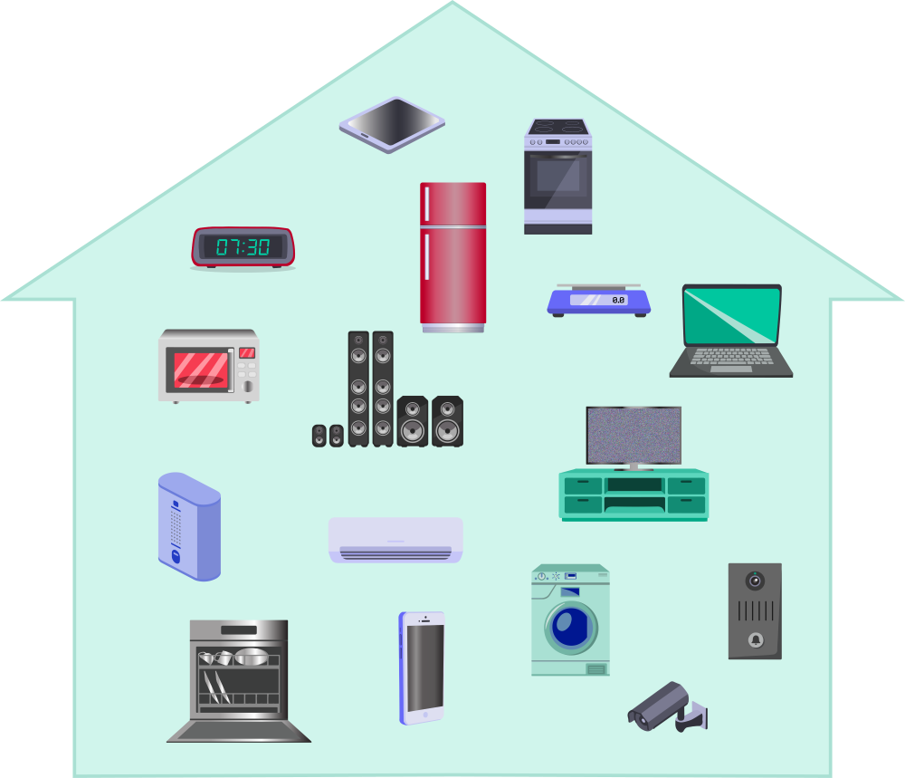

„Паметни“ дигитални уређаји
===========================

.. infonote::

 .. image:: ../../_images/robot1a.png
    :height: 100
    :align: left

 Када урадиш дате задатке и одговориш на питања у лекцији знаћеш да наведеш неке од карактеристика „паметног“ дигиталног уређаја.

 |

Да би дигитални уређај био „паметан“ уређај мора да буде повезан на интернет. Интернет је велика мрежа која повезује различите дигиталне уређаје. 

-------------

На доњој слици је дат приказ како се повезују дигитални уређаји на интернету. 
Један важан уређај који повезује све дигиталне уређаје назива се **рутер**. Упиши у празна поља имена осталих  дигиталних уређаја.

.. image:: ../../_images/internet.png
    :width: 600
    :align: center

.. questionnote::

 Како твоја породица користи интернет? Заокружи све начине на које твоја породица користи интернет. Направите мапу ума.  

.. suggestionnote::

  Мапа ума је визуелни начин организовања и представљања идеја и информација. Почиње са централним појмом и грана се у повезане 
  појмове користећи речи, слике и симболе.

Један дигитални уређај може да се повеже са другим дигиталним уређајима широм света.

|

.. questionnote::

 Напиши како је мама могла да укључи клима уређај помоћу мобилног телефона?

-------------

Пажљиво проучи слику.

|

Заокружи зеленом бојом све уређаје које можеш да нађеш у кухињи, црвеном бојом купатило, а наранџастом бојом све уређаје које 
можеш да пронађеш у дневној соби. Именуј све уређаје.

|

Још једном погледај слику. Да ли је неки од приказаних уређаја „паметан“ дигитални уређај? Црном бојом заокружи оне уређаје који 
су „паметни“ дигитални уређаји. Именуј их све.

----------

.. questionnote::

 Нацртај како видиш „паметан“ дигитални уређај у будућности.

.. image:: ../../_images/prostor_za_crtanje.png
    :width: 500
    :align: center

|

Која је улога тог уређаја?

.. image:: ../../_images/robot5c.png
    :width: 100
    :align: right

------------

**Рад код куће**

Напиши како препознајеш да неки дигитални уређај спада у групу „паметних“ дигиталних уређаја.

|

