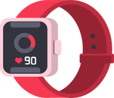
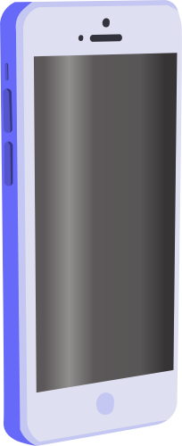

Дигитални уређаји су паметни
============================

.. |kv| image:: ../../_images/kv.png
            :height: 15px  

.. |line| image:: ../../_images/line.png
            :width: 100px  

.. |stampac| image:: ../../_images/stampac.png
            :height: 100px

.. |digcam| image:: ../../_images/digitalna_kamera.png
            :height: 100px

.. |sat2| image:: ../../_images/sat_2.png
            :height: 100px

.. |sat11| image:: ../../_images/sat_11.png
            :height: 100px

.. |sat1| image:: ../../_images/kv.png
            :height: 100px

.. |sat1130| image:: ../../_images/pola_12.png
            :height: 100px

.. infonote::

 .. image:: ../../_images/robot11.png
    :height: 100
    :align: left

 Када урадиш дате задатке и одговориш на питања у лекцији бићеш у могућности да опишеш неке од особина „паметних“ дигиталних уређаја.
 
 |

Запиши једну предност и један недостатак сваког начина на који можеш да користиш интернет.

.. csv-table:: 
   :header: "**Како користим интернет**", "**Предност**", "**Недостатак**"
   :widths: auto
   :align: left

   "Делим фотографије и видео-записе", "|kv|", "|kv|"
   "Шаљем поруке", "|kv|", "|kv|"
   "Играм игрице", "|kv|", "|kv|"
   "Учим", "|kv|", "|kv|"
   "", "", ""

Упореди своје решење са друговима или другарицама.

-------------------

Дигитални уређаји се могу повезати са другим дигиталним уређајима. Када су дигитални уређаји повезани, они преносе информације међу 
собом , што чини комуникацију бржом и лакшом.

„Паметнa кућа“ представља објекат опремљен дигиталним уређајима који вам омогућава да се осећате безбедно уз значајне уштеде у потрошњи енергије. 
Oсмисли како би изгледала твоја “паметна кућа”. Нацртај све дигиталне уређаје које желиш да има твоја паметна кућа.

|

.. image:: ../../_images/prostor_za_crtanje.png
    :width: 500
    :align: center

.. questionnote::

 Објасни зашто је твоја кућа „паметна“.

----------

Пажљиво погледај сва четири дигитална уређаја. Сваки од њих има неку улогу. Како се зову ови уређаји? Напиши у пољима испод слике. 

.. csv-table:: 
  :widths: auto
  :align: center
   
  "", "|ajfon|", "|stampac|", "|pametni_sat|", "|digcam|"
  "Име уређаја", "|line|", "|line|", "|line|", "|line|"
  "", "", "", "", ""

Од горе приказана четири дигитална уређаја два спадају у паметне дигиталне уређаје. Заокружи црвеном бојом та два уређаја.

----------

У прошлости, сатови су се користили само за одређивање времена. На линији испод слике сата допиши време које сваки сат показује.

.. csv-table:: 
  :widths: auto
  :align: center
   
  "|sat2|", "|sat11|", "|sat1|", "|sat1130|"
  "|line|", "|line|", "**фали слика**", "|line|"
  "", "", "", "", ""