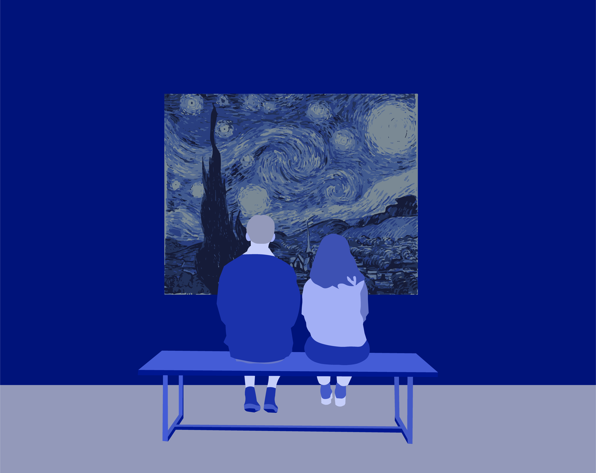
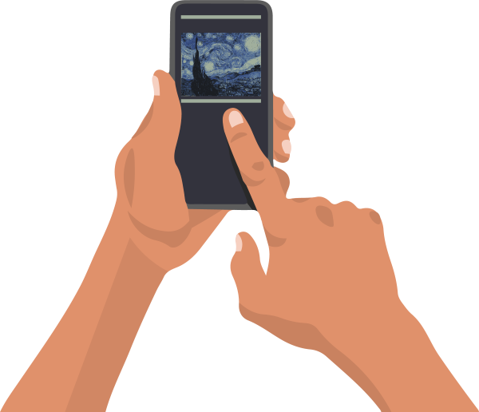
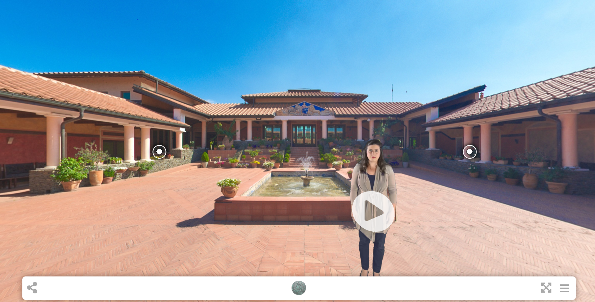

Дигитално путовање
==================

.. infonote::

 .. image:: ../../_images/robot11.png
    :height: 120
    :align: left

 Када урадиш дате задатке и одговориш на питања у лекцији знаћеш да наведеш на који начин дигитални уређаји могу да помогну у 
 упознавању света око нас.

|

Пажљиво проучи обе слике. Опиши шта видиш на сликама. 

.. csv-table:: 
   :widths: auto
   :align: center

   "|galerija|", "|gt|"
   "   ", "  "

Дигитални уређаји су повезани преко интернета и помоћу њих можеш да видиш и обиђеш свет.  

|

.. quizq::

 .. image:: ../../_images/svet.png
    :width: 400
    :align: center

 .. mchoice:: p116
    :multiple_answers:
    :hide_labels:
    :answer_a: Обиђеш и упознаш градове.
    :answer_b: Обиђеш музеје и галерије.
    :answer_c: Одеш на концерт омиљеног бенда.
    :answer_d: Одгледаш позоришну представу.
    :answer_e: Посетиш золошки врт
    :feedback_a: Одговор је тачан.
    :feedback_b: Одговор је тачан.
    :feedback_c: Одговор је тачан.
    :feedback_d: Одговор је тачан.
    :feedback_e: Одговор је тачан.
    :correct: a, b, c, d, e

    Означи шта све можеш да урадиш користећи дигитални уређај. 

    Опиши шта све још можеш да радиш помоћу дигиталних уређаја. 

.. infonote::

   .. image:: ../../_images/robot2.png
     :height: 120
     :align: left

   **Не морамо да путујемо да бисмо видели свет!**

|

|

Виртуелна тура је симулација постојеће локације уз помоћ низа видео-записа или фотографија.

Хајде да заједно са учитељем или учитељицом посетиш `Виминацијум <http://viminacium.org.rs/izlozbe/viminacium-virtual-tour/>`_.

|

.. questionnote::

 Шта ти се највише свидело на овој виртуелној тури? Опиши.

Ипак прави доживљај је да заједно са својим родитељима или учитељем/учитељицом и друговима и другарицама посетиш нека од ових места. 
Пре него што обиђеш неку историјску локацију, добар савет је да истражиш место користећи интернет и дигитални уређај.

|

.. image:: ../../_images/robot13.png
    :width: 100
    :align: right

------------

**Домаћи задатак**

|

Заједно са својим родитељима или теби блиском одраслом особом, а уз помоћ дигиталних уређаја посети `Народни музеј у Београду <https://www.narodnimuzej.rs/ucenje-i-zabava/virtuelnimuzej>`_ 
или `галерију Матице српске <https://www.galerijamaticesrpske.rs/virtuelna-setnja/>`_. 

.. questionnote::

 Опиши своје путовање кроз музеј или галерију. Шта ти се највише свидело?

Одабери друга или другарицу са којима желиш да нацрташ виртуелну туру места у коме живите. Заједно са другом или другарицом 
осмисли виртуелну туру која треба да представља низ слика које по вама чине најлепше делове вашег града. 

----------------

У радној свесци на страници **45** нацртајте виртуелну туру места у коме живиш, додајте и текст којим се описује дата слика.
