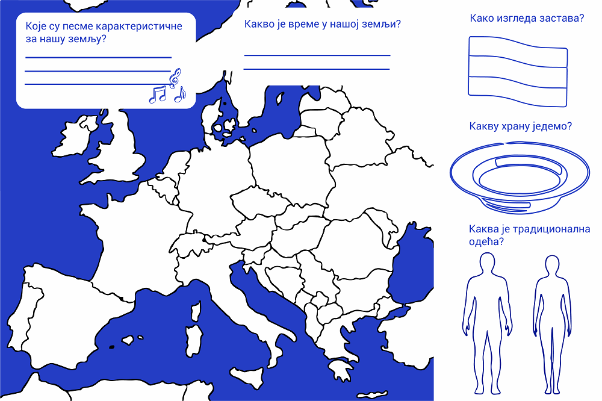

Дигитализована културна баштина
===============================

.. infonote::

 .. image:: ../../_images/robot11.png
    :height: 120
    :align: left

 Када урадиш дате задатке и одговориш на питања у лекцији бићеш у стању да објасниш како дигитални уређаји могу да допринесу бољем 
 разумевању и чувању нашег културног наслеђа.

|

Културно наслеђе (баштина) је све оно што ценимо и желимо да пренесемо на будуће генерације. То могу бити музика, слика, игра, 
зграда.

Културна баштина се налази на различитим местима. Да бисмо сачували културну баштину од заборава, дигитализујемо је. 
Дигитализација је процес превођења фотографије или уметничких дела, музике, докумената у дигитални облик. 
Дигитализована културна баштина је лако доступна и заштићена од заборава.

----------

Пажљиво проучи слику.

|

.. questionnote::

 Опиши ситуацију на слици. Шта људи раде на слици?

 Опиши шта све можемо да дигитализујемо? 

.. 
    .. questionnote::
 .. image:: ../../_images/robot12.png
    :height: 120
    :align: left

 Упознај своју земљу.

.. Размисли о културном наслеђу своје земље. У радној свесци на страници **XX** нацртај или напиши у пољима испод питања твој одговор.

.. questionnote::

 Зашто је важно да негујемо своју културну баштину? Опиши.

.. image:: ../../_images/robot13.png
    :width: 100
    :align: right

------------

.. **Домаћи задатак**

.. Представи своју породицу. У радној свесци на страници **XX** нацртај или напиши све о својој породици, којим језиком говорите у 
 породици, коју храну волите, коју музику слушате, шта волите да радите у слободно време?

|

.. Да ли нешто из твог краја треба да сачувамо за будуће генерације?

|

.. Разговарај са својим родитељима или са теби блиском одраслом особом о културној баштини твог места. У радној свесци на страници 
 **XX** нацртај зграду, део града или споменик који по теби представљају култуну баштину која треба да буде сачувана. 

-----------

.. Замоли родитеље или теби блиску одраслу особу да ти помогне да пронађеш важне особине културне баштине народа из суседних земаља. 
 У радној свесци на страници **XX** напиши или нацртај резултате заједничког истраживања.

