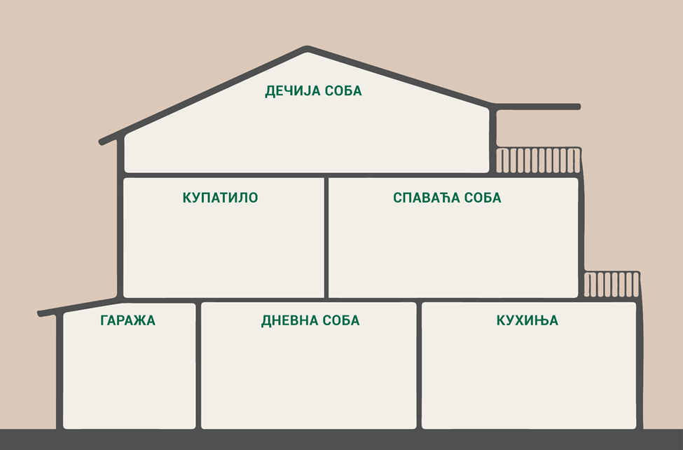
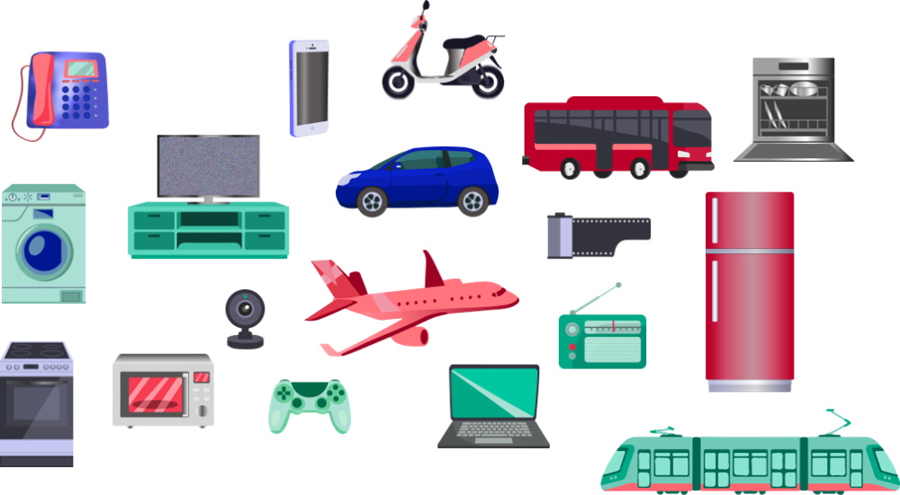

Дигитално друштво
=================

.. |kv| image:: ../../_images/kv.png
            :height: 15px

.. infonote::

 .. image:: ../../_images/robot11.png
    :height: 120
    :align: left

 Поред задатака који проверавају твоје разумевање начина коришћења дигиталних уређаја у свакодневном животу, имаш прилику да 
 самостално процениш своје знање о животним ситуацијама дигитални уређаји о обављању послова, о начинима настајања уметничких са и 
 без дигиталних уређаја, о предностима и манама дигиталних и папирних уџбеника, о начину на које дигитални уређаји могу да помогну 
 у чувању културне баштине, као и о разликама између традиционалних видова комуникације са комуникацијом уз помоћ дигиталних уређаја.

|

.. У радној свесци на страници **XX** cпоји бројеве и затим обој добијен предмет. Опиши назив предмета и како се користи?

.. image:: ../../_images/skrivena2.png
    :width: 500
    :align: center

----------

.. У радној свесци на страници **XX** нацртај и обој све предмете који могу да се налазе у собама. 
    
Поред дигиталних уређаја, нацртај и не дигиталне уређаје.

|

.. questionnote::
 .. image:: ../../_images/robot12.png
    :height: 120
    :align: left

 Размисли колико ти дигитални уређаји помажу у свакодневном животу. Опиши.

 Размисли колико ти ови уређаји помажу у свакодневном животу. Објасни.

|

Пажљиво погледај слике предмета.

|

.. У радној свесци на страници **XX** заокружи зеленом бојом све дигиталне уређаје, а црвеном бојом све „паметне“ дигиталне уређаје. 
 Именуј само „паметне“ уређаје.

-------------------

..
   .. questionnote::

 Пажљиво прочитај тврдње. У радној свесци на страници XX обој квадратић зеленом бојом испред тврдњи о којима већ нешто знаш, 
 наранџастом бојом ако о тој теми желиш да научиш још нешто, а црвеном бојом ако је за тебе све то било ново али си сада нешто 
 научио/ла.

.. csv-table:: 
   :widths: auto
   :align: left

   "|kv|", "Знам како се зову дигитални уређаји из могу окружења."
   "|kv|", "Разумем у којим животним ситуацијама дигитални уређаји олакшавају обављање послова."
   "|kv|", "Умем да опишем како људи лакше обављају послове помоћу дигиталних уређаја."
   "|kv|", "Умем да разликујем уметничка дела створена помоћу дигиталних уређаја од оних која су настала на другачије начине."
   "|kv|", "Знам да наведем предности и мане дигиталних и папирних уџбеника.Умем да разликујем уметничка дела створена помоћу дигиталних уређаја од оних која су настала на другачије начине."
   "|kv|", "Самостално или уз помоћ наставника користим дигиталне уџбенике за учење."
   "|kv|", "Умем да опишем традиционалне видове комуникације и упоредим их са комуникацијом уз помоћ дигиталних уређаја."
   "|kv|", "Знам да набројим карактеристике „паметног” дигиталног уређаја. "
   "|kv|", "Могу да опишем на који начин дигитални уређаји могу да нам помогну у чувању културне баштине."
   "", ""

 
 

 

