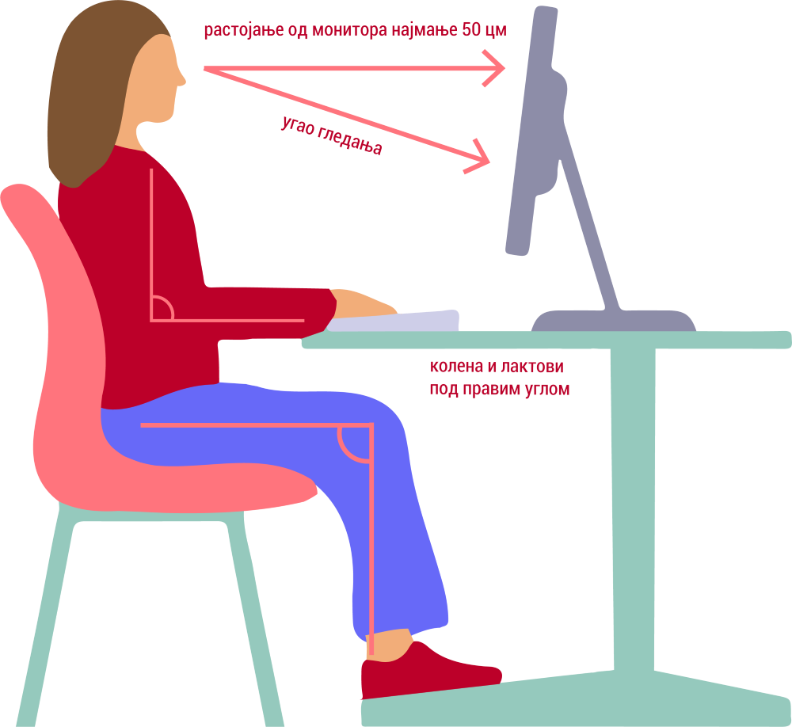
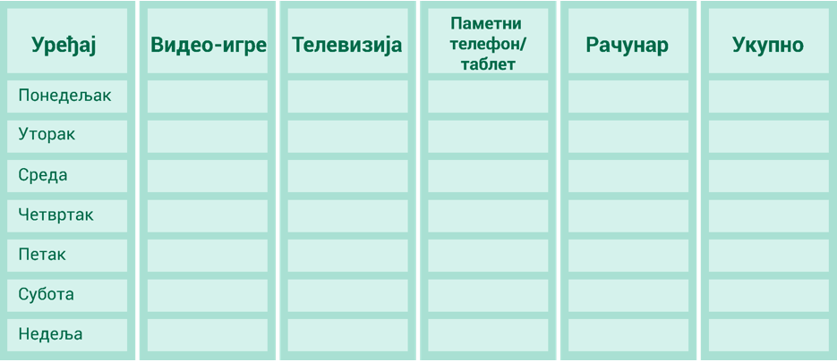
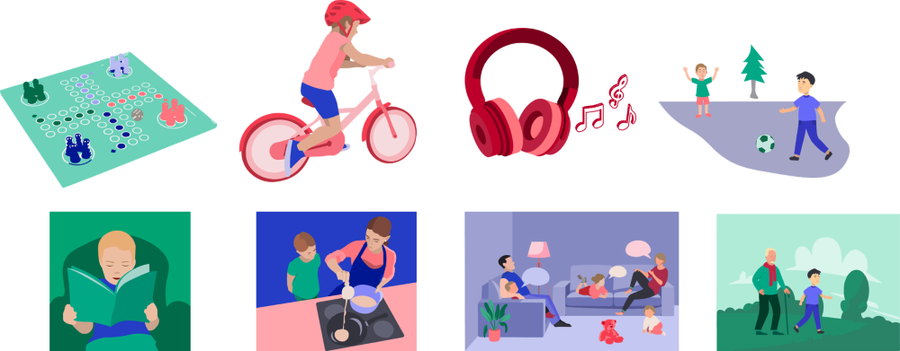

Коришћење дигиталних уређаја и здравље
======================================

.. infonote::

 .. image:: ../../_images/robot21.png
    :height: 120
    :align: left

 Када урадиш дате задатке и одговориш на питања у лекцији знаћеш да наведеш основна правила за коришћење дигиталних уређаја на начин који не угрожава твоје здравље. Такође, бићеш у стању да наведеш неке од здравствених ризика везаних за прекомерно или неправилно 
 коришћење дигиталних уређаја.

|

Пажљиво проучи слику.

|

|

На основу горње слике у радној свесци на страници **54** напиши препоруке за седење за дигиталним уређајем.

|

.. mchoice:: p219a
   :multiple_answers:
   :hide_labels:
   :answer_a: Користи дигитални уређај само уз присуство теби блиске одрасле особе.
   :answer_b: Немој да користиш храну или пиће у близини дигиталног уређаја.
   :answer_c: Самостално можеш да користиш дигиталне уређаје.
   :answer_d: Користи дигитални уређај само када је укључен у струју.
   :answer_e: Остави таблет на безбедном месту када га не користиш.
   :feedback_a: Одговор је тачан.
   :feedback_b: Одговор је тачан.
   :feedback_c: Одговор није тачан.
   :feedback_d: Одговор није тачан.
   :feedback_e: Одговор је тачан.
   :correct: a, b, e

   Означи квадратиће испред тврдњи које се односе на правилно руковање дигиталним уређајем.

Не треба да користиш дигиталне уређаје дуже од пола сата. Ако ипак користиш дигитални уређај дуже од тог времена потребно је 
да урадиш вежбе које су дате на слици. 

|

.. image:: ../../_images/slika.png
   :width: 500
   :align: center 

.. infonote::

 .. image:: ../../_images/robot24.png
     :height: 120
     :align: left

 Нека ти учитељ или учитељица покажу како се правилно ради свака вежба која је приказана на слици.

|

Користи доњу табелу и у радној свесци на страници **55** напиши колико времена проводиш користећи дигитални уређај. 

Забавно је када користиш дигиталне уређаје. Али исто тако је важно да време које проводиш испред екрана дигиталног уређаја не буде дуже од два 
сата дневно. 

.. infonote::

 Ево неколико препорука које ће ти помоћи да органичиш време за екраном дигиталног уређаја:
  - Искористи време за екраном дигиталног уређаја као награду за урађен домаћи задатак или сређену собу.
  - Користи сат да провериш колико времена сваког дана проводиш за екраном дигиталног уређаја. 
  - Разговарај са родитељима о времену које можеш да проведеш испред екрана дигиталног уређаја.
  - Када се играш са друговима или другарицама не користи дигитални уређај.
  - Не користи дигиталне уређаје када имаш породична окупљања. 
  - Води дневник о томе колико времена недељно проводиш за екраном дигиталног уређаја.
  - Одмори очи од гледања у екран дигиталног уређаја.
  - Редовно ради вежбе за врат, рамена и шаке. 
  - Не користи дигиталне уређаје сат времена пре спавања.
  - Одабери дан у недељи без дигиталних уређаја.

.. mchoice:: p219b
   :multiple_answers:
   :hide_labels:
   :answer_a: Изазива болове у врату, раменима и шакама.
   :answer_b: Помаже да будем физички активнији/ја.    
   :answer_c: Утиче на мој сан.
   :answer_d: Боље видим када користим дигиталне уређаје.         
   :answer_e: Утиче на смањење концентрације.
   :feedback_a: Одговор је тачан.
   :feedback_b: Одговор није тачан.
   :feedback_c: Одговор је тачан.
   :feedback_d: Одговор није тачан.
   :feedback_e: Одговор је тачан.
   :correct: a, c, e

   Ако проводиш превише времена за екраном дигиталног уређаја то може утицати на твоје здравље. Реченице испод се односе на прекомерено коришћење дигиталних уређаја. Означи квадратиће испред тачних тврдњи.

Увек је важно да ускладиш време проведене испред екрана дигиталног уређаја са другим активностима. 

|

Пажљиво погледај све активности које су приказане на сликама. 
Опиши их. У радној свесци на страници **56** заокружи активности којим би изабрао/ла да се бавиш у своје слободно време. 

|

|

.. image:: ../../_images/robot23.png
    :width: 100
    :align: right

------------

**Домаћи задатак**

|

У радној свесци на страници **57** нацртај или опиши активност коју обављаш без употребе дигиталног уређаја.

|

