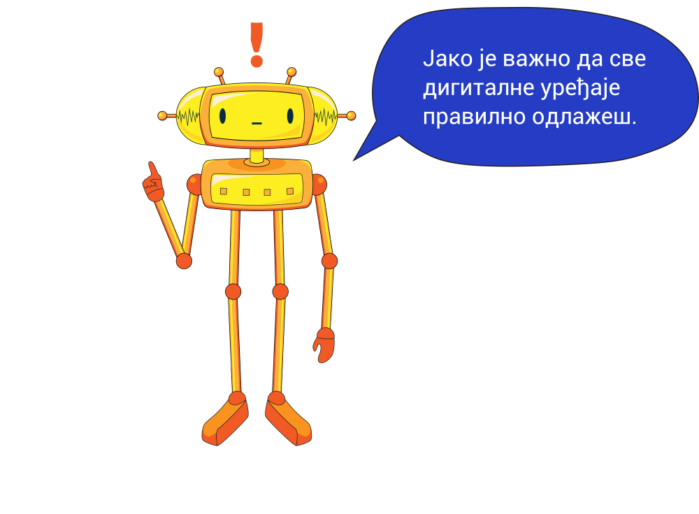
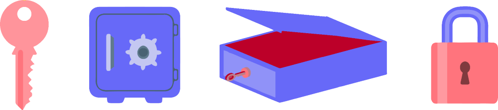
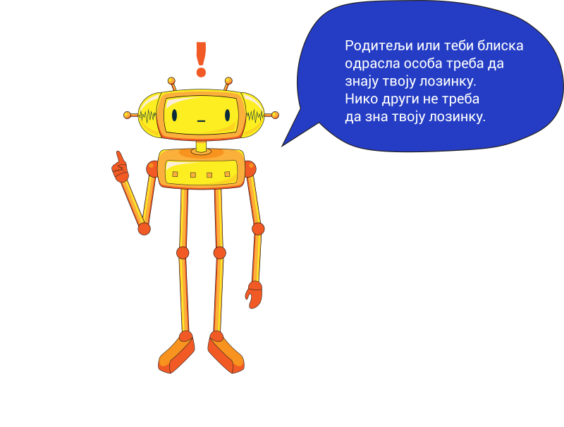
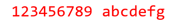
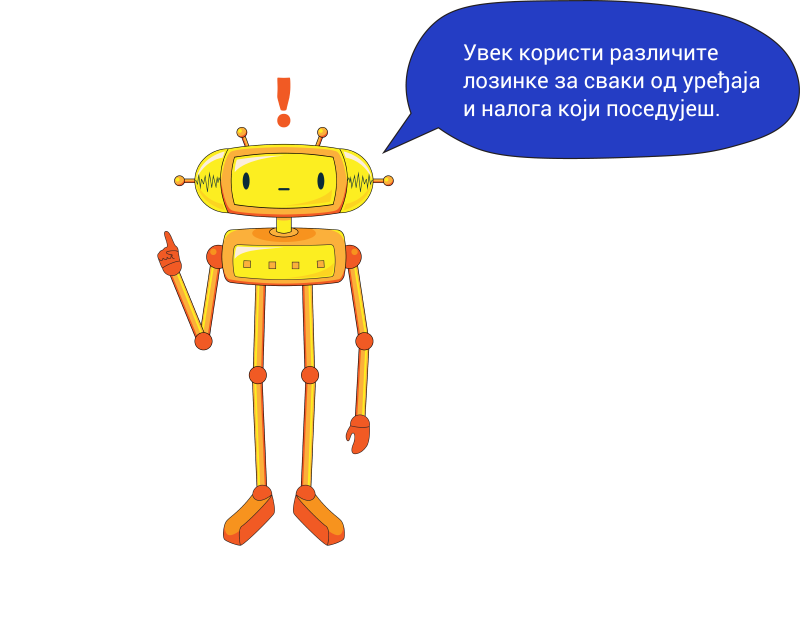

Безбедно коришћење дигиталних уређаја
=====================================

.. infonote::

 .. image:: ../../_images/robot21.png
    :height: 100
    :align: left

 Када урадиш дате задатке и одговориш на питања у лекцији знаћеш да наведеш основне препоруке за руковање дигиталним уређајем на 
 одговоран начин (примена мера физичке заштите) и објасниш зашто је важно примењивати их.

Да би дигитални уређај правилно радио потребно је да се одговорно понашаш према њему. 

Пажљиво проучи следећа правила.
Свака слика је означена бројем.

|

.. quizq::

    Повежи бројеве слика са одговарајућим правилом.

    |

    .. image:: ../../_images/pravila.png
            :width: 780px
            :align: center

    .. dragndrop:: d221
        :feedback: Покушајте поново.
        :match_1: 1 ||| Немој да постављаш чашу са водом или слатким пићем поред дигиталног уређаја.
        :match_2: 2 ||| Дигиталне уређаје треба штитити од прашине.
        :match_3: 3 ||| Екране таблета и паметних телефона заштити постављањем заштитне пластике или стакла
        :match_4: 4 ||| Лаптоп треба да стоји на столу.
        :match_5: 5 ||| Не остављај дигитални уређај да буде изложен јаком извору топлоте.

Поред заштите уређаја од оштећења, потребно је да заштитимо и информације које се налазе на њему.

Размисли, а затим у радној свесци на страници **XX** заокружи начине на које људи чувају своје ствари. 

|

|

Као што користиш кључ да закључаш кућу или стан, лозинка представља кључ зе приступ дигиталном уређају. Тачније, лозинке користиш да чуваш информације.

.. questionnote::

 У радној свесци на страници XX напиши за шта ти и твоји укућани користите лозинке?

Понекад људи користе лозинке које су уобичајене јер име је тако лако да их запамте.

.. questionnote::

 Зашто људи не треба да користе овакве лозинке? Размисли шта ће се десити ако неко погоди овакву лозинку? Опиши.

Постоје нека основна правила којих треба да се придржаваш да би лозинка била заиста јака.

|

✔	Лозинка треба да се састоји од малих и великих слова. Користи најмање једно велико слово.

✔	Лозинка треба да се састоји од бројева. Користи најмање једну цифру.

✔	Лозинка треба да се састоји и од неких специјалних знакова, на пример, ?&#£$!@

✔	Лозинка треба да се састоји од најмање 8 знакова.

✔	За лозинку не треба да користиш имена и датуме рођења теби блиских особа или кућних љубимаца.

-------

.. quizq::

 .. mchoice:: p221a
    :hide_labels:
    :answer_a: Да.
    :answer_b: Не.
    :feedback_a: Одговор није тачан.
    :feedback_b: Одговор је тачан.
    :correct: b

    Када осмислиш јаку лозинку, можеш да је користиш на свим уређајима и налозима. Да ли је ово тачно? Означи кружић испред тачног одговора.

.. image:: ../../_images/robot23.png
    :width: 100
    :align: right

------------

**Домаћи задатак**

|

.. quizq::

 .. mchoice:: p221b
    :multiple_answers:
    :hide_labels:
    :answer_a: датум твог рођендана
    :answer_b: емотикони
    :answer_c: велика и мала слова 
    :answer_d: специјалне знакове
    :answer_e: бројеве
    :feedback_a: Одговор није тачан.
    :feedback_b: Одговор није тачан.
    :feedback_c: Одговор је тачан.
    :feedback_d: Одговор није тачан.
    :feedback_e: Одговор је тачан.
    :correct: c, d, e

    Шта све треба да садржи јака лозинка? Означи све квадратиће испред одговора који су тачни.

.. quizq::

 .. mchoice:: p221c
    :hide_labels:
    :multiple_answers:
    :answer_a: Користи назив земље у својој лозинки.
    :answer_b: Упиши своју лозинку у свој дневник ситним словима у случају да је заборавиш.
    :answer_c: Користи различите јаке лозинке за сваки од својих уређаја и налога на мрежи.
    :answer_d: Лозинке са бројевима је најлакше погодити.
    :feedback_a: Одговор није тачан.
    :feedback_b: Одговор није тачан.
    :feedback_c: Одговор је тачан.
    :feedback_d: Одговор није тачан.
    :correct: c

    Да би ваша лозинка била јака означи који од ових савета је најбоље послушати. Означи све квадратиће испред савета за који сматраш да је тачан.
