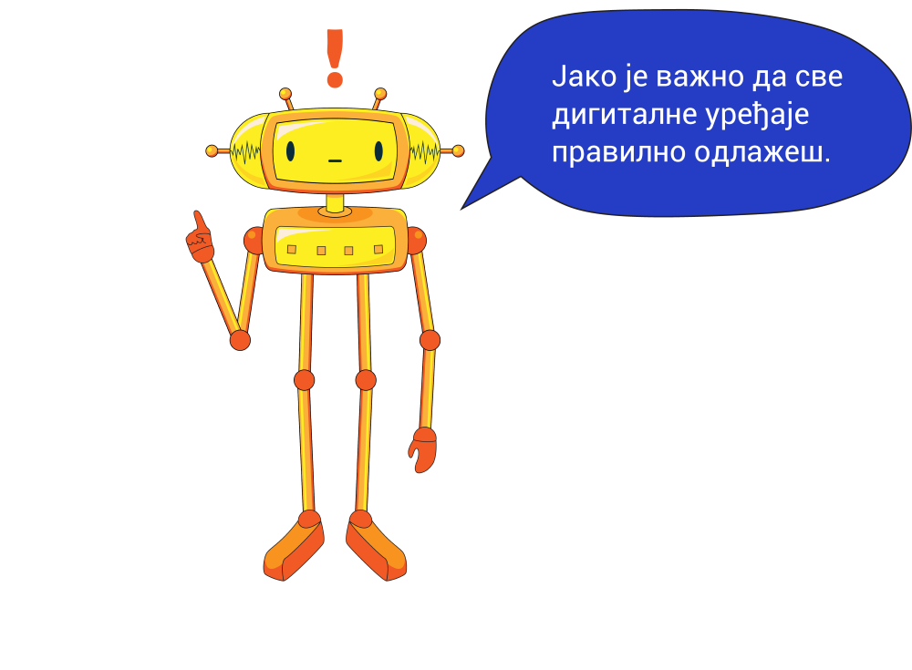

Електронски отпад је опасан
===========================

.. infonote::

 .. image:: ../../_images/robot21.png
    :height: 120
    :align: left

 Када урадиш дате задатке и одговориш на питања у лекцији разумећеш начин како се одлаже електронски отпад, 
 а чиме се штити животна средина.

|

У радној свесци на страници **XX** заокружи предмете који се могу рециклирати.

|

Oпиши на који начин људи у граду најчешће одлажу отпад. Да ли је то за природу прихватљив начин? 

У радној свесци на на страници **XX** нацртај или напиши како се ти и чланови твоје породице понашате према отпаду? 

.. questionnote::

 Шта се дешава са дигиталним уређајем када се поквари? Опиши.

Старе и покварене дигиталне уређаје називамо електронски отпад. Никада их не бацај заједно са осталим смећем. 
Сви дигитални уређаји су састављени од различитих материјала који загађују и уништавају нашу животну средину

.. suggestionnote::

 .. image:: ../../_images/robot25.png
    :height: 120
    :align: left

 **Занимљивост**. Уређаји као што су конзоле за игре, бушилице, лаптопови, мобилни телефони и ТВ садрже делове и материјале као што су пластика, 
 стакло и метал. 

 Рециклирањем једне пегле може да се произведе око 13 лименки. Пластика из косилице може да се користи за израду музичких 
 инструмената и браника за аутомобиле.

Пажљиво проучи на слици поступак одлагања и рециклаже електронског отпада.

|

.. image:: ../../_images/slika.png
    :width: 600
    :align: center

.. questionnote::

 Опиши поступак одлагања и рециклаже електронског отпада.

|

Канте за различите врсте отпада обојене су различитим бојама.

|

.. image:: ../../_images/robot23.png
    :width: 100
    :align: right

------------

**Домаћи задатак**

|

У коју канту иде следећи отпад? У радној свесци на страници XX повежи врсту канте за одлагање отпада са врстом отпада. 

|

