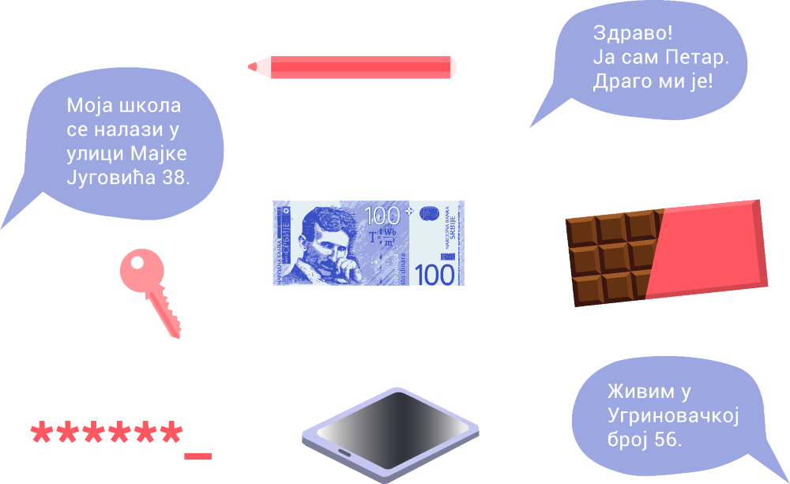
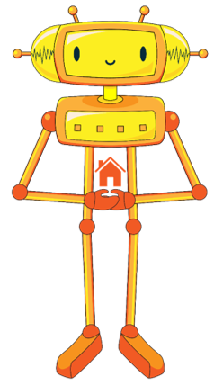

Подаци о личности
=================

.. infonote::

 .. image:: ../../_images/robot21.png
    :height: 120
    :align: left

 Када урадиш дате задатке и одговориш на питања у лекцији разумећеш шта су основни подаци о личности и знаћеш да наведеш пример неких од основних података о личности.

 Такође, бићеш у стању да објасниш зашто не би требало да другима дајемо своје податке када комуницирамо преко дигиталних уређаја. 

|

Лични подаци су сви они подаци који се односе на особу, и на основу којих можемо да утврдимо о којој се особи ради.

Под личним подацима подразумевају се:

✔	име и презиме особе

✔	адреса становања

✔	датум рођења

✔	број телефона

✔	јединствени матични број

✔	фотографија

✔	локација где се особа тренутно налази

✔	отисак прста

✔	број пасоша

------------

У радој свесци на страници **63** заокружи предмете и појмове које можеш да поделиш са члановима твоје породице, пријатељима и 
непознатим људима. Користи наранџасту боју за породицу, зелену боју за пријатеље и плаву за све остале.

.. mchoice:: p223
    :multiple_answers:
    :hide_labels:
    :answer_a: име
    :answer_b: број мобилног телефона
    :answer_c: омиљени хоби
    :answer_d: свој надимак
    :answer_e: слика твоје куће
    :feedback_a: Одговор је тачан.
    :feedback_b: Одговор је тачан.
    :feedback_c: Одговор је тачан.
    :feedback_d: Одговор је тачан.
    :feedback_e: Одговор је тачан.
    :correct: a, b, c, d, e

    Означи квадратиће испред појмова који представљају све оно што није безбедно да делиш на интернету.

------------

**Домаћи задатак**

|

У радној свесци на страници **64** нацртај слике апликација које користиш у школи или код куће. Имај у виду да је апликације потребно да користиш у присуству себи блиске одрасле особе.
На овај начин ствараш свој дигитални отисак. Упоредите свој дигитални отисак са другом или другарицом. По чему се разликују? По чему су исти?
