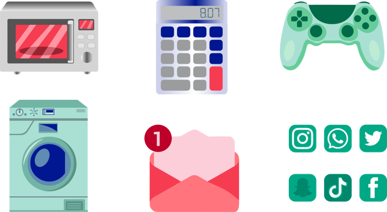
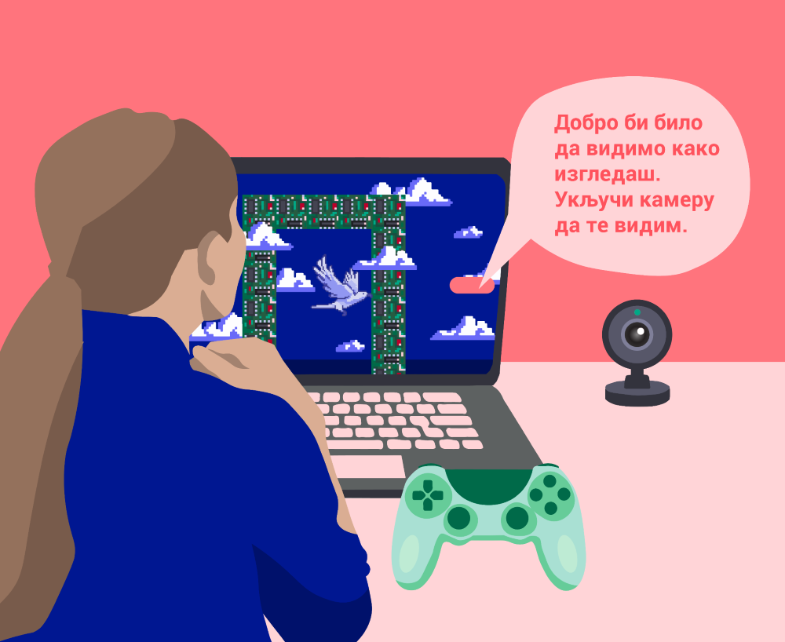
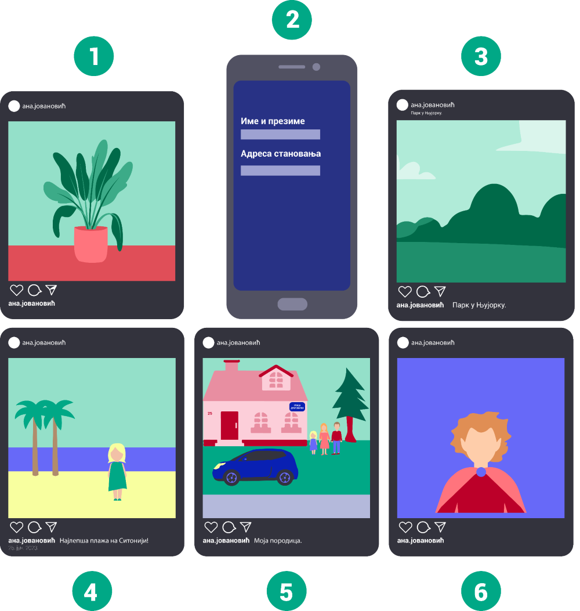

Безбедно коришћење дигиталних уређаја
=====================================

.. |kv| image:: ../../_images/kv.png
            :height: 15px  

.. infonote::

 .. image:: ../../_images/robot21.png
    :height: 120
    :align: left

 Поред задатака у којима провераваш своје знање у вези са коришћењем дигиталних уређаја на безбедан начин, имаћеш могућност да 
 самопроцениш своје знање о основним правилима безбедног коришћења дигиталних уређаја, о ризицима који могу настати приликом 
 прекомерног коришћења дигиталних уређаја, везе између одлагања електронског отпада и животне средине, правилима о заштити личних 
 података, саветима за помоћ у случају контакта са непримереним дигиталним садржајем, непознатим, злонамерним особама или особама 
 које комуницирају на неприхватљив начин.

|

.. У радној свесци на страници **XX** заокружи све слике које су повезане са коришћењем лозинке.

|

   
-----------

.. mchoice:: p226
    :multiple_answers:
    :hide_labels:
    :answer_a: Поштуј друге кориснике. Буди љубазан/на на мрежи.
    :answer_b: Не дели личне податке.
    :answer_c: Дели број телефона и адресу становања. 
    :answer_d: Реци блиској одраслој особи ако те је нешто на интернету узнемирило или осећаш непријатност.
    :answer_e: Можеш да делиш сваку слику на интернету.
    :feedback_a: Одговор је тачан.
    :feedback_b: Одговор је тачан.
    :feedback_c: Одговор није тачан.
    :feedback_d: Одговор је тачан.
    :feedback_e: Одговор није тачан.
    :correct: a, b, d

    Означи квадратић поред тврдњи које представљају правило безбедног понашања на интернету.

Пажљиво проучи слику.

|

|

.. questionnote::

 Опиши ситуацију у којој се налази девојчица. Шта она треба да уради?

Погледај доње слике. 

|

..
   .. questionnote::

 Опиши ситуације на слици. Коју од слика можеш да делиш јавно, а коју приватно? У радној свесци на страници XX у табелу упиши 
 број слике у одговарајуће колоне.

|

.. csv-table:: 
   :header: "**Јавно**", "**Приватно**" 
   :widths: auto
   :align: left

   "(свако може да види фотографије које објавиш и ствари о којима пишеш. Ово укључује и људе које не познајеш.)", "(једини који могу да виде фотографије које постављаш и ствари о којима пишеш су твоји пријатељи или људи које познајеш.)"
   
   "  ", "  "
   "  ", "  "

|

-----------

.. Пажљиво прочитај тврдње. У радној свесци на страници XX обој квадратић зеленом бојом испред тврдњи које показују да је то 
   знање које су већ имао, наранџастом бојом ако о томе јо нешто желиш да научиш, и ако црвеном бојом да је за тебе све било 
   ново, али и да си сада научио/ла.

|

.. csv-table:: 
   :widths: auto
   :align: left

   "|kv|", "Познајем основна правила за коришћење дигиталних уређаја."
   "|kv|", "Умем да наведем неке од здравствених ризика везаних за прекомерно или неправилно коришћење дигиталних уређаја. "
   "|kv|", "Умем да објасним на који начин се одлаже електронски отпад и познајем последице неправилног одлагања овог отпада по животну средину."
   "|kv|", "Умем да набројим основне податке о личности."
   "|kv|", "Умем да објасним колико је опасно делити података о личности при комуникацији помоћу дигиталних уређаја."
   "|kv|", "Знам коме треба да се обратим за помоћ ако дођем у контакт са непримереним дигиталним садржајем, непознатим, злонамерним особама или особама које комуницирају на неприхватљив начин. "
   "|kv|", "Познајем основна правила руковања дигиталним уређајем на одговоран начин."

 

