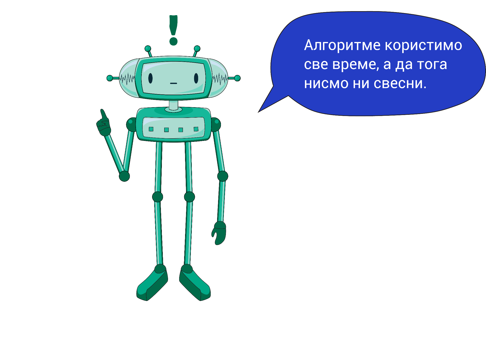

Алгоритам
=========

.. infonote::

 .. image:: ../../_images/robot31.png
    :height: 120
    :align: left

 Када урадиш све задатке и одговориш на сва питања у лекцији, знаћеш да анализираш 
 једноставан познати поступак/активност и предлажеш кораке за његово спровођење.

|

Ако било који проблем поделиш на кораке, онда кажемо да размишљаш алгоритамски. 
**Алгоритам** је низ корака помоћу којих се описује неки задатак. Тачније, то је упутство 
помоћу кога људи или машине могу да успешно решавају и обављају неки посао. 

Сваки алгоритам, било да га извршавају људи или машине, има следеће особине:

1. Изводи се корак по корак.
2. У сваком кораку је тачно одређено шта треба да се уради.
3. После сваког корака следи тачно одређен следећи корак.
4. Ниједан корак не траје бесконачно, већ се завршава након одређеног времена.

..
    .. questionnote::

 У радној свесци на страници **XX** нацртај и опиши сваки корак у процесу прања руку.

Упореди свој алгоритам са алоритом друга или другарице.

----------

Поређај кораке за прављење тоста. 

- Узми две кришке хлеба.
- Стави хлеб у тостер.
- Сачекај да се тост појави.
- Извади тост из тоста.
- На тост намажи путер.
- Загризи и уживај.

.. questionnote::

 Шта ће се десити ако ове кораке нисте пратили исправним редоследом? Опиши.

Дигитални уређаји могу да прате алгоритме, баш као и људи. Рад дигиталног уређаја 
контролише рачунар који је програмиран помоћу алгоритма. 

Пажљиво проучи слику.

.. image:: ../../_images/slika.png
    :width: 600
    :align: center

.. questionnote::
 
 Опиши поступак којим се особа вози лифтом.

.. У радној свесци на страни **XX** обележи редослед корака којима се описује поступак позивања лифта у згради.

- Притисни дугме да позовеш лифт. 
- Отвори врата од лифта. 
- Уђи у лифт. 
- Затвори врата за собом. 
- Притисни тастер за спрат на који идеш. 
- Лифт се зауставља на одабраном спрату. 
- Отвори врата од лифта. 
- Изађи из лифта. 
- Затвори врата за собом.
                         

Да ли је могуће прескочити неки од ових корака? Шта ће се десити? Опиши.

..
    .. questionnote::

 У радној свесци на страници **XX** нацртај и обој семафор и опиши редослед којим се смењују светла на 
 семафору.

|

.. image:: ../../_images/robot33.png
    :width: 100
    :align: right

------------

.. **Домаћи задатак**

.. |

.. Нека ти родитељ или теби блиска одрасла особа помогне да на интернету пронађеш 
.. упутство за прављење оригами птице.

|

.. У радној свесци на страници XX нацртај дигитални уређај који имаш у кући и опиши 
   алгоритам на основу кога он правилно ради.

