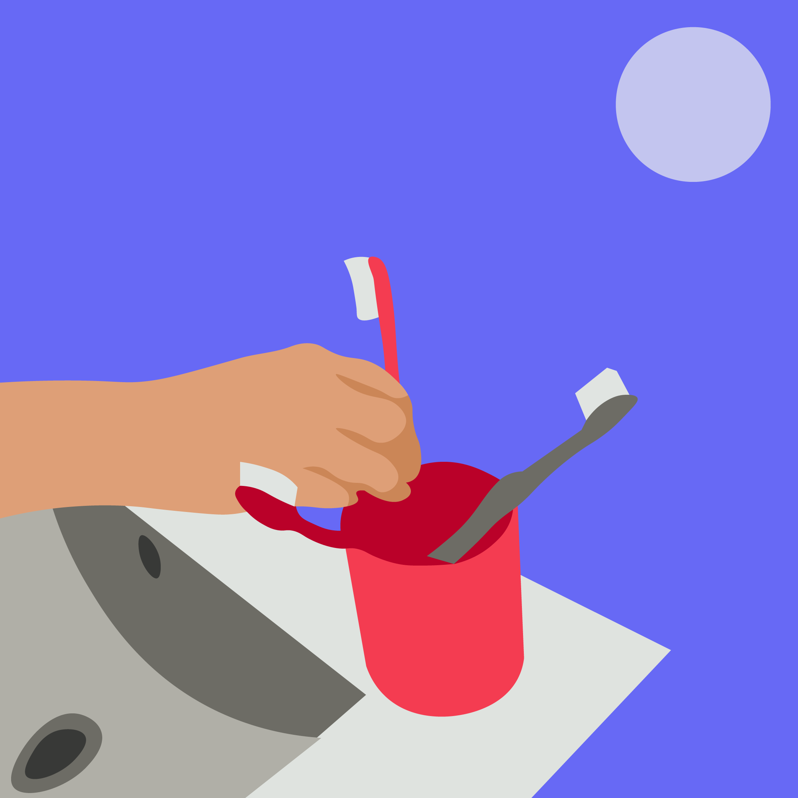
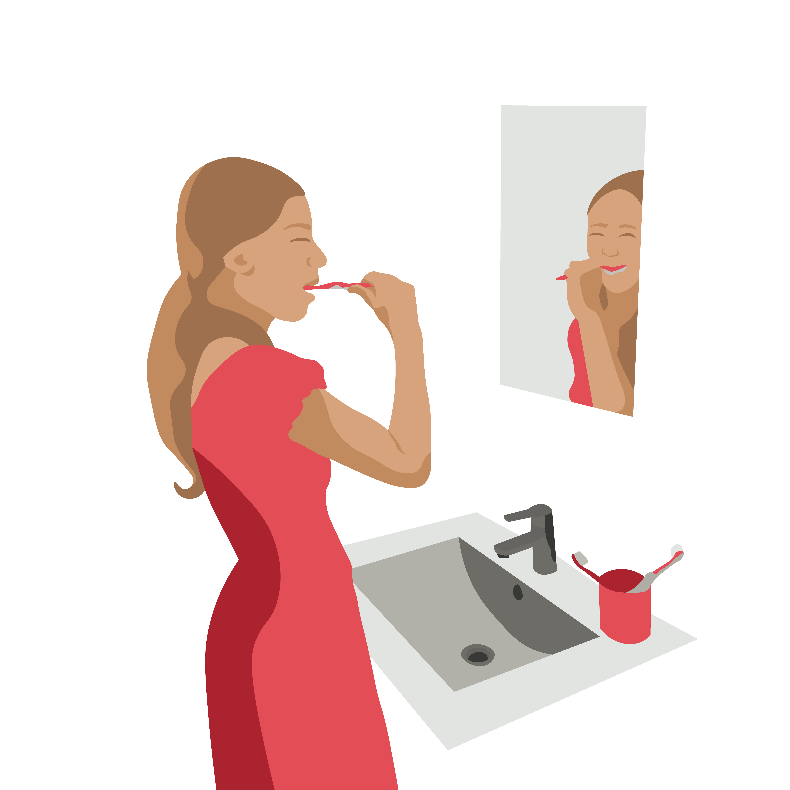

Алгоритам
=========

.. infonote::

 .. image:: ../../_images/robot31.png
    :height: 120
    :align: left

 Када урадиш све задатке и одговориш на сва питања у лекцији, знаћеш да анализираш 
 једноставан познати поступак/активност и предлажеш кораке за његово спровођење.

|

.. mchoice:: mchoicezubi
    :hide_labels:
    :answer_a: Узми четкицу, стави пасту на четкицу, опери предње зубе, опери зубе позади, испљуни пасту, пусти воду, испери уста, испери четкицу, затвори воду, врати четкицу на месту, узми пешкир, обриши уста пешкиром да их осушиш, врати пешкир
    :answer_b: Узми четкицу, опери предње зубе, стави пасту на четкицу, опери зубе позади, испљуни пасту, пусти воду, испери четкицу, узми пешкир, затвори воду, врати четкицу на месту, обриши уста пешкиром да их осушиш, врати пешкир, испери уста
    :feedback_a: Одговор је тачан.
    :feedback_b: Одговор није тачан.
    :correct: a

    Означи тачан редослед корака како дете пере зубе. Означи кружић са тачним распоредом корака којим се показује како се перу зуби.

Ако било који проблем поделиш на кораке, онда кажемо да размишљаш алгоритамски. 
**Алгоритам** је низ корака помоћу којих се описује неки задатак. Тачније, то је упутство 
помоћу кога људи или машине могу да успешно решавају и обављају неки посао. 

.. image:: ../../_images/izjava5.png
    :width: 400
    :align: center

Сваки алгоритам, било да га извршавају људи или машине, има следеће особине:

1. Изводи се корак по корак.
2. У сваком кораку је тачно одређено шта треба да се уради.
3. После сваког корака следи тачно одређен следећи корак.
4. Ниједан корак не траје бесконачно, већ се завршава након одређеног времена.

.. questionnote::

 У радној свесци на страници **71** нацртај и опиши сваки корак у процесу прања руку.

Упореди свој алгоритам са алоритом друга или другарице.

----------

Поређај кораке за прављење тоста. 

.. dragndrop:: dndtost
        :feedback: Покушајте поново.
        :match_1: 1 ||| Узми две кришке хлеба.
        :match_2: 2 ||| Стави хлеб у тостер.
        :match_3: 3 ||| Сачекај да се тост појави.
        :match_4: 4 ||| Извади тост из тостера.
        :match_5: 5 ||| На тост намажи путер.
        :match_6: 6 ||| Загризи и уживај.

.. questionnote::

 Шта ће се десити ако ове кораке нисте пратили исправним редоследом? Опиши.

Дигитални уређаји могу да прате алгоритме, баш као и људи. Рад дигиталног уређаја 
контролише рачунар који је програмиран помоћу алгоритма. 

Пажљиво проучи слику.

.. image:: ../../_images/slika.png
    :width: 600
    :align: center

.. questionnote::
 
 Опиши поступак којим се особа вози лифтом.

Поређај кораке у прави редослед којим се описује поступак како се користи лифт.

.. dragndrop:: dndlift
        :feedback: Покушајте поново.
        :match_1: 1 ||| Притисни дугме да позовеш лифт.
        :match_2: 2 ||| Отвори врата од лифта.
        :match_3: 3 ||| Уђи у лифт.
        :match_4: 4 ||| Затвори врата за собом.
        :match_5: 5 ||| Притисни тастер за спрат на који идеш.
        :match_6: 6 ||| Лифт се зауставља на одабраном спрату.
        :match_7: 7 ||| Отвори врата од лифта..
        :match_8: 8 ||| Изађи из лифта.
        :match_9: 9 ||| Затвори врата за собом.

Испод су наведени кораци којима ти се дају инструкције за вожњу лифтом. Поређани су редом. 

- Притисни дугме да позовеш лифт. 
- Отвори врата од лифта. 
- Уђи у лифт. 
- Затвори врата за собом. 
- Притисни тастер за спрат на који идеш. 
- Лифт се зауставља на одабраном спрату. 
- Отвори врата од лифта. 
- Изађи из лифта. 
- Затвори врата за собом.
                         

Да ли је могуће прескочити неки од ових корака? Шта ће се десити? Опиши.

.. questionnote::

 У радној свесци на страници **72** нацртај и обој семафор и опиши редослед којим се смењују светла на 
 семафору.

|

.. image:: ../../_images/robot33.png
    :width: 100
    :align: right

------------

**Домаћи задатак**

------------

Нека ти родитељ или теби блиска одрасла особа помогне да на интернету пронађеш 
упутство за прављење оригами птице. Приметићеш да се упутство састоји из низа корака које је потребно да начиниш да би направио/ла оригами птицу. Важно је да поштујеш редослед корака. 

------------

Као што ти пратиш упутство које се састоји од низа корака, тако и дигитални уређаји прате упутство које им је неко задао, односно прате алгоритам. У радној свесци на страници **73** нацртај дигитални уређај који имаш у кући и опиши алгоритам на основу кога он правилно ради.

