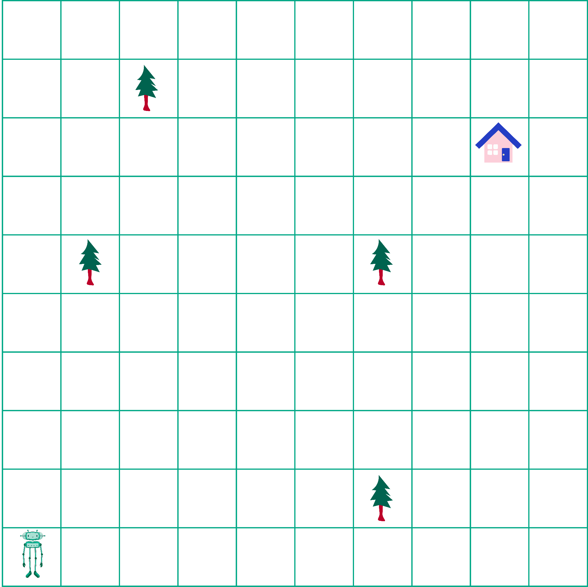
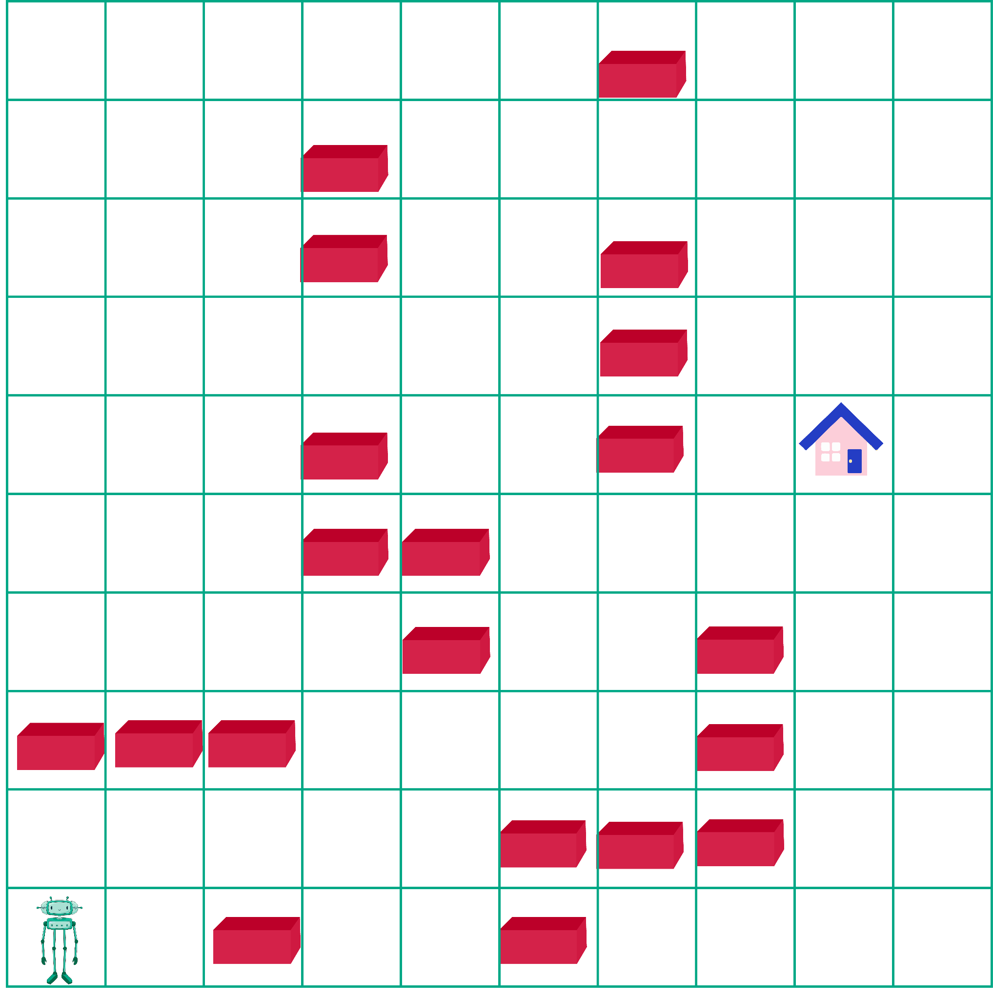
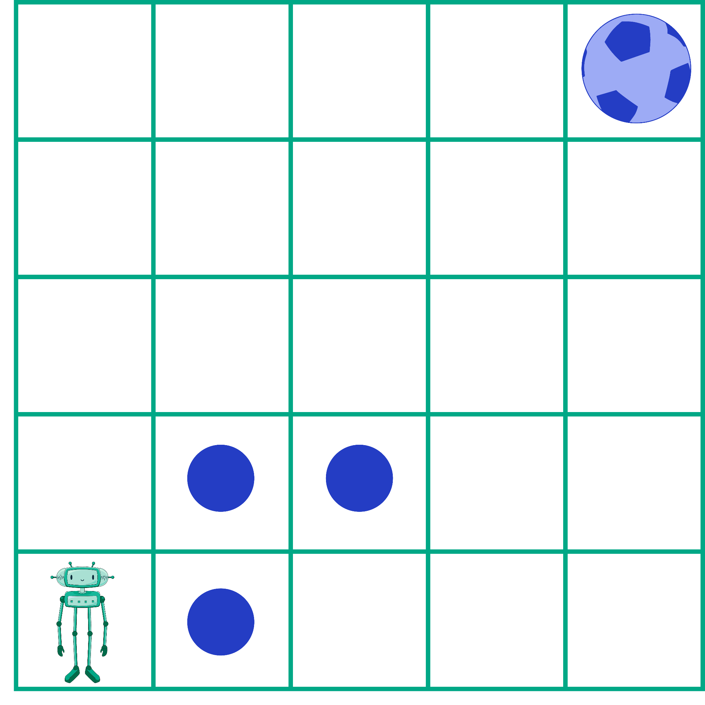
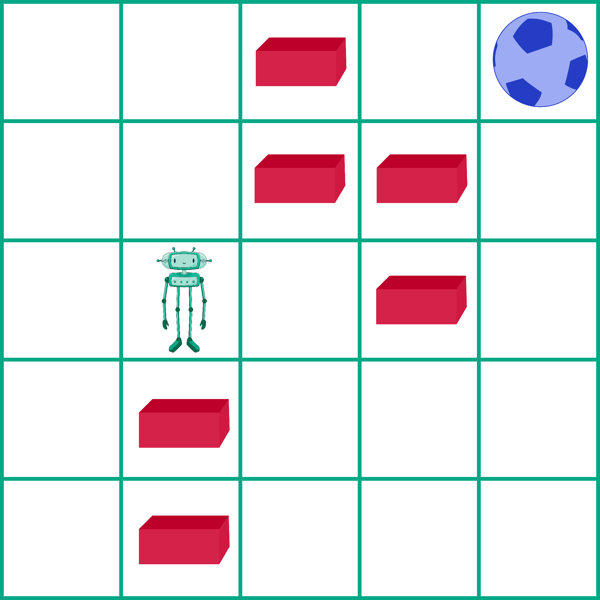

Размишљамо као рачунар
======================

.. infonote::

 .. image:: ../../_images/robot31.png
    :height: 120
    :align: left

 Када урадиш све задатке и одговориш на сва питања у лекцији моћи ћеш да анализираш 
 једноставан познати поступак/активност и предложићеш кораке за његово спровођење. 

Пажљиво проучи слику. 

.. image:: ../../_images/u_digitalni_uredjaji.png
    :width: 500
    :align: center

|

У радној свесци на страници **XX** заокружи све дигиталне уређаје којих је раде на 
основу алгоритма.

.. questionnote::

 Одабери један од дигиталних уређаја и у радној свесци на страници **XX** напиши 
 инструкције на основу којих је дати уређај ради.

Данас скоро сви дигитални уређаји садрже рачунаре који на основу програма извршавају 
своје функције. На пример, клима-уређај хлади или греје просторију, машина за сушење 
веша на основу програма осушиће веш, итд. Човек је тај који каже дигиталном уређају 
шта да ради. Он пише програме (кодове) на основу којих сви ти уређаји раде.

Пре него што научиш да програмираш дигиталне уређаје, прво треба да научиш да 
мислиш као они. Важно је да сваки проблем поделиш на једноставне кораке.   

Ако роботу кажеш: “Иди до „куће“, ништа се неће десити јер робот разуме само 
следеће наредбе (кораке):

|

.. image:: ../../_images/simboli2.png
    :width: 300
    :align: center

.. questionnote::

 У радној свесци на страници **XX** пронађи пут којим робот долази до куће.

|

|

Упореди своје решење са нашим.

.. quizq::

 Да ли ће на основу следећих наредби, робот стићи до куће?

 |

 .. image:: ../../_images/koraci328a.png
    :width: 600
    :align: center

 .. mchoice:: p328
   :answer_a: Да
   :answer_b: Не
   :correct: a

.. questionnote::

 Да ли робот може да дође до куће неким другим путем.

У радној свесци на страници **XX** напиши кораке (наредбе) које робот разуме и 
доведи робота до куће.

Упореди своје решење са решењима твојих другова и другарица.

Колико корака има твој програм? 

.. questionnote::

 У радној свесци на страници **XX** напиши кораке (наредбе) које робот разуме и 
 доведи робота до куће.

Пронађи најкраћи пут до куће. Упореди свој програм са програмима твојих другова и 
другарица.

У радној свесци на страници **XX** напиши колико корака има твој програм? 

|

.. image:: ../../_images/robot33.png
    :width: 100
    :align: right

------------

**Домаћи задатак**

|

Робот прати команде које му задајеш. 

|

.. image:: ../../_images/simboli2.png
    :width: 300
    :align: center

.. questionnote::

 У радној свесци на страници **XX** поређај команде у прави редослед да успешно 
 доведеш робота до плаве лопте. 

Нека ти плаве тачкице помогну да започнеш кретање. 

|

|

У радној свесци на страници **XX** напиши колико корака има твој алгоритам? 

.. questionnote::

 Да ли је то једино решење? Наведи још један низ команди помоћу којих ћеш робота довести до плаве лопте. У радној свесци на страници **XX** напиши ново упутство.

|

У радној свесци на страници **XX** поређај команде у прави редослед да успешно доведеш робота до плаве лопте. Циглице представљају зид кроз који робот не може да прође.

|

|

У радној свесци на страници **XX** напиши колико колико корака има твој програм? 