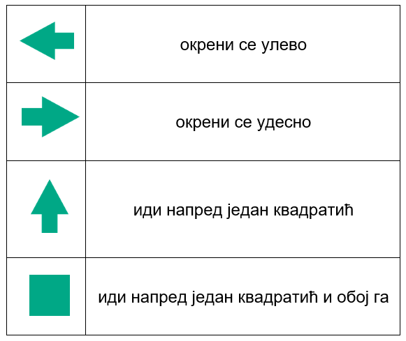
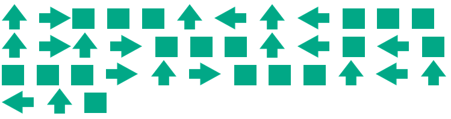
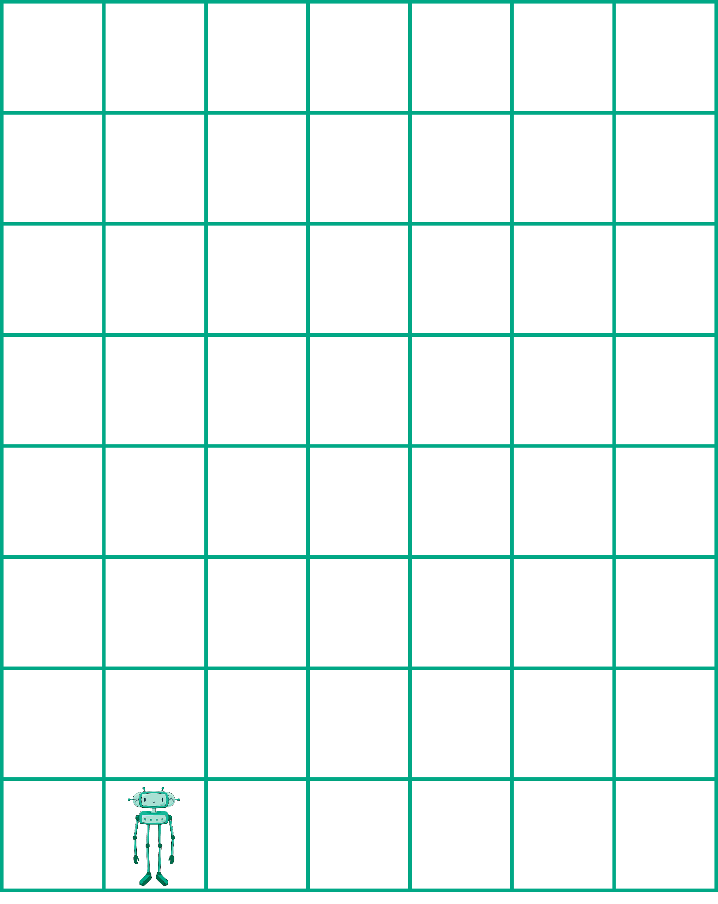
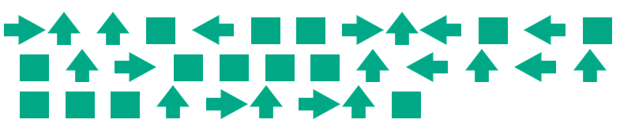
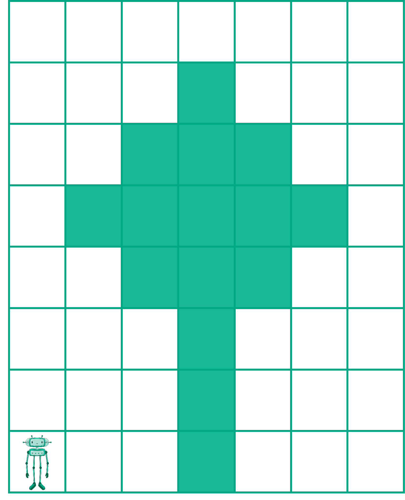
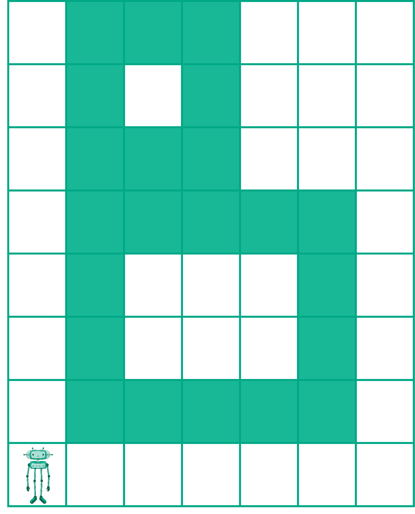
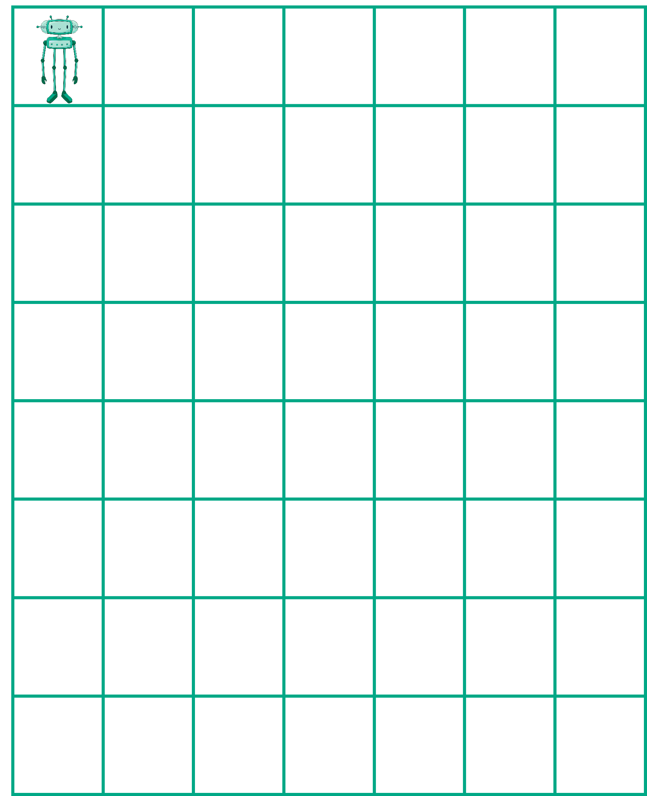
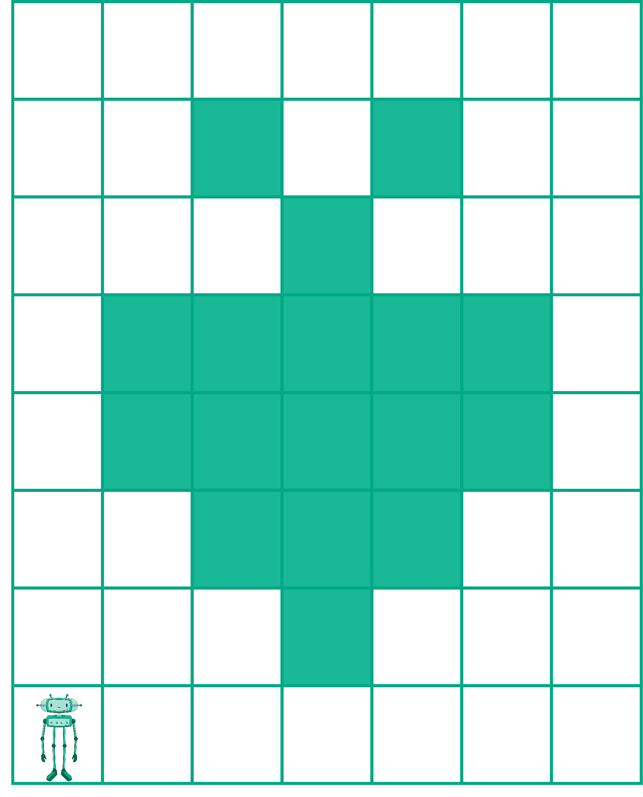

Знам где рачунар греши!
=======================

.. infonote::

 .. image:: ../../_images/robot31.png
    :height: 120
    :align: left

 Када урадиш све задатке и одговориш на сва питања у лекцији знаћеш да протумачиш симболе познатог/договореног значења 
 и спроведеш поступак описан њима. Знаћеш да уочиш и исправиш грешке у симболима израженог упутства (алгоритму), 
 провериш ваљаност свог решења и по потреби га поправиш (самостално или сараднички).

|

Робот разуме следеће наредбе:

Робот треба да нацрта слику пратећи кораке дате доњим алгоритмом. 

.. questionnote::

 У радној свесци на страници **XX** искористи мрежу по којој се робот креће да би 
 проверио/ла шта робот исцртава.

.. mchoice:: p329
   :answer_a: квадрат
   :answer_b: кућа
   :answer_c: круг 
   :answer_d: семафор
   :correct: b

   Шта је робот нацртао? Означи кружић испред тачног одговора.

|

-------

Проучи алгоритам помоћу кога је робот исцртао слику. 

.. questionnote::

 У радној свесци на страници **XX** искористи мрежу да провериш тачност алгоритма. Исправи кораке ако је потребно.

-----------

У радној свесци на страници **XX** напиши алгоритам на основу кога ће робот исцртати следећу слику.

|

----------------

.. questionnote::

 Осмисли слику. У радној свесци на страници **XX** напиши алгоритам на основу кога ће робот исцртати твоју слику.

|

Тестирај свој алгоритам, тако што ћеш замолити друга или другарицу да на основу 
твојих инструкција нацртају слику. Провери да ли је робот на основу алгоритма исцртао 
твоју слику. Ако то није случај исправи алгоритам. 

|

.. image:: ../../_images/robot33.png
    :width: 100
    :align: right

------------

**Домаћи задатак**

|

У радној свесци на страници **XX** напиши алгоритам на основу кога ће робот исцртати следећу слику.

