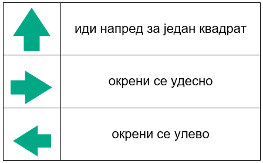

Прави пут
=========

.. infonote::

 .. image:: ../../_images/robot31.png
    :height: 120
    :align: left

 Када урадиш све задатке и одговориш на сва питања у лекцији знаћеш да спроведеш 
 поступак за решавање проблема. Такође, моћи ћеш да уочиш и исправиш грешке у 
 датом алгоритму и провериш исправност свог решења и, ако је неопходно, додатно 
 га усавршиш.     

Дати су следећи симболи.

|

|

.. questionnote::

 Пажљиво погледај упутство. Постоји грешка у упутствима. Исправи грешку тако што ћеш у радној свесци на страници **91** да напишеш правилно упутство.

Упутство до гараже:

----------------

Упутство до полицијске станице:

---------------

Упутство до ватрогасне станице:

.. questionnote::

 Провери тачност алгоритма.  Исправи кораке у упутству.

--------------

У радној свесци на страници **92** напиши упутство до игралишта.

-----------

У радној свесци на страници **93** напиши упутство до супермаркета.

-----------

Пажљиво анализирај слику. Дати су следећи симболи.

|

|

.. image:: ../../_images/mreza330b.png
    :width: 500
    :align: center

|

У радној свесци на страницама **95** и **96** уради следеће задатке.

.. questionnote::

 Користећи наведене симболе напиши алгоритам који представља пут којим дечак иде до школе пролазећи поред солитера.	
 
 - Провери тачност алгоритма.  
 
 - Исправи кораке ако је потребно.

.. questionnote::

 Користећи наведене симболе напиши алгоритам који представља пут којим дечак иде до школе пролазећи поред гараже.	
 
 - Провери тачност алгоритма.  
 
 - Исправи кораке ако је потребно.

.. questionnote::

 Користећи наведене симболе напиши алгоритам који представља пут којим дечак иде до школе, ако пролази поред ватрогасне станице.	
 
 - Провери тачност алгоритма.  
 
 - Исправи кораке ако је потребно.

-------------

Сва три алгоритма решавају исти проблем. И сва три алгоритма су тачна, дају права упутства од солитера до школе. Међутим, између њих постоји разлика. 

.. mchoice:: p330a
   :hide_labels:
   :answer_a: Поред ватрогасне станице 
   :answer_b: Поред солитера
   :answer_c: Поред гараже
   :feedback_a: Одговор није тачан.
   :feedback_b: Одговор није тачан.
   :feedback_c: Одговор је тачан!
   :correct: c 

   Ако желиш да купиш доручак, као путоказ бираш алгоритам:

.. mchoice:: p330b
   :hide_labels:
   :answer_a: Поред ватрогасне станице
   :answer_b: Поред солитера
   :answer_c: Поред гараже
   :feedback_a: Одговор није тачан.
   :feedback_b: Одговор је тачан!
   :feedback_c: Одговор није тачан.
   :correct: b

   Ако желиш да стигнеш најкраћим путем од солитера до школе, као путоказ бираш алгоритам:

|

.. image:: ../../_images/robot33.png
    :width: 100
    :align: right

------------

**Домаћи задатак**

|

Користећи наведене симболе за кретање, у радној свесци на страници **97** напиши све 
   путање од куће до биоскопа.

.. questionnote::

 Колико различитих алгоритама за решавање овог проблема можеш да пронађеш? 
 По чему се разликују ови алгоритми? Напиши у радној свесци на страници **98**. 
