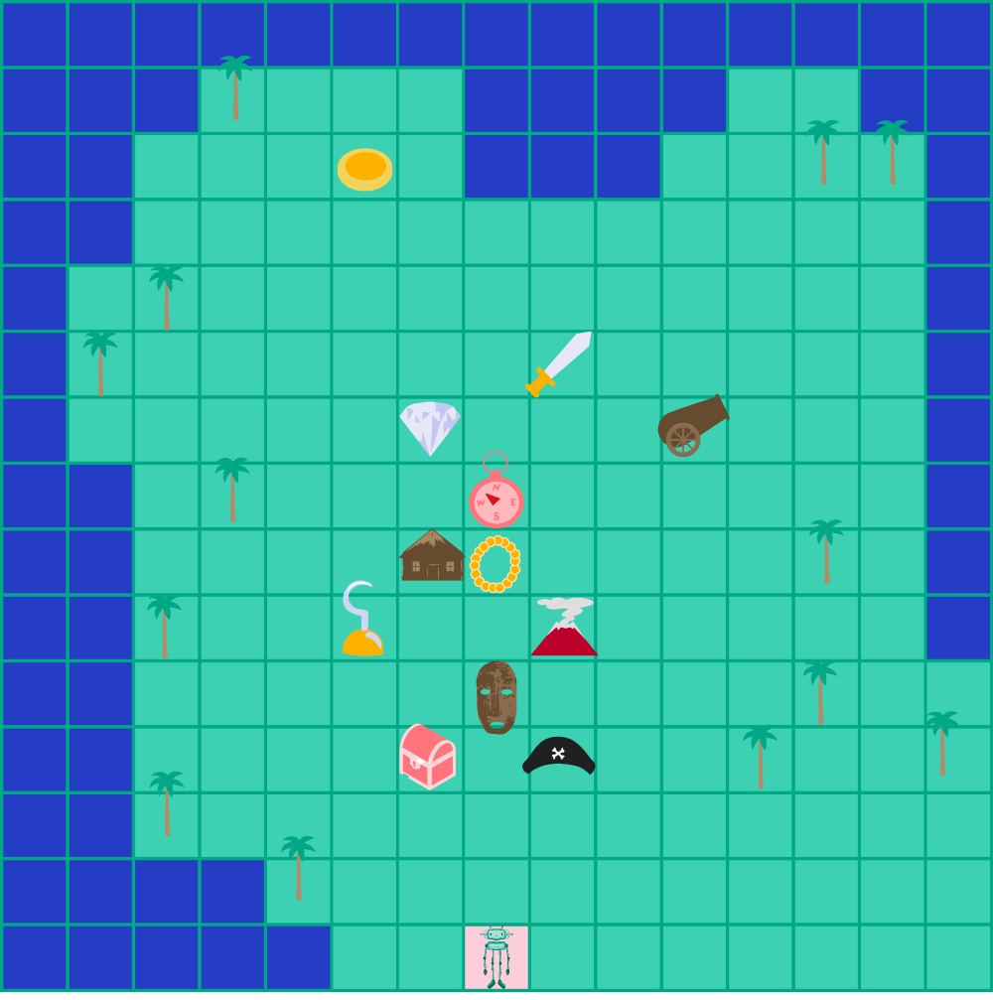

Када робот прати упутство
=========================

.. infonote::

 .. image:: ../../_images/robot31.png
    :height: 120
    :align: left

 Када урадиш све задатке и одговориш на сва питања у лекцији знаћеш да спроведеш 
 поступак описан алгоритмом. Осим тога, знаћеш да уочиш и исправиш грешку у 
 алгоритму и провериш тачност решења и, ако је потребно да га исправиш.

Истраживачка експедиција је пронашла мало опасно острво на коме су гусари давно 
оставили своје благо. Помоћу дрона су сликали острво и направили мапу острва. 
Пред тобом се налази мапа острва. Истраживачи су послали робота да им помогнеш да 
пронађу што више предмета које су гусари оставили на острву. 

Робот прати упутства које су му дали истраживачи дали. Робот разуме следеће кораке.

|

.. image:: ../../_images/simboli2.png
   :width: 300
   :align: center

|

.. questionnote::
 
 Робот прати следеће инструкције. У радној свесци на страници **98** прати инструкције које робот има.

.. quizq::

 Шта је робот пронашао? Означи кружић испред предмета који је робот пронашао.

 | 

 .. image:: ../../_images/332_maska.png
    :width: 200
    :align: center

 .. mchoice:: p332a1
   :hide_labels:
   :answer_a: гусарска капа
   :answer_b: ковчег
   :answer_c: маска 
   :answer_d: кука
   :feedback_a: Одговор није тачан.
   :feedback_b: Одговор није тачан.
   :feedback_c: Одговор је тачан!
   :feedback_d: Одговор није тачан.
   :correct: c

.. quizq::

 Шта је робот пронашао? Означи кружић испред предмета који је робот пронашао.

 | 

 .. image:: ../../_images/332_kuka.png
    :width: 300
    :align: center

 .. mchoice:: p332a2
   :hide_labels:
   :answer_a: кука
   :answer_b: ковчег
   :answer_c: маска 
   :answer_d: дијамант
   :feedback_a: Одговор је тачан!
   :feedback_b: Одговор није тачан.
   :feedback_c: Одговор није тачан.
   :feedback_d: Одговор није тачан.
   :correct: a

.. quizq::

 Шта је робот пронашао? Означи кружић испред предмета који је робот пронашао.

 | 

 .. image:: ../../_images/332_prsten.png
    :width: 300
    :align: center

 .. mchoice:: p332a3
   :hide_labels:
   :answer_a: кука
   :answer_b: ковчег
   :answer_c: дијамант
   :answer_d: топ
   :feedback_a: Одговор није тачан.
   :feedback_b: Одговор није тачан.
   :feedback_c: Одговор није тачан.
   :feedback_d: Одговор је тачан!
   :correct: d
   

.. quizq::

 Шта је робот пронашао? Означи кружић испред предмета који је робот пронашао.

 | 

 .. image:: ../../_images/332_sat.png
    :width: 400
    :align: center

 .. mchoice:: p332a4
   :hide_labels:
   :answer_a: топ
   :answer_b: ковчег
   :answer_c: сат
   :answer_d: прстен
   :feedback_a: Одговор није тачан.
   :feedback_b: Одговор није тачан.
   :feedback_c: Одговор је тачан!
   :feedback_d: Одговор није тачан.
   :correct: c

.. quizq::

 Шта је робот пронашао? Означи кружић испред предмета који је робот пронашао.

 | 

 .. image:: ../../_images/332_kapa.png
    :width: 250
    :align: center

 .. mchoice:: p332a5
   :hide_labels:
   :answer_a: гусарска капа
   :answer_b: ковчег
   :answer_c: сат
   :answer_d: прстен
   :feedback_a: Одговор је тачан!
   :feedback_b: Одговор није тачан.
   :feedback_c: Одговор није тачан.
   :feedback_d: Одговор није тачан.
   :correct: a

.. quizq::

 Шта је робот пронашао? Упиши одговор.
 
 |

 .. image:: ../../_images/332_vulkan.png
    :width: 250
    :align: center

 .. fillintheblank:: 332а6

    Одговор: |blank|

    - :^[Вв]улкан|[Vv]ulkan$|[Pp]laninu|[ПП]ланину|ВУЛКАН|VULKAN|PLANINU|ПЛАНИНУ: Одговор је тачан.
      :x: Одговор није тачан.

 
.. quizq::

 Шта је робот пронашао? Упиши одговор.
 
 |

 .. image:: ../../_images/332_dijamant.png
    :width: 350
    :align: center

 .. fillintheblank:: 332а7

    Одговор: |blank|

   - :^[Дд]ијамант|[Dd]ijamant$|ДИЈАМАНТ|DIJAMANT: Одговор је тачан.
     :x: Одговор није тачан.

.. quizq::

 Шта је робот пронашао? Упиши одговор.
 
 |

 .. image:: ../../_images/332_top.png
    :width: 350
    :align: center

 .. fillintheblank:: 332а8

    Одговор: |blank|

    - :^[Tt]op|[Тт]оп$|ТОП|TOP: Одговор је тачан.
      :x: Одговор није тачан.

 .. image:: ../../_images/robot33.png
    :width: 100
    :align: right

------------

**Домаћи задатак**

|

У радној свесци на страницама **99** и **100** напиши инструкције да пронађеш:

- Мач. Тесирај свој алгоритам. Ако треба исправи га.

- Дукат. Тестирај свој алгоритам. Ако треба исправи га.
