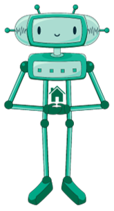

Робот у свету геометријских фигура
==================================

.. infonote::

 .. image:: ../../_images/robot31.png
    :height: 120
    :align: left

 Када урадиш све задатке и одговориш на сва питања у лекцији бићеш у стању да да 
 разложиш процедуру за исцртавање различитих геометријских облика на појединачне 
 кораке. Поред тога, моћи ћеш да тестираш сваки алгоритам и провериш његову тачност, 
 те да га исправиш ако је то потребно.     

|

Робот разуме следеће кораке:

|

.. image:: ../../_images/simboli2.png
   :width: 300
   :align: center

|

Проучи следеће кораке. Прати команде које извршава робот и упари их са добијеном сликом.

.. quizq::

 Означи кружић испред тачног одговора.

 .. image:: ../../_images/334a.png
    :width: 600
    :align: center

 | 

 .. image:: ../../_images/334ra.png
    :width: 500
    :align: center

 .. mchoice:: p334a
   :hide_labels:
   :answer_a: 1
   :answer_b: 2
   :answer_c: 3
   :answer_d: 4
   :answer_e: 5
   :feedback_a: Одговор је тачан!
   :feedback_b: Одговор није тачан.
   :feedback_c: Одговор није тачан.
   :feedback_d: Одговор није тачан.
   :feedback_e: Одговор није тачан.
   :correct: a

.. questionnote::

 Да ли робот може да нацрта исти облик пратећи друге кораке (наредбе)? 
 Напиши те нове наредбе. У радној свесци на страници **103** напиши те нове наредбе.

.. quizq::

 Означи кружић испред тачног одговора.

 .. image:: ../../_images/334b.png
    :width: 600
    :align: center

 | 

 .. image:: ../../_images/334rb.png
    :width: 500
    :align: center

 .. mchoice:: p334b
   :hide_labels:
   :answer_a: 1
   :answer_b: 2
   :answer_c: 3
   :answer_d: 4
   :answer_e: 5
   :feedback_a: Одговор није тачан.
   :feedback_b: Одговор није тачан.
   :feedback_c: Одговор је тачан!
   :feedback_d: Одговор није тачан.
   :feedback_e: Одговор није тачан.
   :correct: c

.. questionnote::

 Да ли робот може да нацрта исти облик пратећи друге кораке (наредбе)? 
 Напиши те нове наредбе. У радној свесци на страници **105** напиши те нове наредбе.

.. quizq::

 Означи кружић испред тачног одговора.

 .. image:: ../../_images/334c.png
    :width: 600
    :align: center

 | 

 .. image:: ../../_images/334rc.png
    :width: 500
    :align: center

 .. mchoice:: p334c
   :hide_labels:
   :answer_a: 1
   :answer_b: 2
   :answer_c: 3
   :answer_d: 4
   :answer_e: 5
   :feedback_a: Одговор није тачан.
   :feedback_b: Одговор је тачан!
   :feedback_c: Одговор није тачан.
   :feedback_d: Одговор није тачан.
   :feedback_e: Одговор није тачан.
   :correct: b

.. questionnote::

 Да ли робот може да нацрта исти облик пратећи друге кораке (наредбе)? 
 Напиши те нове наредбе. У радној свесци на страници **107** напиши те нове наредбе.

.. quizq::

 Означи кружић испред тачног одговора.

 .. image:: ../../_images/334d.png
    :width: 600
    :align: center

 | 

 .. image:: ../../_images/334rd.png
    :width: 500
    :align: center

 .. mchoice:: p334d
   :hide_labels:
   :answer_a: 1
   :answer_b: 2
   :answer_c: 3
   :answer_d: 4
   :answer_e: 5
   :feedback_a: Одговор није тачан.
   :feedback_b: Одговор није тачан.
   :feedback_c: Одговор није тачан.
   :feedback_d: Одговор није тачан.
   :feedback_e: Одговор је тачан!
   :correct: e

.. questionnote::

 Да ли робот може да нацрта исти облик пратећи друге кораке (наредбе)? 
 Напиши те нове наредбе. У радној свесци на страници **109** напиши те нове наредбе.

.. quizq::

 Означи кружић испред тачног одговора.

 .. image:: ../../_images/334e.png
    :width: 600
    :align: center

 | 

 .. image:: ../../_images/334ra.png
    :width: 500
    :align: center

 .. mchoice:: p334e
   :hide_labels:
   :answer_a: 1
   :answer_b: 2
   :answer_c: 3
   :answer_d: 4
   :answer_e: 5
   :feedback_a: Одговор није тачан.
   :feedback_b: Одговор није тачан.
   :feedback_c: Одговор није тачан.
   :feedback_d: Одговор је тачан!
   :feedback_e: Одговор није тачан.
   :correct: d

.. questionnote::

 Да ли робот може да нацрта исти облик пратећи друге кораке (наредбе)? 
 Напиши те нове наредбе. У радној свесци на страници **111** напиши те нове наредбе.

|

------------

**Домаћи задатак**

|

У радној свесци на страници **112** прати команде које извршава робот и упари их са добијеним сликама.

|

Робот извршава следеће команде.

|

У радној свесци на страници **112** обој квадратић испред тачног одговора.

.. questionnote::

 Да ли робот може да нацрта исти облик пратећи друге кораке (наредбе)? У радној 
 свесци на страници **113** напиши те нове наредбе.

Прати команде које извршава робот и упари их са добијеном сликом. У радној свесци на страници **114** обоји квадратић испред тачног одговора.

|

