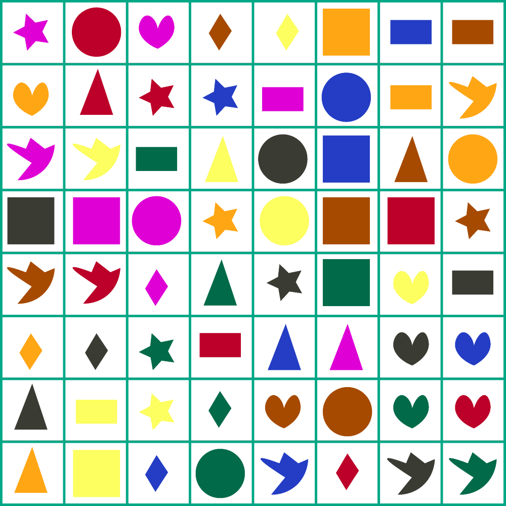

Алгоритам одређује понашање дигиталног уређаја
==============================================

.. infonote::

 .. image:: ../../_images/robot31.png
    :height: 120
    :align: left

 Када урадиш све задатке и одговориш на сва питања у лекцији разумећеш како алгоритми утичу на понашање дигиталних уређаја. 

|

Робот разуме следеће кораке.

.. image:: ../../_images/simboli2.png
    :height: 170
    :align: center

Пажљиво проучи доњу слику.

|

|

.. questionnote::

 Постави робота на браон квадрат. Окрени га ка црвеном квадрату.

 У радном листу на страници **117** напиши алгоритам који ће омогућити роботу да посети 
 све кругове, али тако да не пређе преко плавог квадрата.  
 
Колико корака има твој алгоритам?

Упореди своје решење са решењима твојих другова и другарица. Колико њихови алгоритми имају корака? Ако је неки алгоритам дошао до решења у мањем броју корака, покушај да пронађеш краћи пут и напишеш нови алгоритам.

--------

Реши следеће задатке:

.. questionnote::

 Постави робота на црвени квадрат. Окрени га ка жутом срцу. 

 У радном листу на страници **119** напиши алгоритам помоћу кога ће робот доћи до 
 плавог троугла. 
 
Колико корака има твој алгоритам? 

Упореди своје решење са решењима твојих другова и другарица. Колико њихови алгоритми имају корака? Ако је неки алгоритам дошао до решења у мањем броју корака, покушај да пронађеш краћи пут и напишеш нови алгоритам.	

--------

.. questionnote::

 Постави робота на црвени правоугаоник. Окрени га ка зеленом троуглу. 
 
 У радном листу на страници **119** напиши алгоритам који ће омогућити роботу да 
 посети све правоугаонике. 
 
Колико корака има твој алгоритам? 

Упореди своје решење са решењима твојих другова и другарица. Колико њихови алгоритми имају корака? Ако је неки алгоритам дошао до решења у мањем броју корака, покушај да пронађеш краћи пут и напишеш нови алгоритам.	

--------

.. questionnote::

 Постави робота на црвени круг. Окрени га ка љубичастом срцу.

 У радном листу на страници **120** напиши алгоритам помоћу кога ће робот доћи до 
 зеленог круга, тако да на свом путу не пређе преко љубичастог квадрата. 

Колико корака има твој алгоритам? 

Упореди своје решење са решењима твојих другова и другарица. Колико њихови алгоритми имају корака? Ако је неки алгоритам дошао до решења у мањем броју корака, покушај да пронађеш краћи пут и напишеш нови алгоритам.	

|

.. image:: ../../_images/robot33.png
    :width: 100
    :align: right

------------

**Домаћи задатак**

|

Постави робота на плави троугао. Окрени га ка наранџастом квадрату. 

У радном листу на страници **121** напиши алгоритам помоћу кога ће робот доћи до жуте птичице. 

Колико корака има твој алгоритам?	

------------

Постави робота на жути круг. Окрени га ка наранџастој звезди. 

У радној свесци на страници **121** напиши алгоритам који ће омогућити роботу да посети све птичице. 

Колико корака има твој алгоритам?	

----------------

Постави робота на црни троугао. Окрени га ка жутом правоугаонику. 

У радној свесци на страници **121** напиши алгоритам помоћу кога ће робот доћи до плавог круга, тако да на свом путу не пређе преко црног круга. 

Колико корака има твој алгоритам?
