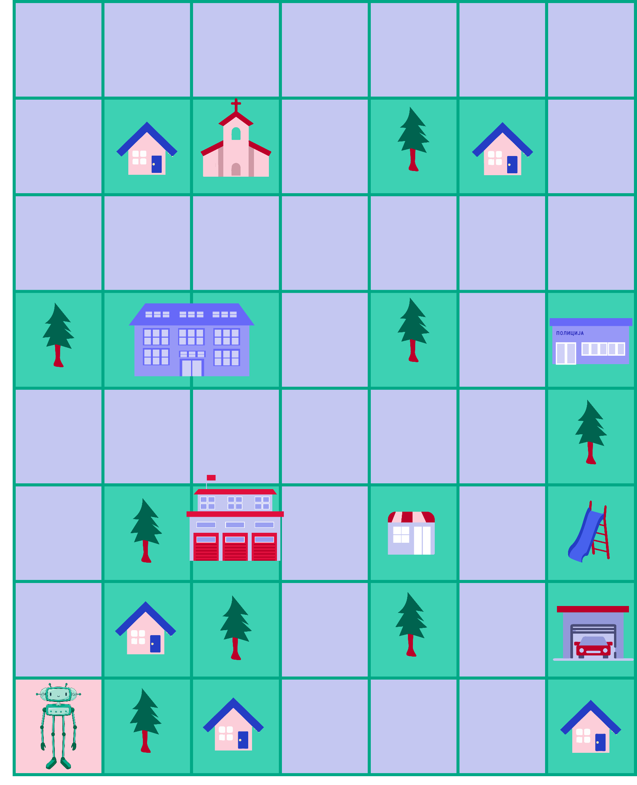

Алгоритамски начин размишљања
=============================

.. |kv| image:: ../../_images/kv.png
            :height: 15px  

.. infonote::

 .. image:: ../../_images/robot31.png
    :height: 120
    :align: left

 Поред задатака помоћу којих ћеш да провериш своје знање о поступцима за решавање различитих проблема, на крају ове лекције имаћеш 
 прилику да самопроцениш своје знање о поступцима за решавање проблема, о симбола и спровођењу корака који их описују, 
 о уочавању и исправљању грешака у алгоритму, о провери исправност решења, као и о томе како алгоритми утичу на понашање 
 дигиталних уређаја.

|

..
    .. questionnote::

 У радној свесци на страници **XX** напиши или нацртај кораке на основу којих ћеш направити папирни авион.

|

Дати су следећи симболи.

.. image:: ../../_images/simboli2.png
    :width: 300
    :align: center

|

|

.. Пажљиво погледај упутство. Постоји грешка у њему. У радној свесци на страници **XX** исправи грешке тако да што ћеш напишеш правилно упутство.

|

**Упутство до цркве**: |uc|. 

Провери тачност алгоритма. Исправи кораке у упутству.

|

**Упутство до школе**: |us|. 

Провери тачност алгоритма. Исправи кораке у упутству.

|

**Упутство до ватрогасне станице**: |uvs|. 

Провери тачност алгоритма. Исправи кораке у упутству.

|

..
    .. questionnote::
 
 У радној свесци на страници **XX** напиши упутство до гараже.

|

.. quizq::

 Прати команде које извршава робот и упари их са добијеном сликом.

 |uz|

 .. image:: ../../_images/p336.png
   :width: 300
   :align: center
 
 Означи кружић испред тачног одговора.

 .. mchoice:: p336
     :hide_labels:
     :answer_a: 1
     :answer_b: 2
     :answer_c: 3
     :answer_d: 4
     :feedback_a: Одговор је тачан.
     :feedback_b: Одговор није тачан.
     :feedback_c: Одговор није тачан.
     :feedback_d: Одговор није тачан.
     :correct: a

.. Да ли робот може да нацрта исти облик пратећи друге кораке (наредбе)? Опиши и радној свесци на страници XX напиши те нове наредбе.

..
    .. questionnote::

 У радној свесци на страници **XX** напиши алгоритам којим ће робот исцртати слово Ш.

Дај алгоритам другу или другарици и замоли их да нацртају слику на основу твог упутства. 
Провери да ли нацртана слика одговара твом упутству. Ако то није случај, пробај да направиш нови алгоритам. Тестирај га поново.

-----------------

.. Пажљиво прочитај тврдње. У радној свесци на страници **XX** обој квадратић зеленом бојом испред тврдњи које показују да је то знање које 
   си већ имао, наранџастом бојом ако о томе још нешто желиш да научиш, и црвеном бојом ако је за тебе све било ново, али си 
   сада научио/ла.

.. csv-table:: 
   :widths: auto
   :align: left

   "|kv|", "Умем својим речима да објасним појам алгоритам;"
   "|kv|", "Препознајем значење симбола и умем да спроведем кораке које они описују. "
   "|kv|", "У стању сам да исправим и проверим тачност алгоритма."
   "|kv|", "Знам да алгоритам одређује понашање дигиталног уређаја."
   "", ""

